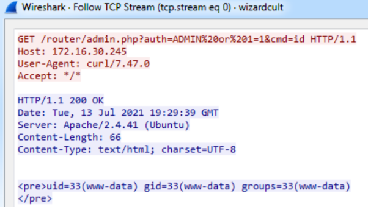
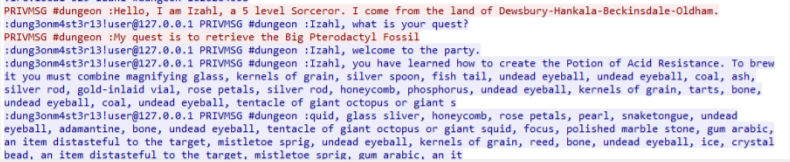

## Flareon8

這次 Flareon 實驗室的同學都在打 (@artis、@xiaobye、@wiiwu、@hexrabbit)，原本想說第一次打個 6 題，拿個及格分就好，不過因為看到同學都在打，所以就繼續打下去了，最後前前後後花了近一個月的時間才把 10 題打完，感謝實驗室的同學讓我有動力解下去，實在是沒想到我有這個機會拿到 badge。

在這邊用筆記的方式來記錄這次的解題過程，內容會參照官方解與我自己的解題方式，希望不要跟實驗室的學長 @terrynini 一樣，最後幾題都變成有生之年系列 XD


### 01 - credchecker

看 javascript 能得知帳號密碼分別為 `Admin` 與 `Z29sZGVudGlja2V0`：

```js
function checkCreds() {
if (username.value == "Admin" && atob(password.value) == "goldenticket")
{
	var key = atob(encoded_key);
	var flag = "";
	for (let i = 0; i < key.length; i++) {
		flag += String.fromCharCode(key.charCodeAt(i) ^ password.value.charCodeAt(i % password.value.length));
	}
```

輸入後得到 flag： `enter_the_funhouse@flare-on.com`


P.S. 官方說這次第一題是歷年最簡單的一次，大概就是剛接觸 CTF 第一道題目的程度吧


### 02 - known

此題提供了 `UnlockYourFiles.exe` 以及一些被加密的檔案，而執行 `UnlockYourFiles.exe` 會跳出 prompt 要你輸入 key 來解密檔案，雖然不知道 key 的值，但是我們可以從不同**檔案格式的 format** 來推敲解密後的密文會是什麼樣子，舉例來說 PNG 檔案的前 8 bytes 為 `89 50 4e 47 0d 0a 1a 0a`，某個 key 作為 input 後，加密過的 PNG 在解密完的前 8 bytes 也會是 `89 50 4e 47 0d 0a 1a 0a`，這個概念在密碼學稱作 **known plaintext attack**。

透過逆向可以知道 decrypt function 如下：

```c
char __cdecl dec_5E11F0(char *orig_file, char *input)
{
  int i; // ecx
  char result; // al

  for ( i = 0; i < 8; LOBYTE(i) = i + 1 )
  {
    result = __ROL1__(input[i] ^ orig_file[i], i) - i;
    orig_file[i] = result;
  }
  return result;
}
```


經過上述提到的已知明文 (PNG header) 與 brute force 來求出 key，並且因為 decrypt 只是對單個 byte 做運算，因此 brute force 的 worst case 為 256 * 8：

```python
#!/usr/bin/python3

def rol(val, off, bits):
    mask = 2**bits - 1
    return ((val << off) & mask) | ((val >> (8 - off)) & mask)

def ror(val, off, bits):
    mask = 2**bits - 1
    return ((val >> off) & mask) | ((val << (8 - off)) & mask)

# for debug
def enc(key, plain):
    cipher = b''
    plen = len(plain)
    for j in range(0, plen, 8):
        if j + 8 > plen:
            jj = plen
        else:
            jj = j + 8
        ppart = plain[j:jj]
        pplen = len(ppart)
        for i in range(pplen):
            # cipher[i] + i == rol(plain[i] ^ key[i], i)
            # ror(cipher[i] + i, i) ^ key[i] == plain[i]
            cipher += bytes([ ror(ppart[i] + i, i, 8) ^ key[i] ])
    return cipher

def dec(key, cipher):
    plain = b''
    clen = len(cipher)
    for j in range(0, clen, 8):
        if j + 8 > clen:
            jj = clen
        else:
            jj = j + 8
        cpart = cipher[j:jj]
        cplen = len(cpart)
        for i in range(cplen):
            out = rol(key[i] ^ cpart[i], i, 8) - i
            if out < 0:
                out += 256
            plain += bytes([ out ])
    return plain

import string

wl = string.printable
wl = wl.encode()
png_header = b'\x89\x50\x4E\x47\x0D\x0A\x1A\x0A'

# get key
capa = open('/tmp/Files/capa.png.encrypted', 'rb').read()
capa_header = capa[:8]
key = b''

for i in range(8):
    for w in wl:
        tmpk = key + bytes([w])
        tmpk = tmpk.ljust(8, b'\x00')
        out = dec(tmpk, capa_header)
        
        if out[i] == png_header[i]:
            key += bytes([w])
            break

print("key: ", key)
print("enc png_header: ", enc(key, png_header))
print("are same ?")
assert(enc(key, png_header) == capa_header)
print("Yes !\n")
print("dec capa_header: ", dec(key, capa_header))
print("get png header ?")
assert(png_header == dec(key, capa_header))
print("Yes !\n\nstart dec file ...")

# dec data
import glob
path = "/tmp/Files/*.encrypted"
for fn in glob.glob(path):
    cipher = open(fn, 'rb').read()
    open(fn + '.dec', 'wb').write(dec(key, cipher))
    print(f"[*] output fn: {fn + '.dec'}")
```


### 03 - antioch

解壓縮題目的檔案後，如果有接觸過 docker 的話，應該能直接聯想到是一個 export 出來的 image，下一步基本上就是直接跑起來，並拖出正在執行的 binary 出來逆向。

逆完 binary 後，能知道程式有兩個核心：

1. 輸入的 `name` 以及 `color`，會經過 hash function (CRC32) 產生 hash value，並且比對 table 的當中是否有對應的 `name` 或 `color` 的 hash value，當兩者都與 table 中紀錄的相同，就會回傳一個數字。而此時需要一點靈力，或者是你有觀察到一開始給的壓縮檔中還有其他壓縮檔沒有用到，當回頭解開就能發現裡面 .json 的 metadata 有紀錄人名，嘗試作為 `name` 餵入，就能過第一關的 `name` hash value check。雖然後續會要提供 `color`，但是因為  `name`、`color` 的 hash value 以及數字的資料排再一起，因此可以直接從 `name` 推得後續取得的 number。
2. 載入 `a.dat` ~ `z.dat`，做一些操作後印出，但是在 `.dat` 不正確的情況下印出來的東西是沒意義的

目標很明確，找出正確的 `a.dat` ~ `z.dat`，並在 binary 操作完畢後即可取的 flag，而 `.dat` 也能在各個壓縮檔案中看到，不過有些 layer 只有部分 `.dat`，大概可以猜到不同 layer 可能會提供不同的 `.dat`。

此時要介紹 docker container 使用到一個叫做 **overlayfs** 的機制：container 本身是一個 image base 加上一堆 layer 所組成，當檔案重複時，越高層的 layer 的優先權越大，最後會將這些 image 與 layer merge，掛載到屬於該 container 的 mount namespace。

當有了 overlayfs 的概念後，能夠想到這些數字應該就是作者對應到的 layer 的優先權，下一步即為取得所有作者對應的優先權做排序，並將對應作者目錄內的 `layer.tar` 的路徑更新到 image 的 metadata `manifest.json` 當中，之後還需要將對應 `layer.tar` 的 sha256 更新到那個 config .json，才能正常載入 image。

載入修改完的 docker image，並從 container 當中取得已經 overlay 的 `a.dat` ~ `z.dat`，最後使用 `gdb` 執行 `./AntiochOS` 並跳到 `0x401460`，跑完後就能得到 acsii art 形式的 flag。


exploit:

```python
#!/usr/bin/python3

from pwn import *
import glob
import json

names = []
json_map = {}
for f in glob.glob('*/json'):
    j = json.loads(open(f, 'r').read())
    if 'author' in j:
        names.append(j['author'])
        json_map[ j['author'] ] = f.split('/')[0]

"""
order = {}
for i in range(len(names)):
    name = names[i]
    r = process('./AntiochOS')
    r.sendlineafter('> ', 'approach')
    r.sendlineafter('name? ', name)
    r.sendlineafter('quest? ', 'owo')
    r.sendlineafter('color? ', 'owo')
    r.recvuntil('#')
    order[ int(r.recvline()[:-1].decode(), 10) ] = name
    r.close()

print(order)
"""
order = {'13': 'Roger the Shrubber', '23': 'King Arthur', '27': 'Dennis the Peasant', '11': 'Trojan Rabbit', '16': 'Legendary Black Beast of Argh', '28': 'Dinky', '20': 'Rabbit of Caerbannog', '25': 'Sir Ector', '12': 'Chicken of Bristol', '1': 'Miss Islington', '2': 'Sir Bors', '21': 'Sir Not-Appearing-in-this-Film', '22': 'Prince Herbert', '8': 'Zoot', '30': 'Sir Gallahad', '10': 'Green Knight', '29': 'Black Knight', '6': 'Sir Bedevere', '4': 'Dragon of Angnor', '24': 'Inspector End Of Film', '7': 'Sir Robin', '3': 'Tim the Enchanter', '18': 'Sir Lancelot', '15': 'Sir Gawain', '14': 'Bridge Keeper', '19': 'Lady of the Lake', '26': 'Squire Patsy', '9': 'Squire Concorde', '17': 'A Famous Historian', '5': 'Brother Maynard'}

#order = sorted(order.items(), key=lambda x: int(x[0]), reverse=True)
order = sorted(order.items(), key=lambda x: int(x[0]))
ap = ""
tars = []

for item in order:
    ap += f"\"{json_map[ item[1] ]}/layer.tar\",\n"
    tars.append(f"{json_map[ item[1] ]}/layer.tar")

print("**** append to manifest.json ****")
print(ap)

ap = ""
import hashlib
for tar in tars:
    b = open(tar, 'rb').read()
    ap += f"\"sha256:{hashlib.sha256(b).hexdigest()}\",\n"

print("\n**** append to the config json ****")
print(ap)

# Five-Is-Right-out@flare-on.com
```


### 04 - myaquaticlife

難以言喻的一題，基本上大概知道要去看點擊之後做的反應，但是那個 binary 裡面的 code 基本上都是去呼叫另一個 dll，傳入 code 給 dll，做像是 interpret 的行為，而 binary 本身就只有寫 MFC 相關的 onclick event handler，不重要的 code 很多，我在這個部分花了整整三天吧。


稍微看一下執行檔的字串會發現 "Multimedia Builder" (MMB)，而 MMB 的[介紹](https://www.mediachance.com/mmb/)如下：

> With MMB you can develop autorun menus, multimedia apps, games, or front-ends for your CD's* without having to spend months learning complex programming languages.
>
> If you are already distributing software on CD-ROM or DVD, creating your own CD-Audio or making your Audio CD you will love this easy-to-use, intuitive software.
>
> Create multimedia applications with graphic, text, sounds, Audio ,Video, supporting CD Audio or Mixed-mode CD's, executing applications and much more...
>
> MMB creates small stand-alone exe applications and has many bells & whistles you will ever need. Create a cool looking app or small game and send it to all your friends

基本上 MMB 為一個執行檔的框架，提供給你一些既有的功能，像是聲音、audio、video 等等。


不過在動態追 binary 或是用 process monitor 觀察，會發現它會去存取 `C:\Users\<user>\AppData\Local\Temp\MMBPlayer` 底下的檔案，進去資料夾可以看到有許多 gif、html 等等的，而按照我用 `spy++` 戳過還有動態追蹤的觀察，會猜測 binary 內部應該是有一個 engine 負責處理 html 的 render，並且在過程中開發人員可以用 plugin 定義在 parse html 的相關操作，像是此 html 當中會有如 `href="script:script16"` 的 attribute，這就代表點擊該 object 時會執行 script16 對應到的操作。

除了 gif 與 html，會發現一個 **fathom.dll**，逆一下會發現內容定義的多半就是開發人員的程式邏輯，並且也能在 0x2e40 看到回傳 **chose wrong** 的字串。從字串往前面看，能發現有一些比對與運算，可以猜到這個就是檢查結果的部分，如果結果錯誤就回傳 **chose wrong**，如果結果對的話，回傳的應該就是 flag。再深入逆一下，會發現 string 分成 part1 與 part2，而他會拿這兩個 string 與一組定值做一些 operation，並且將得到的 byte stream 做 md5，最後將 md5 結果跟某已知的 md5 做比對，如果對的話，就會做一些運算，最後產出 flag。

function 當中有兩個地方是比較字串長度的 (offset -0xC)，可以在那兩個地方下斷點，並且一個個點擊圖片，看在斷點處會是什麼字串，最後會發現字串由以下組成：

Part 1

- 3 - 07 - DFWEyEW
- 4 - 06 - PXopvM
- 13 - 07 - BGgsuhn

Part 2

- 7 - 06 - newaui
- 10 - 06 - HwdwAZ
- 11 - 05 - SLdkv


由於不知道點擊的組成，因此寫一個 script 做比對：

```python
#!/usr/bin/python3

import hashlib
import itertools

target = '6c5215b12a10e936f8de1e42083ba184'

KEY = bytes.fromhex('9625a4a9a3969a909fafe538f9819e16f9cbe4a4878f8fbad29da7d1fca3a800')
str1 = ['DFWEyEW', 'PXopvM', 'BGgsuhn']
str2 = ['SLdkv', 'HwdwAZ', 'newaui']
lstr2 = [
    str2[0] + str2[1] + str2[2],
    str2[0] + str2[2] + str2[1],
    str2[1] + str2[0] + str2[2],
    str2[1] + str2[2] + str2[0],
    str2[2] + str2[0] + str2[1],
    str2[2] + str2[1] + str2[0],
]

while True:
    for i, j, k in itertools.product(str1, str1, str1):
        for p2 in lstr2:
            m = hashlib.md5()
            key = KEY
            p1 = i+j+k
            b1 = p1.encode()
            b2 = p2.encode()
            output = b''
            for idx in range(31):
                val = (key[idx] ^ b1[idx % len(b1)]) - b2[idx % 17]
                if val < 0:
                    val += 0x100
                output += bytes([ val ])
            
            m.update(output)
            if m.hexdigest() == target:
                print("Great !", i, j, k, p2)
                exit(1)
# Great ! PXopvM DFWEyEW BGgsuhn SLdkvnewauiHwdwAZ
# 4 3 13 11 7 10
```

能得到 Part 1 以及 Part 2 分別的點擊順序，照順序點擊後即可取得 flag。

如果在一開始使用 MMB decompiler 來看執行檔做的行為，會得到：

```
CreateText("mytext","visitlabel$,1050,580,yippy")
LoadText("visitlabel$","vc$")
colr$='TEXTCOLOR=255,0,0'
SetObjectParam("outlabel$","colr$")
SetObjectParam("outlabel$","FONTNAME=Comic Sans MS")
SetObjectParam("outlabel$","FONTSIZE=24")
colors$[1] = '255,0,0'
colors$[2] = '0,255,0'
colors$[3] = '0,0,255'
colors$[4] = '255,0,0'
colors$[5] = '0,255,0'
colors$[6] = '0,0,255'
colors$[7] = '255,0,0'
colors$[8] = '0,255,0'
colors$[9] = '0,0,255'
colors$[10] = '255,0,0'
colors$[11] = '0,255,0'
colors$[12] = '0,0,255'
colors$[13] = '255,0,0'
colors$[14] = '0,255,0'
colors$[15] = '0,0,255'
For Loop= 1 To 1000
  For Counter= 1 To 15
    CreateText("mytext","outlabel$,20,100 + 50 * Counter,yippy")
    LoadText("outlabel$","var1$")
    colr$='TEXTCOLOR='+colors$[Counter]
    SetObjectParam("outlabel$","colr$")
    SetObjectParam("outlabel$","FONTNAME=Comic Sans MS")
    SetObjectParam("outlabel$","FONTSIZE=48")
    Pause("1000")
    DeleteObject("outlabel$")
  Next Counter
Next Loop
```

除此之外也能在 decompile 的結果中發現：

```
part1$='derelict:MZZWP'
part2$='lagan:BAJkR'
part2$='flotsam:DFWEyEW'
part1$='flotsam:PXopvM'
part2$='derelict:LDNCVYU'
part3$='derelict:yXQsGB'
part2$='jetsam:newaui'
part3$='lagan:QICMX'
part1$='lagan:rOPFG'
part3$='jetsam:HwdwAZ'
part1$='jetsam:SLdkv'
part2$='derelict:LSZvYSFHW'
part3$='flotsam:BGgsuhn'
part4$='lagan:GTYAKlwER'
part4$='derelict:RTYXAc'
part2$='lagan:GTXI'
```

聽實驗室的同學 (@wiiwu) 說按照 part 的順序點擊，一樣可以拿到 flag。


P.S. 過程中研究了一些 AFX 與 MFC 的東西，如 event map 的結構如下：

```c
struct AFX_MSGMAP_ENTRY
{
	UINT nMessage;
	UINT nCode;
	UINT nID;
	UINT nLastID;
	UINT nSig;
	void (*pfn)(void);
};

struct AFX_MSGMAP
{
	const AFX_MSGMAP *(__stdcall *pfnGetBaseMap)();
	const AFX_MSGMAP_ENTRY *lpEntries;
};
```

不過對解題沒什麼幫助 XD


### 05 - FLARE Linux VM

被噓爆的通靈題 XD，雖然我覺得方向是滿明確的

VM 打開後會發現 `crontab` 當中有一個 `zyppe` 會定期去 encode `Documents` 目錄下檔案，不過 encode 方式同時也是 decode 方式，因此能簡單的取得 encode 過的檔案內容。

在 decode 完後，會發現每個檔案都是一個線索，其中一個線索提到有個執行檔需要提供密碼，在提供密碼後會輸出一些字串，應該就是 flag，因此我們要做的事情就是解開那些線索，並將每個線索得到的部分 password 組合起來，而接下來就是靠一些 OSINT + 一些通靈的部分去解開線索。

解題過程沒什麼技術成分，紀錄如下：

```
The 1st byte of the password is: 0x45 ('E')
The 2st byte of the password is 0x34 ('4')
The 3rd byte of the password is: 0x51 ('Q') (rasberries.txt.broken)
The 4th byte of the password is: 0x35 ('5')
The 5th byte of the password is: 0xMS (0x64 by recipe) ('d')
he 6th byte of the password is: 0x36 ('6')
The 7th byte of the password is: 0x66 ('f')
The 8th byte of the password is: 0x60 ('`')
The 10th byte of the password is the bell number preceding 203 (52) ('4')
The 11th byte of the password is the number of unique words in /etc/Quijote.txt (108) ('l')
(要把全部轉成都大寫或都小寫)
The 12th byte of the password is the largest known number to be the sum of two primes in exactly two different ways
68 [[7, 61], [31, 37], [37, 31], [61, 7]] ('D')
The 13th byte of the password is: 0x35 ('5')
The 14th (and last byte) of the password is the sum of the number of participants from Spain, Singapore and Indonesia that finished the FLARE-ON 7, FLARE-ON 6 or FLARE-ON 5
7 --> 9 + 19 + 0
6 --> 7 + 25 + 2
5 --> 4 + 6 + 1
chr(96) ('I')

6th or 9th == 115 ('s')

# E4Q5d6f`s4lD5I

charset = "0123456789abcdefghijklmnopqrstuvwxyzABCDEFGHIJKLMNOPQRSTUVWXYZ!\"#$%&\'()*+,-./:;<=>?@[\\]^_`{|}~ "

(In env)
NUMBER1=2
NUMBER2=3
NUMBER3=37

(/usr/bin/dot)
sha256 == 'b3c20caa9a1a82add9503e0eac43f741793d2031eb1c6e830274ed5ea36238bf'

.daiquiris --> Qac 7ys hcpe xq cyp typxterl xi: 0m66
==> Bifid cipher decoder with "eggs"
The 7th byte of the password is: 0x66

nachos --> enc data (0xbX) ==> 用 RC4
In the FLARE team we really like Felix Delastelle algorithms, specially the one which combines the Polybius square with transposition, and uses fractionation to achieve diffusion. ==> Bifid cipher

natillas --> enc data (0x8X) ==> 用 RC4
Do you know natillas? In Spain, this term refers to a custard dish made with milk and KEYWORD, similar to other European creams as crème anglaise. In Colombia, the delicacy does not include KEYWORD, and is called natilla.
KEYWORD ==> eggs (by https://en.wikipedia.org/wiki/Natillas)

dumpling --> Abn lef emadkxp frceqdnhe? Tah gdcktm temyku xxo qo ktyhzn! Zd'k raooua, por uda ztykqh
==> Bifid cipher decoder with "eggs"
Are you missing something? You should search for it better! It's hidden, but not really

donuts --> 'Din moq agos etcp Ememog Lhobeihz Awttivt ytxtv drwvgoswps?'
==> Bifid cipher decoder with "eggs"
==> Did you know that Giovan Battista Bellaso loved microwaves?

ice_cream: ==> 用 formula
If this challenge is too difficult and you want to give up or just in case you got hungry, what about baking some muffins? Try this recipe:
0 - Cinnamon
1 - Butter 150gr
2 - Lemon 1/2
3 - Eggs 3
4 - Sugar 150gr
5 - Flour 250gr
6 - Milk 30gr
7 - Icing sugar 10gr
8 - Apple 100gr
9 - Raspberries 100gr

Mix 0 to 9 and bake for 30 minutes at 180°C.

ice_coffee ==> 用 formula
The only problem with RC4 is that you need a key. The FLARE team normally uses this number: "SREFBE" (as an UTF-8 string). If you have no idea what that means, you should give up and bake some muffins.
==> 對照 ice cream ==> RC4 的 passphrase == 493513

instant noodle ==> 用 formula
The 5th byte of the password is: 0x64
(The 5th byte of the password is: 0xMS)

banana --> enc data (0x8X)
==> XOR with "Reese's"
Are you good at maths? We love maths at FLARE! We use this formula a lot to decode bytes: "ENCODED_BYTE + 27 + NUMBER1 * NUMBER2 - NUMBER3"
(a[i] + 27 + 2 * 3 - 37)

reeses -->
V2UgTE9WRSAiUmVlc2UncyIsIHRoZXkgYXJlIGdyZWF0IGZvciBldmVyeXRoaW5nISBUaGV5IGFyZSBhbWF6aW5nIGluIGljZS1jcmVhbSBhbmQgdGhleSBldmVuIHdvcmsgYXMgYSBrZXkgZm9yIFhPUiBlbmNvZGluZy4K
"We LOVE "Reese's", they are great for everything! They are amazing in ice-cream and they even work as a key for XOR encoding."

backerries --> enc data (0x8X)
==> XOR with "Reese's"
If you are not good in maths, the only thing that can save you is to be a bash expert. Otherwise you will be locked here forever HA HA HA!

blue --> enc data (0x2X)
==> XOR with "Reese's" ==> The 4th byte of the password is: 0x35

oats -->
Kww jvkugh xatnfk phz JDMZG kswm dr Liqvksn. Tciq bwuk o xuigz an keharzwluvi jhqfa efp pcms crzel owpmsnsvxaav qe Hsioxwd!
pvkdo://trmlfmt.tci/aieeyi_06 (icrowavesmicrowavesmicro)
(https://twitter.com/anamma_06)
jkhls://oaafbgi.qkm/HediitvAaccefuk
(https://twitter.com/MalwareMechanic)

(key: microwaves)
You should follow the FLARE team in Twitter. They post a bunch of interesting stuff and have great conversation on Twitter!

===> https://twitter.com/anamma_06/status/1414583864865996803

omelettes -->
Kww jvkugh xatnfk phz JDMZG kswm dr Liqvksn. Oolwdekjs phzc emg ivh wnbvq mvf ecp lzx qac nvore zzwz qh pcq gzx ltm hcoc.
(key: microwaves)
You should follow the FLARE team in Twitter. Otherwise they may get angry and not let you leave even if you get the flag.

hoxhe://byzhpem.ggy/ipraia_06 (avesmicrowavesmicrowaves)
(https://twitter.com/anamma_06)

cxlba://vnwptzv.uau/qjondvv1 (vesmicrowavesmicrowaves)
(https://twitter.com/osardar1)

zfbrj://hsioxwd.kqd/AwlrejqUgtvwndg (smicrowavesmicrowavesmicrowaves)
(https://twitter.com/MalwareMechanic)

oranges -->
Fpg 8kv xyoi gr bjv dwsnagdl kj: 0l60
The 8th byte of the password is: 0x60 (microwaves)

raisins -->
VGhlIDNyZCBieXRlIG9mIHRoZSBwYXNzd29yZCBpcy4uIGl0IGlzIGEgam9rZSwgd2UgZG9uJ3QgbGlrZSByYWlzaW5zIQo=
The 3rd byte of the password is.. it is a joke, we don't like raisins!

rasberries -->
The 3rd byte of the password is: 0x51

sausage --> enc data (0x2X)
===> rotate left 1: The 2st byte of the password is 0x34

shopping_list -->
[U]don noodles
[S]trawberries
[R]eese's
[B]anana chips
[I]ce Cream
[N]atillas
[D]onuts
[O]melettes
[T]acos
/usr/bin/dot --> flag checker

spaghetti --> enc data (0x2X)
rotate left 1 --> In the FLARE language "spaghetti" is "c3BhZ2hldHRp". (base64 --> spaghetti)

tacos --> hex value (0x160)
===> key: 'Sheep should sleep in a shed' + '15.2' == 'Sheep should sleep in a shed15.2' (`cat /etc/*-release`)
===> IV: tacos00000000000
"sGVB. It seems you are very very close to get the flag! Be careful when converting decimal and hexadecimal values to ASCII and hurry up before we run out of tacos!"

tomato --> hex value (0x350)
m\.FWems you are close to escape... We are preparing the tomatoes to throw at you when you open the door! It is only a joke...
The 11th byte of the password is the number of unique words in /etc/Quijote.txt
The 13th byte of the password is revealed by the FLARE alias

ugali --> hint for ugali Sausages , spagjetti
"Ugali with Sausages or Spaghetti is tasty. It doesnt matter if you rotate it left or right, it is still tasty! You should try to come up with a great recipe using CyberChef."

unagi --> 1st password

udon_noddle --> "ugali", "unagi" and "udon noodles" are delicious. What a coincidence that all of them start by "u"!

strawbarry --> enc data (0xeX)
In the FLARE team we like to speak in code. You should learn our language, otherwise you want be able to speak with us when you escape (if you manage to escape!). For example, instead of "strawberries" we say "c3RyYXdiZXJyaWVz" (base64 --> strawberries)

tiramisu.txt.broken -->
th byte of the password is the atomic number of the element moscovium
The 10th byte of the password is the bell number preceding 203 
The 12th byte of the password is the largest known number to be the sum of two primes in exactly two different ways
The 14th (and last byte) of the password is the sum of the number of participants from Spain, Singapore and Indonesia that finished the FLARE-ON 7, FLARE-ON 6 or FLARE-ON 5

nutella.txt.broken --> 用 RC4 解
```


### 06 - PetTheKitty

題目只提供了一個 pcap 檔案，而當開啟 pcap，可以看到封包當中有一些 `ME0W` 的 prefix，並且一共有兩組溝通。

- 第一組溝通透過 Follow TCP stream，可以看到有個明顯的 `PNG` magic
- 第二組溝通的封包則是夾雜 `ME0W` 以及 `PA30`

由於 `ME0W` 應該是開發人員自己定義的 magic number，因此一開始能夠做的事情就是找不斷出現的 `PA30` 字串，google 一陣子之後會發現，`PA30` 是 windows **Delta Compression Patch** 時使用到的資料格式的 magic number，參考[該篇文章](https://bannsecurity.com/index.php/home/10-ctf-writeups/57-ritsec-ctf-2019-patch-2sday)能發現用 python 的 revenge module 可以輕鬆使用微軟的 `ApplyDeltaA` API 將 delta patch 在某個檔案上。

稍微研究一下，第一組溝通的封包格式大概是 `ME0W` + 檔案大小 (4 bytes) + 檔案大小 (4 bytes) + 檔案內容，照這個方式可以 extract 出一個 PNG 以及一個 `PA30` 檔：

- PNG 點開來是一隻很醜的貓，並且感覺異常的大
- `PA30` 是 **Delta Compression Patch** 的記錄檔

此時嘗試將異常大的 `PNG` 檔與拿到的 `PA30` 檔來執行 `ApplyDeltaA`，而後會生成一個 **dll**，function symbol 包含了 `Le_meow` ，應該就是 malware 後續會使用到的部分。


另一組溝通的封包格式開始變得不太一樣，雖然一樣有 `PA30`，但是每個 request 與 response 看起來都比上個溝通還小，並且雙方 交換訊息頻繁，在逆了 dll 之後會發現他與 server 的溝通方式如下：

1. client 打開 cmd，並將 cmd 的 output 導向至某塊記憶體位置
2. 當一有資料，就先將 output 跟 `"meoow"` 字串做 xor，之後執行 `createDeltaB`，並將結果送到 server
3. server 會回傳一組資料，而在使用 `ApplyDeltaB `後，與 `"meoow"` 字串做 xor，得到 new_output
4. 將 new_output 傳入 cmd 當作 input，代表執行 new_output 內的指令
5. 重複 2-4


過程中部分 function 會需要視窗的大小，雖然這部分沒有透漏，但是可以猜到初始值應該會是 `0`，並且視窗大小可以由執行一次 `ApplyDeltaB` 後得到的檔案大小得知，最後就是呼叫 windows API 以及做 xor，並將**輸入的指令**與**執行的結果**印出觀察，在某次的 output 當中即會得到帶有 flag 字串的 output。

而在最後的過程中，可以知道 **server **(.144) 指的就是 attacker，而 **client** (.139) 指的就是 victim，而第二步驟即是將 victim 的 terminal output 透過 Delta compression Patch 的方式傳給 attacker，而 attacker 在透過相同的方式傳送 command 給 victim。

以下為 exploit：

```python
# REF: https://bannsecurity.com/index.php/home/10-ctf-writeups/57-ritsec-ctf-2019-patch-2sday

# pip install revenge
from revenge import Process
from shutil import copyfile
import glob
import struct
import time

PATCH_LIST = 'patch_list' # get from pcapng
TARGET = 'src'
LEN = 475136

def apply_patch():
    p = Process(r"C:\Windows\System32\calc.exe")
    p.memory['LoadLibraryA'](r"C:\Windows\System32\msdelta.dll")
    ApplyDeltaA = p.memory["ApplyDeltaA"]
    size_dict = extract()
    patchs = glob.glob('*.patch')
    patch_dict = dict()

    for patch in patchs:
        patch_dict[ int(patch.split('.')[0]) ] = patch

    patchs = sorted(patch_dict.items())
    open('src', 'wb').write(b'\x00'*LEN)
    meoow = b'meoow'

    # odd --> our request
    # even --> server
    for patch in patchs:
        print(f"[*] current is patching {patch[1]}")
        ApplyDeltaA(1, TARGET, patch[1], TARGET)
        f = open(TARGET, 'rb+')
        encode_data = f.read()
        decode_data = b''

        for i in range(size_dict[ patch[1] ]):
            decode_data += bytes([ encode_data[i] ^ meoow[i % 5] ])
        print(f"[*] \"{patch[1]}\" output: {decode_data.decode()}")

        decode_data = decode_data.ljust(LEN, b'\x00')
        f.write(decode_data)
        f.close()
        input("")

    print("[*] DONE")
    exit(0)

def extract():
    patch_data = open(PATCH_LIST, 'rb').read()
    idx = 1
    curr_size = 0
    size_dict = dict()
    while patch_data != b'':
        if patch_data[:4] != b'ME0W':
            print(f'[-] error {hex(curr_size)}')
            exit(1)
        size = struct.unpack('<I', patch_data[8:12])[0]
        patch = patch_data[12:12+size]
        open(f'{idx}.patch', 'wb').write(patch)
        size_dict[ f'{idx}.patch' ] = struct.unpack('<I', patch_data[4:8])[0]
        print(f"[*] save {idx}.patch done")
        idx += 1
        curr_size += 12 + size
        patch_data = patch_data[12+size:]
    
    print("[*] DONE")
    return size_dict

FIRST_PATCH = 'first' # get from pcapng
PNG = 'png.png' # get from pcapng
FIRST_OUTPUT = 'first_output.dll'

def get_dll():
    p = Process(r"C:\Windows\System32\calc.exe")
    p.memory['LoadLibraryA'](r"C:\Windows\System32\msdelta.dll")
    ApplyDeltaA = p.memory["ApplyDeltaA"]
    ApplyDeltaA(1, PNG, FIRST_PATCH, FIRST_OUTPUT)

apply_patch()
```


### 07 - spel

題目只給你一個預設什麼都不能做拼字程式，有了第四題的經驗後，可以猜到這種有互動 GUI 的 .exe，應該是使用 MFC 產生來可以 interactive 的元件，而產生這些元件的程式碼很多，因此大多數的的 function / code 都不用看。

如果用 debugger 追一下，應該滿明顯可以發現關閉視窗後程式不會馬上停止，而是進入 `sleep()`，如果此時下個斷點，就能從 `sleep()` 往回追進入點，之後會看到有一大段類似 loader 的 code，會把一些像是 shellcode 的東西填到某個可以執行的 memory region，填完之後會跳上去執行。

這段 shellcode 會在加載一個 dll，但是這個 dll 又會在加載一個 dll，當時沒有很了解過程在幹嘛，不過官方的 writeup 也省略了這部分的解釋，只說明此 dll 做了兩件事情：

- Loads the PE file located at 0x1800168F0 (file offset 0x14EF0) into memory
- Resolves the loaded file’s export named `Start`

此 dll 又會跳進載入的 dll，而透過 memory dump 將 dll extract 出來後，稍微逆一下就會知道這個就是主要執行的 dll (稱作 main dll)。

main dll 並沒有太多的 symbol 可以看，不過動態追蹤 main dll 的執行過程中，能發現有一個 function 在執行完畢後總會回傳 library function 的位置，可以猜出他是透過傳入的 value 來 resolve library API。而官方提到 Resolving APIs 的方式是將傳入的值做 `rol7XorHash32()` (`ROL` 與 `XOR `) 來回復原本的 function name，並提到 **flare-ida shellcode-hashes plugin** 可以幫你自動 resolve API。

此 dll 會先嘗試送一個 `@` 給 `inactive.flare-on.com:888`，並且預期收到 `inactive.flare-on.com:888` 回傳的資料會有三種：

- `exe`： decode 後續傳入的 byte data 成 shellcode 並執行，return 0
- `run`： decode 後續傳入的 byte data 成 shellcode 並執行，return 0
- `flare-on.com`： return 1


在回傳 `flare-on.com` 的情況下，後續的程式會在 `HKEY_CURRENT_USER\Software\Microsoft\Spell\ ` 新增兩個 registry (在此稱為 `r0` and `r1`)，registry `r1` 用 XOR 一個程式內的 const 就能復原，解開後為 `flare-on.com.`；registry `r0` 也是用同樣的方式來 extract，解開後得到 `b3s7_sp3llcheck3r_ev3r`，將兩者組起來後就是 flag 了。不過這邊我是直接動態追 function 在寫入 registry 時做了什麼操作，之後就可以推得 flag，所以對 registry 的處理並沒有什麼印象。


P.S. 官方解答中提到一些有用的工具，像是 [capa](https://github.com/mandiant/capa)、[flare-ida](https://github.com/mandiant/flare-ida) 還有 [flare-floss](https://github.com/mandiant/flare-floss) 等等，之後可以用用看

- [process hacker](https://processhacker.sourceforge.io/)
- [flare-emu](https://github.com/mandiant/flare-emu)


### 08 - beelogin

題目只給了一個 5 萬多行的 html，而這個 html 有 5 個密碼欄可以輸入，但是透過動態 + 靜態分析裡面的 js code 後，會發現只有一個密碼欄的 input 長度為 64 時，會將最後要作為 `eval()` 參數的字串做一些額外運算。

考慮最終 js 會執行到 `eval()`，並且 input 會影響到 `eval()` 的參數，可以猜測我們必須控制該 input，讓 `eval()` 能夠順利地執行，並且透過測是可以得知 `eval()` 吃到非法的 js 程式碼時就會不繼續執行，因此 `eval()` 的參數必須要是一段合法的 js code 才行。

仔細分析一下 input 會影響到參數的過程，化簡後的 pseudo code 大致如下 (key == input)：

```js
if (four_password[0].length == 64)
    key = four_password[0].split('');

A_b64 = "b2JDN2luc2tiYXhLOFZaU..."; // L8411
A = atob(A_b64).split('');

B_b64 = "4fny3zLzDRYIOe37Axvh5...."; // L4489
B = atob(B_b64).split('');

for (i = 0; i < A.length; i++) {
    A[i] = (A[i].charCodeAt(0) + key[i % 64].charCodeAt(0)) & 0xFF;
}

for (i = 0; i < B.length; i++) {
    B[i] = (B[i].charCodeAt(0) - A[i % A.length]) & 0xFF;
}

magic_concat_str = "";
for (i = 0; i < B.length; i++) {
    magic_concat_str += String.fromCharCode(B[i]);
}

eval(magic_concat_str);
```

先以 `key` 對固定的 bytes data 做加法運算，再用運算結果對另一個固定 bytes data 做減法運算，最後得到的 `magic_concat_str` 應該要是合法的 js 程式碼，並且在大多數的情況下，js 程式碼的字元應該要是 printable。

於是問題就被限縮在該如何有效限縮 key 的範圍，讓 js 程式碼不只為 printable，還是正常的語句，而在此採取的作法是：

- 考慮到 `A[]` 的長度為 221，將 `B[]` 以每 221 個 bytes 為一組，並將每組的 0, 1, 2,3 ... 挑出來做運算
- `A[0]` 與 `B[0]`、`B[221]`、`B[442]` ... 做完運算應該都要是 printable，並且會產生一個交集的 charset 滿足這個條件
- charset 可以推出對應位置的 key byte 的範圍，最後枚舉範圍中的字元對 `A[]` `B[]` 做運算，而後產生的應該要是有**意義的文字**


以下為實現上述想法的 decoder：

```python
#!/usr/bin/python3

# L8411
key_221_b64 = "b2JDN2luc2tiYXhLOFZaUWRRWTlSeXdJbk9lVWxLcHlrMXJsRnk5NjJaWkQ4SHdGVjhyOENQeFE5dGxUaEd1dGJ5ZDNOYTEzRmZRN1V1emxkZUJQNTN0Umt6WkxjbDdEaU1KVWF1M29LWURzOGxUWFR2YjJqQW1HUmNEU2RRcXdFSERzM0d3emhOaGVIYlE3dm9aeVJTMHdLY2Vhb3YyVGQ4UnQ2SXUwdm1ZbGlVYjA4YVRES2xESnlXU3NtZENMN0J4MnBYdlZET3RUSmlhY2V6Y3B6eUM2Mm4yOWs="

code_b64 = "4fny3zLzDRYIOe37Axvh5Toquw4GGWWdN/48rjUGFDk2mVYh/GKy4/HnF/jL7EgTLPcieLzwF8oJRyAIHf1AJhtG24Ou6drR3/cV2NnY68wIJOwq95P2kO/wDfnkLt/zMwnaGyVfsyX85vc33r4gKtxCO8r5KUzxKDS9tQUVPeD1JQ......" # too long

import string
import base64

key_221 = base64.b64decode(key_221_b64)
code = base64.b64decode(code_b64)
wl = string.printable[:-2]
wlb = wl.encode()
maybe_char_list = [""] * 64

code_floor_221 = len(code) - len(code) % 221
code_list = []

def dec_char(i, code_char, guess_char):
    c = (key_221[i % 221] + ord(guess_char)) & 0xff
    return (code_char - c) & 0xff

for i in range(0, len(code), 221):
    code_list.append( code[i : i+221] )

for i in range(221):
    valid_char_list = wl if len(maybe_char_list[i % 64]) == 0 else maybe_char_list[i % 64]
    
    for code_part in code_list: # [0...221], [222...222+221], ...
        tmp_valid_char_list = ""

        if i >= 64 and code_part == code_list[-1]:
            break
        
        for guess_char in valid_char_list: # guess key64
            guess_code = dec_char(i, code_part[i], guess_char)

            if chr(guess_code) in wl:
                tmp_valid_char_list += guess_char
        
        # update valid set
        valid_char_list = tmp_valid_char_list

    if len(valid_char_list) > 0:
        maybe_char_list[i % 64] = valid_char_list
    else:
        print("error")

print(maybe_char_list)
key = 'ChVCVYzI1dU9cVg1ukBqO2u4UGr9aVCNWHpMUuYDLmDO22cdhXq3oqp8jmKBHUWI'
real_code = ''

for i in range(len(key)):
    real_code += chr(dec_char(i, code[i], key[i]))

print(f"[begin] current key:  {key}")
print(f"[begin] current code: {real_code}")

for i in range(len(key), 64):
    if len(maybe_char_list[i]) == 1:
        key += maybe_char_list[i][0]
        real_code += chr(dec_char(i, code[i], maybe_char_list[i][0]))
    else:
        print(f"--------- level {i} ---------")
        print("------")
        print("| id |")
        print("------")
        for j in range(len(maybe_char_list[i])):
            print(f'{j} --> key: {maybe_char_list[i][j]}, dec: {chr(dec_char(i, code[i], maybe_char_list[i][j]))}')

        j = int(input('choose id> '))
        key += maybe_char_list[i][j]
        real_code += chr(dec_char(i, code[i], maybe_char_list[i][j]))
    
    print(f"[{i}] current key : {key}")
    print(f"[{i}] current code: {real_code}")


key = key.encode()
key_221_dec = b''

for i in range(221):
    key_221_dec += bytes([ (key_221[i] + key[i % 64]) & 0xFF ])

code_dec = b''
for i in range(len(code)):
    code_dec += bytes([ (code[i] - key_221_dec[i % len(key_221_dec)]) & 0xFF ])

open('part1.txt', 'w').write(code_dec.decode())
```


而後會得到一大坨 jsfuck，執行之後還是產生類似的檔案，解法也是一模一樣，只是長度從 221 變成 226，exploit 如下：

```python
#!/usr/bin/python3

key_226_b64 = "N0l2N2l2RTVDYlNUdk5UNGkxR0lCbTExZmI4YnZ4Z0FpeEpia2NGN0xGYUh2N0dubWl2ZFpOWm15c0JMVDFWeHV3ZFpsd2JvdTVSTW1vZndYRGpYdnhrcGJFS0taRnZOMnNJU1haRXlMM2lIWEZtN0RSQThoMG8yYUhjNFZLTGtmOXBDOFR3OUpyT2RwUmFOOUdFck12bXd2dnBzOUVMWVpxRmpnc0ZHTFFtMGV4WW11Wmc1bWRpZWZ6U3FoZUNaOEJiMURCRDJTS1o3SFpNRzcwRndMZ0RCNFFEZWZsSWE4Vg=="

code_b64 = "u8n2Ffpa3OQdRcn9UvkS3T8CAR+mOc/7/wYBJu/txdbwJx1AvhAK8hwezAJO3MxTNCgcHDIFGAcRLzMKDAEMSwno8zj9Wj7QQgkNBwizxurr7is72lwKNsDwFbYTE0AZ/OsWHfD+uiDQFyP1Ktk3ywUS2uU63THYuP489AvSDUYwybXG0fRD6tVQE8......" # too long

import string
import base64

key_226 = base64.b64decode(key_226_b64)
code = base64.b64decode(code_b64)
wl = string.printable[:-2]
# wl = '0123456789abcdefghijklmnopqrstuvwxyzABCDEFGHIJKLMNOPQRSTUVWXYZ'
wlb = wl.encode()
maybe_char_list = [""] * 64

code_floor_226 = len(code) - len(code) % 226
code_list = []

def dec_char(i, code_char, guess_char):
    c = (key_226[i % 226] + ord(guess_char)) & 0xff
    return (code_char - c) & 0xff

for i in range(0, len(code), 226):
    code_list.append( code[i : i+226] )

for i in range(226):
    valid_char_list = wl if len(maybe_char_list[i % 64]) == 0 else maybe_char_list[i % 64]
    
    for code_part in code_list: # [0...226], [222...222+226], ...
        tmp_valid_char_list = ""

        if i >= 64 and code_part == code_list[-1]:
            break
        
        for guess_char in valid_char_list: # guess key64
            guess_code = dec_char(i, code_part[i], guess_char)

            if chr(guess_code) in wl:
                tmp_valid_char_list += guess_char
        
        # update valid set
        valid_char_list = tmp_valid_char_list

    if len(valid_char_list) > 0:
        maybe_char_list[i % 64] = valid_char_list
    else:
        print("error")

print(maybe_char_list)
key = 'UQ8yjqwAkoVGm7VDdhLoDk0Q75eKKhTfXXke36UFdtKAi0etRZ3DoHPz7NxJPgHl'
real_code = ''

for i in range(len(key)):
    real_code += chr(dec_char(i, code[i], key[i]))

print(f"[begin] current key:  {key}")
print(f"[begin] current code: {real_code}")

for i in range(len(key), 64):
    if len(maybe_char_list[i]) == 1:
        key += maybe_char_list[i][0]
        real_code += chr(dec_char(i, code[i], maybe_char_list[i][0]))
    else:
        print(f"--------- level {i} ---------")
        print("------")
        print("| id |")
        print("------")
        for j in range(len(maybe_char_list[i])):
            print(f'{j} --> key: {maybe_char_list[i][j]}, dec: {chr(dec_char(i, code[i], maybe_char_list[i][j]))}')

        j = int(input('choose id> '))
        key += maybe_char_list[i][j]
        real_code += chr(dec_char(i, code[i], maybe_char_list[i][j]))
    
    print(f"[{i}] current key : {key}")
    print(f"[{i}] current code: {real_code}")


key = key.encode()
key_226_dec = b''

for i in range(226):
    key_226_dec += bytes([ (key_226[i] + key[i % 64]) & 0xFF ])

code_dec = b''
for i in range(len(code)):
    code_dec += bytes([ (code[i] - key_226_dec[i % len(key_226_dec)]) & 0xFF ])

open('part2.txt', 'w').write(code_dec.decode())
```

最後執行會跳出帶有 flag 的 `prompt()`。


### 09 - evil


### 10 - wizardcult

題目提供一個 pcap，不過打開後會發現有個明顯使用 golang 撰寫的 binary，將他 extract 出來後，用以下工具 / 方法修復好：

- IDA 7.6
- [user defined call](https://hex-rays.com/products/ida/support/idadoc/1361.shtml)
  - golang 的 calling convention 是用 stack 傳參數 (rbp、rbp+8、rbp+16...、rbp + N * 8)，並且回傳值會放在 rbp + (N+1) * 8 的地方
  - IDA 會幫你修一些，不過因為傳入的參數 struct 與 struct size IDA 不知道，因此一堆 function call 都是爛的，最好的方法就是手動把他修好
- [IDAGolangHelper](https://github.com/sibears/IDAGolangHelper)
  - golang 會把 struct name / struct size / struct member 相關的 metadata 存起來，不過 IDA 載入時並不會去 parse 那些資料
  - 這個 plugin 可以 parse 那些 metadata，轉成 struct 讓我們可以 define 變數的型態，並且因為 symbol 都在，可以更快了解程式運作

而稍微觀察 pcap 的其他部份，可以發現 Attacker 是透過網站漏洞來上傳 / 執行此 binary，而該 binary 為一個 IRC 的 client，當連接上 IRC server 才會做事。 (圖片來源：官方 writeup)



接下來就是慢慢把 binary 修好，雖然有些 function 的行為當下還猜不到，不過逆得差不多後，會對整個程式的運作有大概的理解，並且能將整個程式碼執行過程拆成：



- attacker 上傳惡意程式 `induct`
- victim 的 `induct` 會透過網頁漏洞被執行，並且執行後嘗試與 IRC server 連線
- 進入 IRC server 後會與大家打招呼
  - victim："Hello, I am Izahl, a 5 level Sorceror. I come from the land of Dewsbury-Hankala-Beckinsdale-Oldham"
- 此時叫做 **dung3onm4st3r13** 的 attacker 會知道該使用者為 victim，因此嘗試透過 magic string 試探他
  - attacker："Izahl, what is your quest?"
- 如果 victim 回傳 magic string，這就確定了該使用者確實使用 `induct` 來連接到 IRC server
  - victim："My quest is to retrieve the Big Pterodatyl Fossil"
- attacker 之後會傳 "Welcome to the party."，為開始攻擊的 magic string，之後會送一連串的 ingredients，如上圖當中的 "magnifying glass, kernels of grain, silver spoon ...."

victim 在收到 attacker 傳來的 ingredients 後，會遍歷每個 ingredient，找出其在一個 string array 當中的 index，並用此表示該 ingredient：

```python
#!/usr/bin/python3

import sys

if len(sys.argv) != 2:
    print("./get_bytes_from_table_ingreds.py <file>")
    exit(1)

table = \
[
  { "bone", 4},
  { "undead eyeball", 14},
  { "spider", 6},
  { "fish tail", 9},
  { "adamantine", 10},
  { "tentacle of giant octopus or giant squid", 40},
  { "ice", 3},
  { "coal", 4},
  { "food morsel", 11},
  { "bitumen (a drop)", 16},
  { "giant slug bile", 15},
  { "jade dust", 9},
  { "rotten egg", 10},
  { "silver powder", 13},
  { "artistic representation of caster", 33},
  { "oils and unguents", 17},
  { "soil mixture in a small bag", 27},
  { "gem-encrusted bowl", 18},
  { "magic item", 10},
  { "makeup", 6},
  { "talcum powder", 13},
  { "black silk square", 17},
  { "licorice root shaving", 21},
  { "tears", 5},
  { "salt", 4},
  { "dirt", 4},
  { "silver mirror", 13},
  { "wire of fine silver", 19},
  { "parchment with holy word written upon it", 40},
  { "gauze", 5},
  { "bone dust", 9},
  { "dust", 4},
  { "quartz", 6},
  { "lodestone", 9},
  { "sponge", 6},
  { "rope", 4},
  { "shamrock", 8},
  { "firefly", 7},
  { "iron", 4},
  { "soot", 4},
  { "forked twig", 11},
  { "distilled spirits", 17},
  { "mercury", 7},
  { "opaque glass", 12},
  { "marked sticks or bones", 22},
  { "ink", 3},
  { "niter", 5},
  { "corn", 4},
  { "hot pepper", 10},
  { "pebble", 6},
  { "stone", 5},
  { "wychwood", 8},
  { "miniature hand sculpted from clay", 33},
  { "amber", 5},
  { "brimstone", 9},
  { "pickled tentacle", 16},
  { "jade circlet", 12},
  { "sacrificial offering appropriate to deity", 41},
  { "fur of bloodhound", 17},
  { "jeweled horn", 12},
  { "lime", 4},
  { "vessel to contain a medium-sized creature", 41},
  { "cloth wad", 9},
  { "stem of a thorny plant", 22},
  { "pitch", 5},
  { "chalks and inks infused with precious gems", 42},
  { "tallow", 6},
  { "silk square", 11},
  { "earth", 5},
  { "molasses (a drop)", 17},
  { "feldspar", 8},
  { "jewel", 5},
  { "mandrake root", 13},
  { "focus", 5},
  { "eyeball", 7},
  { "silver bar", 10},
  { "fur", 3},
  { "glass sliver", 12},
  { "ivory portal (miniature)", 24},
  { "crystal bead", 12},
  { "ash", 3},
  { "sand", 4},
  { "feather of owl", 14},
  { "tuft of fur", 11},
  { "ink lead-based", 14},
  { "feather from any bird's wing", 28},
  { "mistletoe", 9},
  { "chrysolite powder", 17},
  { "lead", 4},
  { "phosphorescent moss", 19},
  { "blood", 5},
  { "quiver", 6},
  { "ointment for the eyes", 21},
  { "butter", 6},
  { "wisp of smoke", 13},
  { "magnifying glass", 16},
  { "incense", 7},
  { "honeycomb", 9},
  { "spiderweb", 9},
  { "snaketongue", 11},
  { "humanoid blood", 14},
  { "herbs", 5},
  { "string", 6},
  { "rose petals", 11},
  { "gilded skull", 12},
  { "pearl", 5},
  { "obsidian", 8},
  { "sweet oil", 9},
  { "twig from a tree that has been struck by lightning", 50},
  { "phosphorus", 10},
  { "polished marble stone", 21},
  { "gold-inlaid vial", 16},
  { "gum arabic", 10},
  { "twig", 4},
  { "silver rod", 10},
  { "fur of bat", 10},
  { "mistletoe sprig", 15},
  { "an item distasteful to the target", 33},
  { "moonseeds", 9},
  { "iron blade", 10},
  { "rock chip", 9},
  { "sumac leaf", 10},
  { "fleece", 6},
  { "sunstone", 8},
  { "granite", 7},
  { "quill plucked from a sleeping bird", 34},
  { "diamond", 7},
  { "bell (tiny)", 11},
  { "thorns", 6},
  { "silver spoon", 12},
  { "tarts", 5},
  { "adder's stomach", 15},
  { "reed", 4},
  { "jewel-encrusted dagger", 22},
  { "caterpillar cocoon", 18},
  { "clay pot of grave dirt", 22},
  { "gem as powder", 13},
  { "iron filings or powder", 22},
  { "flesh", 5},
  { "tiny piece of target matter", 27},
  { "ammunition", 10},
  { "clay and water", 14},
  { "sulfur", 6},
  { "black pearl (as crushed powder)", 31},
  { "ruby (as dust)", 14},
  { "gilded acorn", 12},
  { "leather loop", 12},
  { "cloak", 5},
  { "spheres of glass", 16},
  { "cured leather", 13},
  { "snakeskin glove", 15},
  { "alum soaked in vinegar", 22},
  { "cork", 4},
  { "crystal sphere", 14},
  { "flame", 5},
  { "eggshells", 9},
  { "silver cage", 11},
  { "prayer wheel", 12},
  { "copper piece", 12},
  { "crystal vial of phosphorescent material", 39},
  { "feather of hummingbird", 22},
  { "red dragon's scale", 18},
  { "forked metal rod", 16},
  { "snow", 4},
  { "eggshell", 8},
  { "engraving of symbol of the outer planes", 39},
  { "black onyx stone", 16},
  { "petrified eye of newt", 21},
  { "silver whistle", 14},
  { "charcoal", 8},
  { "hand mirror", 11},
  { "lockbox of ornate stone and metal", 33},
  { "glass eye", 9},
  { "silver and iron", 15},
  { "glass or crystal bead", 21},
  { "rotten food", 11},
  { "clay model of a ziggurat", 24},
  { "diamond and opal", 16},
  { "skunk cabbage leaves", 20},
  { "ashes of mistletoe and spruce", 29},
  { "nut shells", 10},
  { "statue of the caster", 20},
  { "exquisite chest", 15},
  { "clay", 4},
  { "thread", 6},
  { "hen's heart", 11},
  { "knotted string", 14},
  { "rhubarb leaf", 12},
  { "sesame seeds", 12},
  { "ruby", 4},
  { "grasshopper's hind leg", 22},
  { "ivory strips", 12},
  { "paper or leaf funnel", 20},
  { "oak bark", 8},
  { "crystal or glass cone", 21},
  { "water", 5},
  { "agate", 5},
  { "holy water", 10},
  { "mica chip", 9},
  { "weapon", 6},
  { "club", 4},
  { "bull hairs", 10},
  { "reliquary containing a sacred relic", 35},
  { "crystal hemisphere", 18},
  { "holly berry", 11},
  { "divinatory tools", 16},
  { "yew leaf", 8},
  { "gum arabic hemisphere", 21},
  { "eyelash in gum arabic", 21},
  { "leather strap", 13},
  { "silver pins", 11},
  { "platinum sword", 14},
  { "legume seed", 11},
  { "detritus from the target creature", 33},
  { "copper wire", 11},
  { "gilded flower", 13},
  { "guano", 5},
  { "artistic representation of target", 33},
  { "flea (living)", 13},
  { "cricket", 7},
  { "oil", 3},
  { "parchment as a twisted loop", 27},
  { "glowworm", 8},
  { "golden reliquary", 16},
  { "umber hulk blood", 16},
  { "jacinth", 7},
  { "holy symbol", 11},
  { "graveyard dirt (just a pinch)", 29},
  { "wood", 4},
  { "fur wrapped in cloth", 20},
  { "honey drop", 10},
  { "platinum-inlaid vial", 20},
  { "fan", 3},
  { "straw", 5},
  { "sapphire", 8},
  { "sunburst pendant", 16},
  { "green plant", 11},
  { "golden wire", 11},
  { "clay pot of brackish water", 26},
  { "platinum rings", 14},
  { "air", 3},
  { "colored sand ", 13},
  { "gem or other ornamental container", 33},
  { "sugar", 5},
  { "holy/unholy water", 17},
  { "gold dust", 9},
  { "copper pieces", 13},
  { "pork rind or other fat", 22},
  { "silver rings", 12},
  { "pickled octopus tentacle", 24},
  { "gem", 3},
  { "dried carrot", 12},
  { "melee weapon", 12},
  { "feather", 7},
  { "ruby vial", 9},
  { "kernels of grain", 16}
]

data = open(sys.argv[1], 'r').read().replace('.', '').split(', ')
bytecode = b''

for d in data:
    if d.startswith('and '):
        d = d.replace('and ', '')
    for i in range(len(table)):
        if d in table[i]:
            bytecode += bytes([ i ])
            break

print(hex(len(bytecode)))
print(bytecode)
open('output', 'wb').write(bytecode)
```

最後 index 串接起來後會被視為一串 bytecode，並在 `wizardcult_vm_LoadProgram()` 時透過 gob decoder 載入成一個 `struct Program`，做一連串的操作。

由於 struct type 與 member 都能知道，因此能夠寫一個 golang 的 gob decoder 觀察他載入的資料有哪些：

```go
package main

import (
	"bytes"
	"encoding/gob"
	"fmt"
	"io/ioutil"
)

type InputDevice struct {
	Name string
	x0 int
	input int
	control int
}

type OutputDevice struct {
	Name string
	x0 int
	output int
	control int
}

type Instruction struct {
	Opcode int
	A0 int
	A1 int
	A2 int
	Bm int
	Cond int
}

type Cpu struct {
	Acc int
	Dat int
	Pc int
	Cond int
	Instructions []Instruction
	x0 int
	x1 int
	x2 int
	x3 int
	control int
}

type ROM struct {
	A0 int
	A1 int
	Data []int
	x0 int
	x1 int
	x2 int
	x3 int
	control int
}

type RAM struct {
	A0 int
	A1 int
	Data []int
	x0 int
	x1 int
	x2 int
	x3 int
	control int
}

type Link struct {
	LHDevice int
	LHReg int
	RHDevice int
	RHReg int
}

type Program struct {
	Magic int
	Input InputDevice
	Output OutputDevice
	Cpus []Cpu
	ROMs []ROM
	RAMs []RAM
	Links []Link
	controls []int
}

func main() {
	dat, _ := ioutil.ReadFile("./output")
	io_buff := bytes.NewBuffer(dat)
    gdec := gob.NewDecoder(io_buff)

	// var prog Program
	var prog Program
	err := gdec.Decode(&prog)
	if err != nil {
		fmt.Printf("%#v	\n", err);
	}

	fmt.Println("########## Input ##########");
	fmt.Printf("Name: %s \n", prog.Input.Name);
	fmt.Printf("x0: %d \n", prog.Input.x0);
	fmt.Printf("input: %d \n", prog.Input.input);
	fmt.Printf("control: %d \n", prog.Input.control);
	fmt.Println("########## Output ##########");
	fmt.Printf("Name: %s \n", prog.Output.Name);
	fmt.Printf("x0: %d \n", prog.Output.x0);
	fmt.Printf("output: %d \n", prog.Output.output);
	fmt.Printf("control: %d \n", prog.Output.control);

	fmt.Println("########## Cpus ##########");
	for i, cpu := range prog.Cpus {
		fmt.Printf("--- cpu%d ---\n", i);
		fmt.Printf("Acc: %d \n", cpu.Acc);
		fmt.Printf("Dat: %d \n", cpu.Dat);
		fmt.Printf("Pc: %d \n", cpu.Pc);
		fmt.Printf("Cond: %d \n", cpu.Cond);
		for _, insn := range cpu.Instructions {
			fmt.Printf("Instruction(Opcode=%d, A0=%d, A1=%d, A2=%d, Bm=%d, Cond=%d),\n", insn.Opcode, insn.A0, insn.A1, insn.A2, insn.Bm, insn.Cond);
		}
		fmt.Printf("x0: %d \n", cpu.x0);
		fmt.Printf("x1: %d \n", cpu.x1);
		fmt.Printf("x2: %d \n", cpu.x2);
		fmt.Printf("x3: %d \n", cpu.x3);
		fmt.Printf("control: %d \n", cpu.control);
	}
	
	fmt.Println("########## ROMs ##########");
	for i, rom := range prog.ROMs {
		fmt.Printf("--- rom%d ---\n", i);
		fmt.Printf("A0: %d \n", rom.A0);
		fmt.Printf("A1: %d \n", rom.A1);
		fmt.Printf("Data: %#v \n", rom.Data);
		fmt.Printf("x0: %d \n", rom.x0);
		fmt.Printf("x1: %d \n", rom.x1);
		fmt.Printf("x2: %d \n", rom.x2);
		fmt.Printf("x3: %d \n", rom.x3);
		fmt.Printf("control: %d \n", rom.control);
	}
	fmt.Println("########## RAMs ##########");
	for i, ram := range prog.RAMs {
		fmt.Printf("--- ram%d ---\n", i);
		fmt.Printf("A0: %d \n", ram.A0);
		fmt.Printf("A1: %d \n", ram.A1);
		fmt.Printf("Data: %#v \n", ram.Data);
		fmt.Printf("x0: %d \n", ram.x0);
		fmt.Printf("x1: %d \n", ram.x1);
		fmt.Printf("x2: %d \n", ram.x2);
		fmt.Printf("x3: %d \n", ram.x3);
		fmt.Printf("control: %d \n", ram.control);
	}
	fmt.Println("########## Links ##########");
	for _, link := range prog.Links {
		fmt.Printf("Link(LHDevice=%d, LHReg=%d, RHDevice=%d, RHReg=%d),\n", link.LHDevice, link.LHReg, link.RHDevice, link.RHReg);
	}
	fmt.Println("########## controls ##########");
	fmt.Printf("controls: %#v\n", prog.controls);
}
```

-  member 知道 size 但不知道確定 type，因此會需要從 binary metadata 中取得相關資訊並做猜測

此 `Program` emulate 了一個 machine 的運行 (`VM`)，machine 的 component 包含了 CPU、RAM、ROM、Input Device 與 Output Device，除此之外還有被 CPU 執行的 Instruction、以及用來串接各個 component 的 Links：

```go
type Program struct {
	Magic int
	Input InputDevice
	Output OutputDevice
	Cpus []Cpu
	ROMs []ROM
	RAMs []RAM
	Links []Link
	controls []int
}
```

而前面提到 `wizardcult_vm_LoadProgram()` 最後做的一連串操作，就是為每個 component 之間的 **Links** 建立一個 **golang 的 channel**，channel 做的事情即為與另一個 component 做傳輸 / 接收資料的操作，舉例來說：


(圖片來源：https://computersciencewiki.org/index.php/Architecture_of_the_central_processing_unit_(CPU))

```go
type InputDevice struct {
	Name string
	x0 int
	input int
	control int
}
```

`InputDevice` struct 當中的 `x0` member 就是上圖與 CPU 建立的傳輸資料的通道 (在此稱作 bus)，因此當 `InputDevice` 寫入資料到 bus 當中，CPU 就能從 bus 的另一端取得資料，反之亦然。

```go
type Cpu struct {
	Acc int
	Dat int
	Pc int
	Cond int
	Instructions []Instruction
	x0 int
	x1 int
	x2 int
	x3 int
	control int
}
```

CPU、ROM、RAM 的 struct 有 `x` 作為 prefix 都是用來作為 bus，在此以 CPU 為例子，如果 `Link` 記錄了 `InputDevice.x0` 與  `CPU.x0` 有一個 bus。以 CPU 的視角來看，當 CPU 執行如 `mov x0, 0x10` 的 `Instruction` 時，代表將 `0x10` 的值傳給 `InputDevice.x0` (實際上應該是反過來，因為應該是 InputDevice 要傳資料給 CPU，不過在此做簡單的舉例)，而當執行 `mov Acc, x0` 時，則代表 CPU 要從 `InputDevice.x0` 讀值並寫入 `Acc`。


當載入完畢 `Program` 後，程式會從 attacker 傳送的封包中找出對應的 `struct Potion`，`struct Potion` 大致長得像：

```go
type Potion struct {
    name string
	handler Handler
    param string
    vm Program
}
```

`name` 與 `handler` 皆 predefine，而在該階段 decode 完的 `Program` 會被存到對應的 `Potion` 當中，在攻擊的下一階段還會產生 `param` 並儲存在相同的 `Potion `內。

舉例來說，程式已經 pre-define `A` 與 `B` 兩個 `Potion`，`A` 的 handler 是 `os.openfile`，`B` 的 handler 是 `os.readfile`，當 attacker 需要使用 `os.openfile` 時，就在封包當中帶上請求 `A` potion 的資訊，並將 `Program`、`param` 用封包的方式傳送。


當對於 `Program` 有基本的了解後，第二步 attacker 會傳送帶有 "you enter the dungeon" magic string 的訊息給 victim，與第一次相同，同樣都是傳送一連串的字串，並且找 index 並組成 byte stream，不過這次傳送的是 description，因此要去 description string array 找：

```python
#!/usr/bin/python3

import sys

if len(sys.argv) != 2:
    print("./get_bytes_from_table_ddesc.py <file>")
    exit(1)

from pwn import *
a = open('raw', 'rb').read()
b = open('descriptions', 'rb').read()

base = 0x400000
ingres = {}

for i in range(0, 0x100):
    chunk = b[i*0x10:(i+1)*0x10]
    addr = u64(chunk[:8]) - base
    size = u64(chunk[8:])
    ingres[ a[addr:addr+size].decode() ] = i

test = open(sys.argv[1], 'r').read().replace('.', '').split(', ')
bytecode = b''
for elem in test:
    if elem.startswith('and '):
        elem = elem.replace('and ', '')
    if elem != '' and elem in ingres:
        bytecode += bytes([ ingres[elem] ])

print("##### your bytecode #####")
print(hex(len(bytecode)))
print(bytecode)
```

這裡 byte 解出來的字串會是之後在執行 function 時傳入的參數，整個 pcap 分成兩次的攻擊，因此有兩次不同的參數：

- 第一次為 `"ls /mages_tower"`
- 第二次為 `"/mages_tower/cool_wizard_meme.png"`

到第一次的攻擊行為只是讓你更了解 `Program` 的行為，第二次才會回傳有意義的資訊。而與上一階段相同，產生的結果同樣會存在 `Potion` 內。


最後一次 victim 會傳有 "It stares at you" 的字串，首先會取出對應的 `Potion`，而後程式會執行類似 `Potion.handler(Potion.param)` 的程式碼，並且將結果輸出至 `InputDevice` 的 channel，而兩次攻擊執行的 function 如下：

- 第一次：`wizardcult_potion_CommandPotion("ls /mages_tower")`
- 第二次：`potion_ReadFilePotion("/mages_tower/cool_wizard_meme.png")`

執行完畢後會進入 `wizardcult_vm___ptr_Program__Execute`，此時 VM 內的 component 會開始執行對應的 handler：

- CPU： 執行 `Instruction[]`
- ROM、RAM： 讀資料


寫了一個簡單的 instruction 的 disassembler，基本上就是重新刻一次他的行為，此外還會額外印出執行時的環境：

```python
#!/usr/bin/python3

from dataclasses import dataclass, field
from typing import List

@dataclass
class InputDevice:
    Name: str = ''
    x0: int = 0
    _input: int = 0
    control: int = 0

@dataclass
class OutputDevice:
    Name: str = ''
    x0: int = 0
    _input: int = 0
    control: int = 0

@dataclass
class ROM:
    A0: int = 0
    A1: int = 0
    Data: List[int] = field(default_factory=list)
    x0: int = 0
    x1: int = 0
    x2: int = 0
    x3: int = 0
    controls: List[int] = field(default_factory=list)

@dataclass
class RAM:
    A0: int = 0
    A1: int = 0
    Data: List[int] = field(default_factory=list)
    x0: int = 0
    x1: int = 0
    x2: int = 0
    x3: int = 0
    controls: List[int] = field(default_factory=list)

@dataclass
class Link:
    LHDevice: int = 0
    LHReg: int = 0
    RHDevice: int = 0
    RHReg: int = 0

@dataclass
class Instruction:
    Opcode: int = 0
    A0: int = 0
    A1: int = 0
    A2: int = 0
    Bm: int = 0
    Cond: int = 0

@dataclass
class CPU:
    Acc: int = 0
    Dat: int = 0
    Pc: int = 0
    Cond: int = 0
    x0: int = 0
    x1: int = 0
    x2: int = 0
    x3: int = 0
    control: int = 0
    Instructions: List[Instruction] = field(default_factory=list)

@dataclass
class Program:
    Magic: int = 0x1337
    Input: InputDevice = InputDevice()
    Output: OutputDevice = OutputDevice()
    Cpus: List[CPU] = field(default_factory=list)
    ROMs: List[ROM] = field(default_factory=list)
    RAMs: List[RAM] = field(default_factory=list)
    Links: List[Link] = field(default_factory=list)
    controls: List[int] = field(default_factory=list)

reg_map = {
    0: 'x0',
    1: 'x1',
    2: 'x2',
    3: 'x3',
    4: 'Acc',
    5: 'Dat',
}

def get_reg_map(A1):
    if A1 in reg_map:
        return reg_map[A1]
    elif A1 < 0:
        return 'x0'
    return str(A1)

def get_reg(cpu_data, A0):
    if A0 == 0:
        return cpu_data.x0
    elif A0 == 1:
        return cpu_data.x1
    elif A0 == 2:
        return cpu_data.x2
    elif A0 == 3:
        return cpu_data.x3
    elif A0 == 4:
        return cpu_data.Acc
    elif A0 == 5:
        return cpu_data.Dat

def set_reg(cpu_data, A1, A0):
    if A1 == 0:
        cpu_data.x0 = A0
    elif A1 == 1:
        cpu_data.x1 = A0
    elif A1 == 2:
        cpu_data.x2 = A0
    elif A1 == 3:
        cpu_data.x3 = A0
    elif A1 == 4:
        cpu_data.Acc = A0
    elif A1 == 5:
        cpu_data.Dat = A0
    return cpu_data

def show_cpu_state(cpu_data):
    print("#######################")
    print(f"""\
    Acc: {cpu_data.Acc}
    Dat: {cpu_data.Dat}
    Pc: {cpu_data.Pc}
    Cond: {cpu_data.Cond}
    x0: {cpu_data.x0}
    x1: {cpu_data.x1}
    x2: {cpu_data.x2}
    x3: {cpu_data.x3}
    control: {cpu_data.control}""")

def execute_cpu(cpu_data):
    # show_cpu_state(cpu_data)
    for insn in cpu_data.Instructions:
        cpu_data = execute_insn(cpu_data, insn)
        cpu_data.Pc += 1
        # show_cpu_state(cpu_data)

    cpu_data.control = 0
    return cpu_data

def execute_insn(cpu_data, insn):
    opcode = insn.Opcode
    A0 = insn.A0
    A1 = insn.A1
    A2 = insn.A2
    Bm = insn.Bm
    Cond = insn.Cond
    print("Will do: ", insn)

    if opcode == 1:
        # mov
        if Bm & 1 == 0:
            print(f"mov {get_reg_map(A1)}, {A0}")
            return set_reg(cpu_data, A1, A0)
        else:
            print(f"mov {get_reg_map(A1)}, {get_reg_map(A0)}")
            return set_reg(cpu_data, A1, get_reg(cpu_data, A0))

    elif opcode == 2:
        # jmp Pc = A0
        print(f"jmp {A0}")
        cpu_data.Pc = A0

    elif opcode == 5:
        # teq
        if Bm & 1 == 0:
            print(f"teq {A1}, {A0}")
            tmp = A0
        else:
            print(f"teq {A1}, {get_reg_map(A0)}")
            tmp = get_reg(cpu_data, A0)

        tmp1 = A1
        if tmp == tmp1:
            cpu_data.Cond = -1
        else:
            cpu_data.Cond = 1

    elif opcode == 6:
        # tgt
        if Bm & 1 == 0:
            print(f"tgt {A1}, {A0}")
            tmp = A0
        else:
            print(f"tgt {A1}, {get_reg_map(A0)}")
            tmp = get_reg(cpu_data, A0)

        tmp1 = A1
        if tmp >= tmp1:
            cpu_data.Cond = -1
        else:
            cpu_data.Cond = 1
    
    elif opcode == 7:
        # tlt
        if Bm & 1 == 0:
            print(f"tlt {A1}, {A0}")
            tmp = A0
        else:
            print(f"tlt {A1}, {get_reg_map(A0)}")
            tmp = get_reg(cpu_data, A0)

        tmp1 = A1
        if tmp >= tmp1:
            cpu_data.Cond = -1
        else:
            cpu_data.Cond = 1

    elif opcode == 8:
        # tcp
        if Bm & 1 == 0:
            print(f"tcp {A1}, {A0}")
            tmp = A0
        else:
            print(f"tcp {A1}, {get_reg_map(A0)}")
            tmp = get_reg(cpu_data, A0)

        tmp1 = A1
        if tmp == tmp1:
            cpu_data.Cond = 0
        elif tmp < tmp1:
            cpu_data.Cond = -1
        else:
            cpu_data.Cond = 1

    elif opcode == 9:
        # add
        if Bm & 1 == 0:
            print(f"add {get_reg_map(A1)}, {A0}")
            tmp = A0
        else:
            print(f"add {get_reg_map(A1)}, {get_reg_map(A0)}")
            tmp = get_reg(cpu_data, A0)
        
        cpu_data.Acc += tmp

    elif opcode == 10:
        # sub
        if Bm & 1 == 0:
            print(f"sub Acc, {A0}")
            tmp = A0
        else:
            print(f"sub Acc, {get_reg_map(A0)}")
            tmp = get_reg(cpu_data, A0)
        
        cpu_data.Acc -= tmp

    elif opcode == 11:
        # mul
        if Bm & 1 == 0:
            print(f"mul Acc, {A0}")
            tmp = A0
        else:
            print(f"mul Acc, {get_reg_map(A0)}")
            tmp = get_reg(cpu_data, A0)
        
        cpu_data.Acc *= tmp

    elif opcode == 12:
        # div
        if Bm & 1 == 0:
            print(f"div Acc, {A0}")
            tmp = A0
        else:
            print(f"div Acc, {get_reg_map(A0)}")
            tmp = get_reg(cpu_data, A0)
        
        if A0 == -1:
            cpu_data.Acc = -1 * cpu_data.Acc
        else:
            cpu_data.Acc //= tmp

    elif opcode == 13:
        print(f"neg Acc")
        cpu_data.Acc ^= 0xffffffff

    elif opcode == 16:
        # and
        if Bm & 1 == 0:
            print(f"and Acc, {A0}")
            tmp = A0
        else:
            print(f"and Acc, {get_reg_map(A0)}")
            tmp = get_reg(cpu_data, A0)
        
        cpu_data.Acc &= tmp

    elif opcode == 17:
        # or
        if Bm & 1 == 0:
            print(f"or Acc, {A0}")
            tmp = A0
        else:
            print(f"or Acc, {get_reg_map(A0)}")
            tmp = get_reg(cpu_data, A0)
        
        cpu_data.Acc |= tmp
        
    elif opcode == 18:
        # xor
        if Bm & 1 == 0:
            print(f"xor Acc, {A0}")
            tmp = A0
        else:
            print(f"xor Acc, {get_reg_map(A0)}")
            tmp = get_reg(cpu_data, A0)
        
        cpu_data.Acc ^= tmp

    elif opcode == 19:
        # shl
        if Bm & 1 == 0:
            print(f"shl Acc, {A0}")
            tmp = A0
        else:
            print(f"shl Acc, {get_reg_map(A0)}")
            tmp = get_reg(cpu_data, A0)
        
        cpu_data.Acc = -(tmp < 0x40) & (cpu_data.Acc << tmp)

    elif opcode == 20:
        # shr
        if Bm & 1 == 0:
            print(f"shr Acc, {A0}")
            tmp = A0
        else:
            print(f"shr Acc, {get_reg_map(A0)}")
            tmp = get_reg(cpu_data, A0)
        
        cpu_data.Acc >>= tmp | -(tmp >= 0x40)
    
    return cpu_data

def set_input_output_chan(device, a, b):
    if a != 0:
        device.x0 = b
    return device

def set_rom_ram_cpu_chan(device, a, b):
    if a == 0:
        device.x0 = b
    elif a == 1:
        device.x1 = b
    elif a == 2:
        device.x2 = b
    elif a == 3:
        device.x3 = b
    return device
    
def parse_link(prog):
    cpu_num = len(prog.Cpus)
    rom_num = len(prog.ROMs)
    ram_num = len(prog.RAMs)

    for link in prog.Links:
        ldev = link.LHDevice
        lreg = link.LHReg
        rdev = link.RHDevice
        rreg = link.RHReg

        lnode = None
        rnode = None

        if ldev == 0:
            lnode = "IN"
        elif ldev == 1:
            lnode = "OUT"
        elif ldev < cpu_num + 2:
            lnode = f"CPU{ldev - 2}"
        elif ldev < cpu_num + rom_num + 2:
            lnode = f"ROM{ldev - 2 - cpu_num}"
        elif ldev < cpu_num + rom_num + ram_num + 2:
            lnode = f"RAM{ldev - 2 - rom_num - cpu_num}"
        
        if rdev == 0:
            rnode = "IN"
        elif rdev == 1:
            rnode = "OUT"
        elif rdev < cpu_num + 2:
            rnode = f"CPU{rdev - 2}"
        elif rdev < cpu_num + rom_num + 2:
            rnode = f"ROM{rdev - 2 - cpu_num}"
        elif rdev < cpu_num + rom_num + ram_num + 2:
            rnode = f"RAM{rdev - 2 - rom_num - cpu_num}"
        else:
            print(rdev, cpu_num, rom_num, ram_num)

        print(f"{lnode}.x{lreg}\t\t<--chan-->\t\t{rnode}.x{rreg}")


prog = Program()
cpu0_insn = [
    Instruction(Opcode=1, A0=0, A1=4, A2=0, Bm=3, Cond=0),
    Instruction(Opcode=5, A0=4, A1=-1, A2=0, Bm=1, Cond=0),
    Instruction(Opcode=1, A0=-1, A1=1, A2=0, Bm=2, Cond=1),
    Instruction(Opcode=1, A0=0, A1=4, A2=0, Bm=3, Cond=1),
    Instruction(Opcode=1, A0=4, A1=2, A2=0, Bm=3, Cond=0),
    Instruction(Opcode=1, A0=2, A1=4, A2=0, Bm=3, Cond=0),
    Instruction(Opcode=1, A0=4, A1=1, A2=0, Bm=3, Cond=0),
]

cpu1_insn = [
    Instruction(Opcode=1, A0=0, A1=4, A2=0, Bm=3, Cond=0),
    Instruction(Opcode=1, A0=4, A1=1, A2=0, Bm=3, Cond=0),
    Instruction(Opcode=1, A0=1, A1=4, A2=0, Bm=3, Cond=0),
    Instruction(Opcode=1, A0=4, A1=2, A2=0, Bm=3, Cond=0),
    Instruction(Opcode=1, A0=2, A1=4, A2=0, Bm=3, Cond=0),
    Instruction(Opcode=1, A0=4, A1=1, A2=0, Bm=3, Cond=0),
    Instruction(Opcode=1, A0=1, A1=5, A2=0, Bm=3, Cond=0),
    Instruction(Opcode=1, A0=128, A1=4, A2=0, Bm=2, Cond=0),
    Instruction(Opcode=16, A0=5, A1=0, A2=0, Bm=1, Cond=0),
    Instruction(Opcode=5, A0=4, A1=128, A2=0, Bm=1, Cond=0),
    Instruction(Opcode=1, A0=5, A1=4, A2=0, Bm=3, Cond=1),
    Instruction(Opcode=18, A0=66, A1=0, A2=0, Bm=0, Cond=1),
    Instruction(Opcode=1, A0=5, A1=4, A2=0, Bm=3, Cond=-1),
    Instruction(Opcode=13, A0=1337, A1=0, A2=0, Bm=0, Cond=0),
    Instruction(Opcode=16, A0=255, A1=0, A2=0, Bm=0, Cond=0),
    Instruction(Opcode=1, A0=4, A1=0, A2=0, Bm=3, Cond=0),

]

cpu2_insn = [
    Instruction(Opcode=1, A0=0, A1=4, A2=0, Bm=3, Cond=0),
    Instruction(Opcode=6, A0=4, A1=99, A2=0, Bm=1, Cond=0),
    Instruction(Opcode=1, A0=4, A1=3, A2=0, Bm=3, Cond=1),
    Instruction(Opcode=1, A0=3, A1=0, A2=0, Bm=3, Cond=1),
    Instruction(Opcode=1, A0=4, A1=1, A2=0, Bm=3, Cond=-1),
    Instruction(Opcode=1, A0=2, A1=0, A2=0, Bm=3, Cond=-1),
]

cpu3_insn = [
    Instruction(Opcode=1, A0=0, A1=4, A2=0, Bm=3, Cond=0),
    Instruction(Opcode=6, A0=4, A1=199, A2=0, Bm=1, Cond=0),
    Instruction(Opcode=1, A0=4, A1=3, A2=0, Bm=3, Cond=1),
    Instruction(Opcode=1, A0=3, A1=0, A2=0, Bm=3, Cond=1),
    Instruction(Opcode=10, A0=100, A1=0, A2=0, Bm=0, Cond=-1),
    Instruction(Opcode=1, A0=4, A1=1, A2=0, Bm=3, Cond=-1),
    Instruction(Opcode=1, A0=2, A1=0, A2=0, Bm=3, Cond=-1),
]

cpu4_insn = [
    Instruction(Opcode=1, A0=0, A1=4, A2=0, Bm=3, Cond=0),
    Instruction(Opcode=10, A0=200, A1=0, A2=0, Bm=0, Cond=0),
    Instruction(Opcode=1, A0=4, A1=1, A2=0, Bm=3, Cond=0),
    Instruction(Opcode=1, A0=2, A1=0, A2=0, Bm=3, Cond=0),
]

cpu5_insn = [
    Instruction(Opcode=1, A0=1, A1=4, A2=0, Bm=3, Cond=0),
    Instruction(Opcode=16, A0=1, A1=0, A2=0, Bm=0, Cond=0),
    Instruction(Opcode=5, A0=4, A1=1, A2=0, Bm=1, Cond=0),
    Instruction(Opcode=1, A0=0, A1=5, A2=0, Bm=3, Cond=0),
    Instruction(Opcode=1, A0=2, A1=4, A2=0, Bm=3, Cond=0),
    Instruction(Opcode=13, A0=1337, A1=0, A2=0, Bm=0, Cond=1),
    Instruction(Opcode=16, A0=255, A1=0, A2=0, Bm=0, Cond=1),
    Instruction(Opcode=18, A0=5, A1=0, A2=0, Bm=1, Cond=0),
    Instruction(Opcode=1, A0=4, A1=0, A2=0, Bm=3, Cond=0),
]
prog.Cpus.append(CPU(Instructions=cpu0_insn))
prog.Cpus.append(CPU(Instructions=cpu1_insn))
prog.Cpus.append(CPU(Instructions=cpu2_insn))
prog.Cpus.append(CPU(Instructions=cpu3_insn))
prog.Cpus.append(CPU(Instructions=cpu4_insn))
prog.Cpus.append(CPU(Instructions=cpu5_insn))

rom0_data = [90, 132, 6, 69, 174, 203, 232, 243, 87, 254, 166, 61, 94, 65, 8, 208, 51, 34, 33, 129, 32, 221, 0, 160, 35, 175, 113, 4, 139, 245, 24, 29, 225, 15, 101, 9, 206, 66, 120, 62, 195, 55, 202, 143, 100, 50, 224, 172, 222, 145, 124, 42, 192, 7, 244, 149, 159, 64, 83, 229, 103, 182, 122, 82, 78, 63, 131, 75, 201, 130, 114, 46, 118, 28, 241, 30, 204, 183, 215, 199, 138, 16, 121, 26, 77, 25, 53, 22, 125, 67, 43, 205, 134, 171, 68, 146, 212, 14, 152, 20]
rom1_data = [185, 155, 167, 36, 27, 60, 226, 58, 211, 240, 253, 79, 119, 209, 163, 12, 72, 128, 106, 218, 189, 216, 71, 91, 250, 150, 11, 236, 207, 73, 217, 17, 127, 177, 39, 231, 197, 178, 99, 230, 40, 54, 179, 93, 251, 220, 168, 112, 37, 246, 176, 156, 165, 95, 184, 57, 228, 133, 169, 252, 19, 2, 81, 48, 242, 105, 255, 116, 191, 89, 181, 70, 23, 194, 88, 97, 153, 235, 164, 158, 137, 238, 108, 239, 162, 144, 115, 140, 84, 188, 109, 219, 44, 214, 227, 161, 141, 80, 247, 52]
rom2_data = [213, 249, 1, 123, 142, 190, 104, 107, 85, 157, 45, 237, 47, 147, 21, 31, 196, 136, 170, 248, 13, 92, 234, 86, 3, 193, 154, 56, 5, 111, 98, 74, 18, 223, 96, 148, 41, 117, 126, 173, 233, 10, 49, 180, 187, 186, 135, 59, 38, 210, 110, 102, 200, 76, 151, 198]
rom3_data = [97, 49, 49, 95, 109, 89, 95, 104, 111, 109, 49, 101, 115, 95, 104, 52, 116, 51, 95, 98, 52, 114, 100, 115]

prog.ROMs.append(ROM(Data=rom0_data))
prog.ROMs.append(ROM(Data=rom1_data))
prog.ROMs.append(ROM(Data=rom2_data))
prog.ROMs.append(ROM(Data=rom3_data))

links = [
    Link(LHDevice=0, LHReg=0, RHDevice=2, RHReg=0),
    Link(LHDevice=2, LHReg=1, RHDevice=1, RHReg=0),
    Link(LHDevice=2, LHReg=2, RHDevice=3, RHReg=0),
    Link(LHDevice=3, LHReg=1, RHDevice=4, RHReg=0),
    Link(LHDevice=3, LHReg=1, RHDevice=4, RHReg=0),
    Link(LHDevice=3, LHReg=2, RHDevice=7, RHReg=0),
    Link(LHDevice=4, LHReg=1, RHDevice=8, RHReg=0),
    Link(LHDevice=4, LHReg=2, RHDevice=8, RHReg=1),
    Link(LHDevice=4, LHReg=3, RHDevice=5, RHReg=0),
    Link(LHDevice=5, LHReg=1, RHDevice=9, RHReg=0),
    Link(LHDevice=5, LHReg=2, RHDevice=9, RHReg=1),
    Link(LHDevice=5, LHReg=3, RHDevice=6, RHReg=0),
    Link(LHDevice=6, LHReg=1, RHDevice=10, RHReg=0),
    Link(LHDevice=6, LHReg=2, RHDevice=10, RHReg=1),
    Link(LHDevice=7, LHReg=1, RHDevice=11, RHReg=0),
    Link(LHDevice=7, LHReg=2, RHDevice=11, RHReg=1),
]

prog.Links = links
parse_link(prog)
l = len(prog.Cpus)

for i in range(l):
    print("---------------------------------------")
    print(f"----------- cpu round {i} -----------")
    print("---------------------------------------")
    prog.Cpus[i] = execute_cpu(prog.Cpus[i])
```


上面的 disassembler 會將 `Instruction[]` 輸出成類 Intel instruction 的形式，同時會按照不同的 CPU 劃分 `Instructions[]`，並且清楚列出 component 之間的 bus 是怎麼接的：

```
IN.x0           <--chan-->              CPU0.x0
CPU0.x1         <--chan-->              OUT.x0
CPU0.x2         <--chan-->              CPU1.x0

CPU1.x1         <--chan-->              CPU2.x0
CPU1.x1         <--chan-->              CPU2.x0
CPU1.x2         <--chan-->              CPU5.x0

CPU2.x1         <--chan-->              ROM0.x0
CPU2.x2         <--chan-->              ROM0.x1
CPU2.x3         <--chan-->              CPU3.x0

CPU3.x1         <--chan-->              ROM1.x0
CPU3.x2         <--chan-->              ROM1.x1
CPU3.x3         <--chan-->              CPU4.x0

CPU4.x1         <--chan-->              ROM2.x0
CPU4.x2         <--chan-->              ROM2.x1

CPU5.x1         <--chan-->              ROM3.x0
CPU5.x2         <--chan-->              ROM3.x1

---------------------------------------
----------- cpu round 0 -----------
---------------------------------------
mov Acc, x0 # 讀 input
if teq x0, Acc
    mov x1, -1 # EOF
    mov Acc, x0
mov x2, Acc # 寫到 c1.x0
mov Acc, x2 # 從 c1.x0 讀
mov x1, Acc # 寫到 out
---------------------------------------
----------- cpu round 1 -----------
---------------------------------------
mov Acc, x0 # 從 c0.x2 讀
mov x1, Acc # 寫到 c2.x0
mov Acc, x1 # 從 c2.x0 讀

mov x2, Acc # 寫到 c5.x0
mov Acc, x2 # 從 c5.x0 讀
mov x1, Acc # 寫到 c2.x0
mov Dat, x1 # 從 c2.x0 讀

mov Acc, 128 # Acc = 128
and Acc, Dat # Acc &= Dat

if teq 128, Acc # 如果 Acc == 128
    mov Acc, Dat # Acc = Dat
    xor Acc, 66 # Acc ^= 66
else
    mov Acc, Dat # Acc = Dat
neg Acc # Acc = ~Acc
and x0, 255 # Acc &= 0xff
mov x0, Acc # 寫到 c0.x2
---------------------------------------
----------- cpu round 2 -----------
---------------------------------------
mov Acc, x0 # 從 c1.x1 讀
if tgt 99, Acc # 如果 > 99
    mov x3, Acc # 寫到 c3.x0
    mov x0, x3 # 從 c3.x0 讀，寫到 c1.x1
else
    mov x1, Acc # 寫到 R0.x0
    mov x0, x2 # 從 R0.x1 讀，寫到 c1.x1
---------------------------------------
----------- cpu round 3 -----------
---------------------------------------
mov Acc, x0 # 從 c2.x3 讀
if tgt 199, Acc # 如果 > 199
    mov x3, Acc # 寫到 c4.x0
    mov x0, x3 # 從 c4.x0 讀，寫到 c2.x3
else
    sub Acc, 100 # Acc -= 100
    mov x1, Acc # 寫到 R1.x0
    mov x0, x2 # 從 R1.x1 讀，寫到 c2.x3
---------------------------------------
----------- cpu round 4 -----------
---------------------------------------
mov Acc, x0 # 從 R2.x0 讀
sub Acc, 200 # Acc -= 200
mov x1, Acc # 寫到 R2.x0
mov x0, x2 # 從 R2.x1 讀，寫到 c3.x3
---------------------------------------
----------- cpu round 5 -----------
---------------------------------------
mov Acc, x1 # 從 R3.x0 讀
and Acc, 1 # Acc &= 1

if teq 1, Acc # 如果 Acc == 1
    mov Dat, x0 # 從 c1.x2 讀
    mov Acc, x2 # 從 R3.x1 讀
    neg Acc # Acc = ~Acc
    and Acc, 255 # Acc &= 255
else
    mov Dat, x0 # 從 c1.x2 讀
    mov Acc, x2 # 從 R3.x1 讀
xor Acc, Dat # Acc ^= Dat
mov x0, Acc # 寫到 R2.x0
```

註解內描述了每個 `Instruction` 執行的行為，比較需要注意的是當對 `ROM.x0` 做操作時，是存取其 index；對 `ROM.x1` 做操作時，得到的是 data 當中對應 index 的 value，這部分可以在 `wizardcult_vm___ptr_ROM__Execute()` 得知，不過解題時沒有深入分析 `selectgo` 的操作，只是用常理去判斷應該會這樣做，並且觀察執行的行為推斷的。


最後 `VM` 執行完後，會將結果以 3 bytes 的組合回傳給 attacker，格式為：

- `wizardcult_comms_CastSpells(byte1)` , `byte2` , `byte3`
  - `CastSpells()` 是將 byte 作為 index 回傳對應的字串
- 而最後一個組合如果 `% 3 != 0`，則會有不同形式的回覆，不過對於解開第二次攻擊的回傳封包並不影響

由於要將 `VM` 的 output 做 inverse 運算，藉此找出原本的 input，因此必須先 parse 封包內容，將資料轉回 byte format：

```python
#!/usr/bin/python3

import sys
import re

table = \
[
    {"Eldritch Blast", 14},
    {"Mass Heal", 9},
    {"Fireball", 8},
    {"Dominate Monster", 16},
    {"Detect Magic", 12},
    {"Stone Shape", 11},
    {"Clairvoyance", 12},
    {"Aid", 3},
    {"Detect Thoughts", 15},
    {"Shapechange", 11},
    {"Fire Shield", 11},
    {"Pass without Trace", 18},
    {"Antipathy/Sympathy", 18},
    {"Sleet Storm", 11},
    {"Dominate Person", 15},
    {"Tree Stride", 11},
    {"Passwall", 8},
    {"Shatter", 7},
    {"Giant Insect", 12},
    {"Revivify", 8},
    {"Circle of Death", 15},
    {"Divination", 10},
    {"Comprehend Languages", 20},
    {"Faerie Fire", 11},
    {"True Polymorph", 14},
    {"Searing Smite", 13},
    {"Dimension Door", 14},
    {"Shield", 6},
    {"Enlarge/Reduce", 14},
    {"Illusory Script", 15},
    {"Resistance", 10},
    {"Earthquake", 10},
    {"Contagion", 9},
    {"Bless", 5},
    {"Raise Dead", 10},
    {"Guidance", 8},
    {"Expeditious Retreat", 19},
    {"Grease", 6},
    {"Message", 7},
    {"Elemental Weapon", 16},
    {"Fear", 4},
    {"Clone", 5},
    {"Wrathful Smite", 14},
    {"Astral Projection", 17},
    {"Flaming Sphere", 14},
    {"Disguise Self", 13},
    {"Maze", 4},
    {"Slow", 4},
    {"Polymorph", 9},
    {"Weird", 5},
    {"Finger of Death", 15},
    {"Protection from Energy", 22},
    {"Nondetection", 12},
    {"Animal Friendship", 17},
    {"Spike Growth", 12},
    {"Goodberry", 9},
    {"Calm Emotions", 13},
    {"Antilife Shell", 14},
    {"Cone of Cold", 12},
    {"Identify", 8},
    {"Power Word Stun", 15},
    {"Control Water", 13},
    {"Thorn Whip", 10},
    {"Power Word Kill", 15},
    {"Blink", 5},
    {"Locate Creature", 15},
    {"Command", 7},
    {"Contingency", 11},
    {"Prismatic Wall", 14},
    {"Blade Ward", 10},
    {"Scrying", 7},
    {"Dominate Beast", 14},
    {"Sacred Flame", 12},
    {"Guards and Wards", 16},
    {"Arcane Eye", 10},
    {"Mirage Arcane", 13},
    {"Magic Mouth", 11},
    {"Glyph of Warding", 16},
    {"Friends", 7},
    {"Sending", 7},
    {"Stinking Cloud", 14},
    {"Compulsion", 10},
    {"Dancing Lights", 14},
    {"Darkness", 8},
    {"Invisibility", 12},
    {"Spare the Dying", 15},
    {"Wall of Fire", 12},
    {"Flame Blade", 11},
    {"Feather Fall", 12},
    {"Magic Weapon", 12},
    {"Purify Food and Drink", 21},
    {"Spirit Guardians", 16},
    {"Witch Bolt", 10},
    {"Animate Objects", 15},
    {"Gaseous Form", 12},
    {"Lightning Bolt", 14},
    {"Move Earth", 10},
    {"Disintegrate", 12},
    {"Mass Healing Word", 17},
    {"Meld into Stone", 15},
    {"Hellish Rebuke", 14},
    {"Aura of Life", 12},
    {"Augury", 6},
    {"Conjure Elemental", 17},
    {"Spider Climb", 12},
    {"Hold Person", 11},
    {"Project Image", 13},
    {"Heroism", 7},
    {"Crown of Madness", 16},
    {"Mirror Image", 12},
    {"Ray of Sickness", 15},
    {"Bane", 4},
    {"Wish", 4},
    {"Contact Other Plane", 19},
    {"Etherealness", 12},
    {"Blinding Smite", 14},
    {"Shield of Faith", 15},
    {"Vampiric Touch", 14},
    {"Shillelagh", 10},
    {"Programmed Illusion", 19},
    {"Remove Curse", 12},
    {"Major Image", 11},
    {"Insect Plague", 13},
    {"Color Spray", 11},
    {"Prismatic Spray", 15},
    {"Charm Person", 12},
    {"Arms of Hadar", 13},
    {"Dream", 5},
    {"Dissonant Whispers", 18},
    {"Teleport", 8},
    {"Dispel Magic", 12},
    {"Forbiddance", 11},
    {"Misty Step", 10},
    {"Cloud of Daggers", 16},
    {"Gentle Repose", 13},
    {"Phantasmal Force", 16},
    {"Circle of Power", 15},
    {"Stoneskin", 9},
    {"Sunbeam", 7},
    {"Fire Storm", 10},
    {"Gust of Wind", 12},
    {"Find Steed", 10},
    {"Druidcraft", 10},
    {"Confusion", 9},
    {"Bestow Curse", 12},
    {"Flesh to Stone", 14},
    {"Arcane Gate", 11},
    {"Ray of Frost", 12},
    {"Greater Invisibility", 20},
    {"Regenerate", 10},
    {"Burning Hands", 13},
    {"Wall of Ice", 11},
    {"True Strike", 11},
    {"Silence", 7},
    {"Banishing Smite", 15},
    {"Commune with Nature", 19},
    {"Time Stop", 9},
    {"Conjure Celestial", 17},
    {"Magic Jar", 9},
    {"True Seeing", 11},
    {"Transport via Plants", 20},
    {"Teleportation Circle", 20},
    {"Spiritual Weapon", 16},
    {"Prayer of Healing", 17},
    {"Awaken", 6},
    {"Conjure Woodland Beings", 23},
    {"Cloudkill", 9},
    {"Imprisonment", 12},
    {"Branding Smite", 14},
    {"Ray of Enfeeblement", 19},
    {"See Invisibility", 16},
    {"Word of Recall", 14},
    {"Silent Image", 12},
    {"Eyebite", 7},
    {"Cordon of Arrows", 16},
    {"Globe of Invulnerability", 24},
    {"Wind Walk", 9},
    {"Continual Flame", 15},
    {"Power Word Heal", 15},
    {"Web", 3},
    {"Protection from Poison", 22},
    {"Grasping Vine", 13},
    {"Telekinesis", 11},
    {"Heat Metal", 10},
    {"Harm", 4},
    {"Antimagic Field", 15},
    {"Jump", 4},
    {"Greater Restoration", 19},
    {"Chain Lightning", 15},
    {"Knock", 5},
    {"Blade Barrier", 13},
    {"Scorching Ray", 13},
    {"Zone of Truth", 13},
    {"Moonbeam", 8},
    {"Light", 5},
    {"Magic Circle", 12},
    {"Hail of Thorns", 14},
    {"Heal", 4},
    {"Blur", 4},
    {"Water Breathing", 15},
    {"Cure Wounds", 11},
    {"Enhance Ability", 15},
    {"Suggestion", 10},
    {"Water Walk", 10},
    {"Conjure Barrage", 15},
    {"Arcane Lock", 11},
    {"Reverse Gravity", 15},
    {"Planar Ally", 11},
    {"Mass Suggestion", 15},
    {"False Life", 10},
    {"Longstrider", 11},
    {"Detect Evil and Good", 20},
    {"Guiding Bolt", 12},
    {"Glibness", 8},
    {"Speak with Dead", 15},
    {"Call Lightning", 14},
    {"Death Ward", 10},
    {"Create Undead", 13},
    {"Beacon of Hope", 14},
    {"Alter Self", 10},
    {"Acid Splash", 11},
    {"Phantom Steed", 13},
    {"Planar Binding", 14},
    {"Prestidigitation", 16},
    {"Animate Dead", 12},
    {"Mind Blank", 10},
    {"Sleep", 5},
    {"Divine Favor", 12},
    {"Telepathy", 9},
    {"Vicious Mockery", 15},
    {"Blight", 6},
    {"Barkskin", 8},
    {"Counterspell", 12},
    {"Conjure Fey", 11},
    {"Find Traps", 10},
    {"Animal Shapes", 13},
    {"Speak with Plants", 17},
    {"True Resurrection", 17},
    {"Warding Bond", 12},
    {"Flame Strike", 12},
    {"Healing Word", 12},
    {"Wall of Thorns", 14},
    {"Wind Wall", 9},
    {"Seeming", 7},
    {"Chill Touch", 11},
    {"Lesser Restoration", 18},
    {"Guardian of Faith", 17},
    {"Meteor Swarm", 12},
    {"Shocking Grasp", 14},
    {"Commune", 7},
    {"Destructive Wave", 16},
    {"Staggering Smite", 16},
    {"Create or Destroy Water", 23},
    {"Sunburst", 8},
    {"Forcecage", 9},
    {"Tongues", 7},
    {"Legend Lore", 11},
    {"Find Familiar", 13},
    {"Thaumaturgy", 11},
    {"Incendiary Cloud", 16},
    {"Storm of Vengeance", 18},
    {"Holy Aura", 9},
    {"Levitate", 8},
    {"Inflict Wounds", 14},
    {"Compelled Duel", 14},
    {"Haste", 5},
    {"Resurrection", 12},
    {"Feign Death", 11},
    {"Delayed Blast Fireball", 22},
    {"Armor of Agathys", 16},
    {"Reincarnate", 11},
    {"Thunderous Smite", 16},
    {"Protection from Evil and Good", 29},
    {"Hex", 3},
    {"Lightning Arrow", 15},
    {"Find the Path", 13},
    {"Modify Memory", 13},
    {"Simulacrum", 10},
    {"Mage Armor", 10},
    {"Demiplane", 9},
    {"Hunger of Hadar", 15},
    {"Tsunami", 7},
    {"Speak with Animals", 18},
    {"Produce Flame", 13},
    {"Animal Messenger", 16},
    {"Hypnotic Pattern", 16},
    {"Mending", 7},
    {"Darkvision", 10},
    {"Gate", 4},
    {"Freedom of Movement", 19},
    {"Plant Growth", 12},
    {"Banishment", 10},
    {"Fire Bolt", 9},
    {"Aura of Vitality", 16},
    {"Wall of Stone", 13},
    {"Magic Missile", 13},
    {"Fly", 3},
    {"Conjure Animals", 15},
    {"Fog Cloud", 9},
    {"Sequester", 9},
    {"Detect Poison and Disease", 25},
    {"Aura of Purity", 14},
    {"Enthrall", 8},
    {"Beast Sense", 11},
    {"Ensnaring Strike", 16},
    {"Blindness/Deafness", 18},
    {"Fabricate", 9},
    {"Foresight", 9},
    {"Conjure Volley", 14},
    {"Symbol", 6},
    {"Control Weather", 15},
    {"Alarm", 5},
    {"Dispel Evil and Good", 20},
    {"Mislead", 7},
    {"Create Food and Water", 21},
    {"Locate Object", 13},
    {"Chromatic Orb", 13},
    {"Entangle", 8},
    {"Geas", 4},
    {"Locate Animals or Plants", 24},
    {"Rope Trick", 10},
    {"Hold Monster", 12},
    {"Poison Spray", 12},
    {"Sanctuary", 9},
    {"Swift Quiver", 12},
    {"Mage Hand", 9},
    {"Ice Storm", 9},
    {"Plane Shift", 11},
    {"Minor Illusion", 14},
    {"Divine Word", 11},
    {"Phantasmal Killer", 17},
    {"Creation", 8},
    {"Wall of Force", 13},
    {"Conjure Minor Elementals", 24},
    {"Mass Cure Wounds", 16},
    {"Hallucinatory Terrain", 21},
    {"Feeblemind", 10},
    {"Unseen Servant", 14},
    {"Daylight", 8},
    {"Thunderwave", 11},
    {"Hallow", 6},
]

if len(sys.argv) != 2:
    exit(1)

datas = open(sys.argv[1], 'r').read().replace('PRIVMSG #dungeon :I cast ', '').split('\n')
p1 = re.compile('(.*) on the (.*)!')
p2 = re.compile('(.*) on the (.*) for (\d+) raw damage!')
p3 = re.compile('(.*) on the (.*) for (\d+)d(\d+) damage!')

result = b''

for data in datas:
    if p3.match(data):
        r = p3.match(data)
        a = r.group(1)
        b = r.group(3)
        c = r.group(4)
        for i in range(len(table)):
            if a in table[i]:
                result += bytes([ i ])
                break
        result += bytes([int(b), int(c)])
    elif p2.match(data):
        r = p2.match(data)
        a = r.group(1)
        b = r.group(3)
        for i in range(len(table)):
            if a in table[i]:
                result += bytes([ i ])
                break
        result += bytes([int(b)])
    elif p1.match(data):
        r = p1.match(data)
        a = r.group(1)
        for i in range(len(table)):
            if a in table[i]:
                result += bytes([ i ])
                break

#open("flag", 'wb').write(result)
print(result)
```


最後因為他第二次攻擊時 `VM` 執行的 `Instruction[]` 皆為簡單的 operation，因此能夠輕鬆寫出 decoder：

```python
#!/usr/bin/python3

import sys

rom0_data = [90, 132, 6, 69, 174, 203, 232, 243, 87, 254, 166, 61, 94, 65, 8, 208, 51, 34, 33, 129, 32, 221, 0, 160, 35, 175, 113, 4, 139, 245, 24, 29, 225, 15, 101, 9, 206, 66, 120, 62, 195, 55, 202, 143, 100, 50, 224, 172, 222, 145, 124, 42, 192, 7, 244, 149, 159, 64, 83, 229, 103, 182, 122, 82, 78, 63, 131, 75, 201, 130, 114, 46, 118, 28, 241, 30, 204, 183, 215, 199, 138, 16, 121, 26, 77, 25, 53, 22, 125, 67, 43, 205, 134, 171, 68, 146, 212, 14, 152, 20]
rom1_data = [185, 155, 167, 36, 27, 60, 226, 58, 211, 240, 253, 79, 119, 209, 163, 12, 72, 128, 106, 218, 189, 216, 71, 91, 250, 150, 11, 236, 207, 73, 217, 17, 127, 177, 39, 231, 197, 178, 99, 230, 40, 54, 179, 93, 251, 220, 168, 112, 37, 246, 176, 156, 165, 95, 184, 57, 228, 133, 169, 252, 19, 2, 81, 48, 242, 105, 255, 116, 191, 89, 181, 70, 23, 194, 88, 97, 153, 235, 164, 158, 137, 238, 108, 239, 162, 144, 115, 140, 84, 188, 109, 219, 44, 214, 227, 161, 141, 80, 247, 52]
rom2_data = [213, 249, 1, 123, 142, 190, 104, 107, 85, 157, 45, 237, 47, 147, 21, 31, 196, 136, 170, 248, 13, 92, 234, 86, 3, 193, 154, 56, 5, 111, 98, 74, 18, 223, 96, 148, 41, 117, 126, 173, 233, 10, 49, 180, 187, 186, 135, 59, 38, 210, 110, 102, 200, 76, 151, 198]

rom3_data = [97, 49, 49, 95, 109, 89, 95, 104, 111, 109, 49, 101, 115, 95, 104, 52, 116, 51, 95, 98, 52, 114, 100, 115]
rom3_ptr = 0

total_data = [90, 132, 6, 69, 174, 203, 232, 243, 87, 254, 166, 61, 94, 65, 8, 208, 51, 34, 33, 129, 32, 221, 0, 160, 35, 175, 113, 4, 139, 245, 24, 29, 225, 15, 101, 9, 206, 66, 120, 62, 195, 55, 202, 143, 100, 50, 224, 172, 222, 145, 124, 42, 192, 7, 244, 149, 159, 64, 83, 229, 103, 182, 122, 82, 78, 63, 131, 75, 201, 130, 114, 46, 118, 28, 241, 30, 204, 183, 215, 199, 138, 16, 121, 26, 77, 25, 53, 22, 125, 67, 43, 205, 134, 171, 68, 146, 212, 14, 152, 20, 185, 155, 167, 36, 27, 60, 226, 58, 211, 240, 253, 79, 119, 209, 163, 12, 72, 128, 106, 218, 189, 216, 71, 91, 250, 150, 11, 236, 207, 73, 217, 17, 127, 177, 39, 231, 197, 178, 99, 230, 40, 54, 179, 93, 251, 220, 168, 112, 37, 246, 176, 156, 165, 95, 184, 57, 228, 133, 169, 252, 19, 2, 81, 48, 242, 105, 255, 116, 191, 89, 181, 70, 23, 194, 88, 97, 153, 235, 164, 158, 137, 238, 108, 239, 162, 144, 115, 140, 84, 188, 109, 219, 44, 214, 227, 161, 141, 80, 247, 52, 213, 249, 1, 123, 142, 190, 104, 107, 85, 157, 45, 237, 47, 147, 21, 31, 196, 136, 170, 248, 13, 92, 234, 86, 3, 193, 154, 56, 5, 111, 98, 74, 18, 223, 96, 148, 41, 117, 126, 173, 233, 10, 49, 180, 187, 186, 135, 59, 38, 210, 110, 102, 200, 76, 151, 198]

def cpu5(dat):
    global rom3_ptr
    if rom3_ptr & 1 == 1:
        acc = rom3_data[rom3_ptr] ^ 0xff
    else:
        acc = rom3_data[rom3_ptr]
    rom3_ptr = (rom3_ptr + 1) % len(rom3_data)
    return acc ^ dat

def cpu2(acc):
    if acc > 199: # 200~255
        return rom2_data[acc - 200]
    elif acc <= 199 and acc > 99: # 100~199
        return rom1_data[acc - 100]
    else: # 0~99
        return rom0_data[acc]

def cpu1(acc):
    acc = cpu2(acc)
    acc = cpu5(acc)
    dat = cpu2(acc)
    if dat & 128 == 128:
        dat ^= 66
    return dat ^ 0xff

def cpu0(png):
    output = b''
    for b in png:
        output += bytes([ cpu1(b) ])
    print(output[:20])
    return output

def decode(data):
    output = b''

    for d in data:
        d ^= 0xff
        if d & 128 == 128:
            d ^= 66
        d = total_data.index(d)
        d = cpu5(d)
        d = total_data.index(d)
        output += bytes([d])

    print(output[:20])
    open(f"flag.png", 'wb').write(output)

if len(sys.argv) != 2:
    exit(1)

data = open(sys.argv[1], 'rb').read()
decode(data)
```

解開後 `flag.png` 的內容就是 flag 了。


總整一下後半部的攻擊流程：

- 透過 ingredients 取得 `Program`
- 透過 description 取得 function 的參數
- 執行 `Potion.handler(param)`，並將結果做為 `VM` 的 input
- 將 `VM` 的 output 以 `<spell(byte1)> <byte2> <byte3>` 三個一組的形式回傳給 attacker

