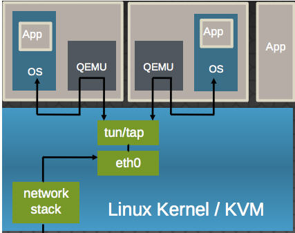

參考 jserv repo：

- [kvm-user-x86](https://github.com/jserv/kvm-user-x86)
- [kvm-host](https://github.com/sysprog21/kvm-host)


## kvm-user-x86

`main()` - 大致流程如下：

1. 透過 `kvm_init()` 建立 `kvm` 的結構，過程中會嘗試存取 kvm device `"/dev/kvm"`
2. 檢查是否支援 kvm，並透過 `ioctl()` 與 device 互動，建立一個 vm
   - KVM_CREATE_VM - 建立 VM instance，會回傳 VM instance 的 fd
   - KVM_SET_USER_MEMORY_REGION - 傳入結構 `kvm_userspace_memory_region`，其中設定了 userspace 的 memory region
   - 預設 RAM size 為 `512000000`
3. 透過 `load_binary()` 載入 binary `"vm.bin"`，寫到 VM 的 ram 當中
4. 透過 `kvm_init_vcpu()` 來初始化 VCPU (virtual CPU)
   - KVM_CREATE_VCPU - 傳入 vcpu id 建立對應的 VCPU，回傳 vcpu fd
   - KVM_GET_VCPU_MMAP_SIZE - 取得 VCPU 需要的空間
5. `kvm_run_vm()` 建立執行 `kvm_cpu_thread()` 的 thread，並等待其終止
6. `kvm_clean_vm()` 與 `kvm_clean_vcpu()` 各自釋放 `mmap()` 給 ram 以及 vcpu 的空間，並且都關閉 fd
7. `kvm_clean()` 關閉 device 的 fd 並釋放 `kvm` 的記憶體

```c
struct kvm *kvm = kvm_init();

if ((kvm == NULL) || (kvm_create_vm(kvm, RAM_SIZE) < 0))
{
	fprintf(stderr, "Fail to create vm\n");
	return -1;
}

load_binary(kvm);

kvm->vcpus = kvm_init_vcpu(kvm, 0, kvm_cpu_thread);

kvm_run_vm(kvm);

kvm_clean_vm(kvm);
kvm_clean_vcpu(kvm->vcpus);
kvm_clean(kvm);

return 0;
```

---

大多數的 function 基本上就如同上述介紹，而比較重要的則是透過 thread 執行的 function `kvm_cpu_thread()`：

```c
struct kvm *kvm = (struct kvm *)data;
kvm_reset_vcpu(kvm->vcpus); // 重置 vcpu 內的 register

while (1)
{
	printf("KVM start run\n");
    // 執行 kvm
	if (ioctl(kvm->vcpus->vcpu_fd, KVM_RUN, 0) < 0)
	{
		fprintf(stderr, "KVM_RUN failed\n");
		exit(1);
	}

    // 當 kvm 跳出時，代表 vm 執行中觸發 trap / exception 等，因此需要回到 host 來處理
    // 此時 exit_reason 會紀錄著 exit 的原因
	switch (kvm->vcpus->kvm_run->exit_reason)
	{
	case KVM_EXIT_IO:
		... // ignore output and sleep
		break;
	default:
		printf("KVM unknown\n");
		break;
	}
}

return 0;
```

- KVM_RUN - 通知 vcpu 可以開始執行
- 可以將 VCPU 想像成是一個 thread

---

`kvm_reset_vcpu()` - 初始化整個執行環境，包含 segment selector 以及 base address：

```c
// 首先取得 segment register
if (ioctl(vcpu->vcpu_fd, KVM_GET_SREGS, &(vcpu->sregs)) < 0)
{
	perror("can not get sregs\n");
	exit(1);
}

// 更新 segment register 內的值
// CODE_START == 0x1000
vcpu->sregs.cs.selector = CODE_START;
vcpu->sregs.cs.base = CODE_START * 16;
vcpu->sregs.ss.selector = CODE_START;
vcpu->sregs.ss.base = CODE_START * 16;
vcpu->sregs.ds.selector = CODE_START;
vcpu->sregs.ds.base = CODE_START * 16;
vcpu->sregs.es.selector = CODE_START;
vcpu->sregs.es.base = CODE_START * 16;
vcpu->sregs.fs.selector = CODE_START;
vcpu->sregs.fs.base = CODE_START * 16;
vcpu->sregs.gs.selector = CODE_START;

// 更新 segment register
if (ioctl(vcpu->vcpu_fd, KVM_SET_SREGS, &vcpu->sregs) < 0)
{
	perror("can not set sregs");
	exit(1);
}

// set CF 而已
vcpu->regs.rflags = 0x0000000000000002ULL;
vcpu->regs.rip = 0;
vcpu->regs.rsp = 0xffffffff;
vcpu->regs.rbp = 0;

// 更新 general register
if (ioctl(vcpu->vcpu_fd, KVM_SET_REGS, &(vcpu->regs)) < 0)
{
	perror("KVM SET REGS\n");
	exit(1);
}
```

- 由於 vm 執行起來為 real mode，因此 selector 經過 `<< 4` 後加上 offset 就會是 target address，其中 `CODE_START` 為 0x1000 是因為編譯 binary 時將 text segment 的 base address 設置在 0x10000

---

這個 example 使用到與 kvm 相關的結構有：

```c
struct kvm_userspace_memory_region {
        __u32 slot;
        __u32 flags;
        __u64 guest_phys_addr; /* mapping 到的 guest physical */
        __u64 memory_size; /* guest memory 的大小 (bytes) */
        __u64 userspace_addr; /* memory 的起始位址 */
};
```

---

kvm segment register 使用結構 `kvm_segment`：

```c
struct kvm_segment {
	__u64 base;
	__u32 limit;
	__u16 selector;
	__u8  type;
	__u8  present, dpl, db, s, l, g, avl;
	__u8  unusable;
	__u8  padding;
};
```

在 real mode，segment register 的值會作為 selector，在被 `<< 4` 後會即是 segment address；而在 protected mode 中，segment register 是用來存放 LDT / GDT 以及對應的 index，透過存取 index 中存放的 segment descriptor 來找到 segment base address 以及相關資訊。

然而觀察此結構欄位，雖然叫做 `kvm_segment`，但是資料欄位同時包含 segment descriptor 的資料以及 real mode 的 selector，猜測 kvm 將這些資料存放在一起是為了減少 overhead。


### kvm-host

>  實作一個 type 2 hypervisor，程式碼比 **kvm-user-x86** 多了一些，程式碼中會刪除一些 error handling 的部分

`main()` - 流程簡潔且直觀，並 support 兩個參數：

- `bzImage` - kernel binary 的檔案位置
- `initrd` (optional) - ram disk 的檔案位置

```c
vm_t vm;
vm_init(&vm); // 初始化
vm_load_image(&vm, kernel_file); // 載入 binary
if (initrd_file) // 若有提供 ram disk 就載入
   	vm_load_initrd(&vm, initrd_file);
vm_run(&vm); // 執行 vm
vm_exit(&vm); // 釋放 vm 的相關資源
```

- `struct vm_t` 存放 kvm, vm, vcpu 的 fd、serial 的資料以及 ram 的記憶體位址

  ```c
  typedef struct {
      int kvm_fd, vm_fd, vcpu_fd;
      void *mem; // ram
      serial_dev_t serial;
  } vm_t;
  ```

---

`vm_init()` 

```c
v->kvm_fd = open("/dev/kvm", O_RDWR); // 存取 kvm device
v->vm_fd = ioctl(v->kvm_fd, KVM_CREATE_VM, 0); // 建立 VM instance
ioctl(v->vm_fd, KVM_SET_TSS_ADDR, 0xffffd000); // 設置 TSS 位址 (Task State Segment)
__u64 map_addr = 0xffffc000;
// 設置 identity map
ioctl(v->vm_fd, KVM_SET_IDENTITY_MAP_ADDR, &map_addr);
// 建立 IRQ chip
ioctl(v->vm_fd, KVM_CREATE_IRQCHIP, 0);
// 建立 PIT
struct kvm_pit_config pit = {.flags = 0};
ioctl(v->vm_fd, KVM_CREATE_PIT2, &pit);

v->mem = mmap(NULL, RAM_SIZE, PROT_READ | PROT_WRITE,
                MAP_PRIVATE | MAP_ANONYMOUS, -1, 0);

struct kvm_userspace_memory_region region = {
    .slot = 0,
    .flags = 0,
    .guest_phys_addr = 0,
    .memory_size = RAM_SIZE,
    .userspace_addr = (__u64) v->mem,
};
// 更新 RAM 位址
ioctl(v->vm_fd, KVM_SET_USER_MEMORY_REGION, &region);
v->vcpu_fd = ioctl(v->vm_fd, KVM_CREATE_VCPU, 0);

vm_init_regs(v); // 初始化 register
vm_init_cpu_id(v); // 初始化 CPUID (instruction)
serial_init(&v->serial); // 初始化 serial
```

- `open()` kvm device 時需要使用 `O_RDWR`
- Identity Paging - virtual addresses are mapped to physical addresses that have the same value，代表 virtual address 在經過 mapping 後會與 physical address 相同
- KVM_CREATE_IRQCHIP - KVM 建立 2 個 8259A 的 PIC
- KVM_CREATE_PIT2 - KVM 建立 i8254 PIT
  - PIT - Programmable Interval Timer (又稱作 timer chip)，作為 event counter, elapsed time indicator, rate-controllable periodic event generator

---

`vm_init_regs()`

```c
struct kvm_sregs sregs;
// 取得 segment register
ioctl(v->vcpu_fd, KVM_GET_SREGS, &sregs);

#define X(R) sregs.R.base = 0, sregs.R.limit = ~0, sregs.R.g = 1
X(cs), X(ds), X(fs), X(gs), X(es), X(ss);
#undef X

// default operation size = 1 ==> 32-bit segment
sregs.cs.db = 1;
sregs.ss.db = 1;
// set 'Protected Mode Enable' bit
sregs.cr0 |= 1;

// 更新 segment register
ioctl(v->vcpu_fd, KVM_SET_SREGS, &sregs);

struct kvm_regs regs;
ioctl(v->vcpu_fd, KVM_GET_REGS, &regs);

regs.rflags = 2; // CF: carry flag
regs.rip = 0x100000, regs.rsi = 0x10000;
// set general register
ioctl(v->vcpu_fd, KVM_SET_REGS, &regs);

return 0;
```

---

`vm_init_cpu_id()`

```c
struct {
    uint32_t nent;
    uint32_t padding;
    struct kvm_cpuid_entry2 entries[N_ENTRIES];
} kvm_cpuid = {.nent = N_ENTRIES};
// 取得 host 的 CPUID 資訊
ioctl(v->kvm_fd, KVM_GET_SUPPORTED_CPUID, &kvm_cpuid);

// N_ENTRIES 為 100
// 一共有 100 個
for (unsigned int i = 0; i < N_ENTRIES; i++) {
    struct kvm_cpuid_entry2 *entry = &kvm_cpuid.entries[i];
    if (entry->function == KVM_CPUID_SIGNATURE) {
        // 如果執行對應的 CPUID，就會設定 ebx, ecx, edx 如下
        entry->eax = KVM_CPUID_FEATURES;
        entry->ebx = 0x4b4d564b; /* KVMK */
        entry->ecx = 0x564b4d56; /* VMKV */
        entry->edx = 0x4d;       /* M */
    }
}
// 設置 cpuid2
ioctl(v->vcpu_fd, KVM_SET_CPUID2, &kvm_cpuid);
```

- KVM_GET_SUPPORTED_CPUID - 可以取得 host 支援的 CPUID 列表

- KVM_SET_CPUID2 - 讓 host 可以模擬 guest 在執行 CPUID 的行為

- KVM_CPUID_SIGNATURE - 用來判斷是否存在於 VM 當中

  ```c
  /* This CPUID returns the signature 'KVMKVMKVM' in ebx, ecx, and edx.  It
   * should be used to determine that a VM is running under KVM.
   */
  #define KVM_CPUID_SIGNATURE	0x40000000
  #define KVM_SIGNATURE "KVMKVMKVM\0\0\0"
  ```

---

`serial_init()` - 用來 guest handle 與 serial 相關的操作

```c
*s = (serial_dev_t){
    .priv = (void *) &serial_dev_priv,
};

pthread_mutex_init(&s->lock, NULL);
s->infd = STDIN_FILENO;
// 建立 thread 執行 serial_console()，處理 serial input/ouput
pthread_create(&s->worker_tid, NULL, (void *) serial_console, (void *) s);
```

---

`vm_load_image()`

```c
// 開啟 target kernel binary
int fd = open(image_path, O_RDONLY);
struct stat st;
fstat(fd, &st);
size_t datasz = st.st_size; // 取得檔案大小
// mmap with fd
void *data = mmap(0, datasz, PROT_READ | PROT_WRITE, MAP_PRIVATE, fd, 0);
close(fd);

struct boot_params *boot =
    (struct boot_params *) ((uint8_t *) v->mem + 0x10000);
void *cmdline = ((uint8_t *) v->mem) + 0x20000;
void *kernel = ((uint8_t *) v->mem) + 0x100000;

// ram 的 0x10000 放 boot_params 結構
memset(boot, 0, sizeof(struct boot_params));
memmove(boot, data, sizeof(struct boot_params));

size_t setup_sectors = boot->hdr.setup_sects;
size_t setupsz = (setup_sectors + 1) * 512;
boot->hdr.vid_mode = 0xFFFF;  // VGA
boot->hdr.type_of_loader = 0xFF;
boot->hdr.loadflags |= CAN_USE_HEAP | 0x01 | KEEP_SEGMENTS;
boot->hdr.heap_end_ptr = 0xFE00;
boot->hdr.ext_loader_ver = 0x0;
boot->hdr.cmd_line_ptr = 0x20000;

// cmdline 位於 0x20000，將參數 console=ttyS0 複製到那
memset(cmdline, 0, boot->hdr.cmdline_size);
memcpy(cmdline, KERNEL_OPTS, sizeof(KERNEL_OPTS));

// 將 kernel 本體放到 0x100000
memmove(kernel, (char *) data + setupsz, datasz - setupsz);

// 新增兩個 e820 memory mapping entry
unsigned int idx = 0;
boot->e820_table[idx++] = (struct boot_e820_entry){
    .addr = 0x0,
    .size = ISA_START_ADDRESS - 1,
    .type = E820_RAM,
};
boot->e820_table[idx++] = (struct boot_e820_entry){
    .addr = ISA_END_ADDRESS,
    .size = RAM_SIZE - ISA_END_ADDRESS,
    .type = E820_RAM,
};
boot->e820_entries = idx;

return 0;
```

- BIOS E820 Table 是在 BIOS 時期使用的 memory 管理機制，可以得到 physical address 的相關資訊，而更多資訊可以參考 [MMU-E820](https://biscuitos.github.io/blog/MMU-E820/)
- `CMDLINE` 與 boot_params 都會在 BIOS E820 管理機制中被使用到

---

`vm_load_initrd()` - 載入傳進來的 ram disk 檔

```c
int fd = open(initrd_path, O_RDONLY);
struct stat st;
fstat(fd, &st);
size_t datasz = st.st_size; // 取得檔案大小
// 一樣做 mmap with fd
void *data = mmap(0, datasz, PROT_READ | PROT_WRITE, MAP_PRIVATE, fd, 0);
close(fd);

// boot_params 落於 offset 0x10000
struct boot_params *boot =
    (struct boot_params *) ((uint8_t *) v->mem + 0x10000);
// 從 boot_params 取得 initrd 的 offset
unsigned long addr = boot->hdr.initrd_addr_max & ~0xfffff;

// 從 max 開始扣，找到滿足放入整個 ramdisk 的位址就 brak
for (;;) {
	if (addr < (RAM_SIZE - datasz))
        break;
    addr -= 0x100000;
}

// 取得 initrd 的絕對位址
void *initrd = ((uint8_t *) v->mem) + addr;

// 複製到裡面
memset(initrd, 0, datasz);
memmove(initrd, data, datasz);

// 更新 ram disk 位置以及大小
boot->hdr.ramdisk_image = addr;
boot->hdr.ramdisk_size = datasz;
return 0;
```

---

`vm_run()`

```c
// 取得 vcpu 需要的 mmap 大小
int run_size = ioctl(v->kvm_fd, KVM_GET_VCPU_MMAP_SIZE, 0);
struct kvm_run *run =
    mmap(0, run_size, PROT_READ | PROT_WRITE, MAP_SHARED, v->vcpu_fd, 0);

while (1) {
    ioctl(v->vcpu_fd, KVM_RUN, 0); // 通知 kvm 執行

    switch (run->exit_reason) {
	// 如果 exit reason 是與 IO 相關，並且 io 的 port 落於 COM1
    // 則呼叫 serial_handle() 來處理
    case KVM_EXIT_IO:
        if (run->io.port >= COM1_PORT_BASE && run->io.port < COM1_PORT_END)
            serial_handle(&v->serial, run);
        break;
    case KVM_EXIT_SHUTDOWN:
        printf("shutdown\n");
        return 0;
    default:
        printf("reason: %d\n", run->exit_reason);
        return -1;
    }
}
```

- 當 IO port 落於 COM1 的範圍，就可以用 `serial_handle()` 來處理

---

`vm_exit()` - 單純釋放資源

```c
serial_exit(&v->serial); // 設置 thread_stop 來終止 thread，並且釋放 mutex 的資源
close(v->kvm_fd);
close(v->vm_fd);
close(v->vcpu_fd);
munmap(v->mem, RAM_SIZE);
```

---

下列大多都與 serial 的 in / out 相關，以 `serial_handle()` 作為處理的進入點，而同時 `serial_console()` ，而在做 io 時經常使用到的結構 `struct serial_dev_priv` 如下：

```c
struct serial_dev_priv {
    uint8_t dll; // out: Divisor Latch Low
    uint8_t dlm; // out: Divisor Latch High
    uint8_t iir; // in: Interrupt ID Register
    uint8_t ier; // out: Interrupt Enable Register
    uint8_t fcr; // out: FIFO Control Register
    uint8_t lcr; // out: Line Control Register
    uint8_t mcr; // out: Modem Control Register
    uint8_t lsr; // out: Line Status Register
    uint8_t msr; // in: Modem Status Register
    uint8_t scr; // io: Scratch Register

    struct fifo rx_buf; // receive buffer
};
```


`serial_handle()` - 根據 io 方向呼叫對應的 function 來處理

```c
void *data = (uint8_t *) r + r->io.data_offset;
// 如果 io direction 為 out，則執行 serial_out()，反之 serial_in()
void (*serial_op)(serial_dev_t *, uint16_t, void *) =
    (r->io.direction == KVM_EXIT_IO_OUT) ? serial_out : serial_in;

uint32_t c = r->io.count; // 取得 io operaiont 的次數
for (uint16_t off = r->io.port - COM1_PORT_BASE; c--; data += r->io.size)
    // s: serial 資訊 (fixed)
    // off: port 與 COM1 base 的 offset (fixed)
    // data: VCPU 的 base address 加上 io 資料的 offset，每次都會取出一個 slot
    serial_op(s, off, data);
```

---

`serial_out()` - 處理 serial 的 input

```c
struct serial_dev_priv *priv = (struct serial_dev_priv *) s->priv;
// 嘗試取得 lock
pthread_mutex_lock(&s->lock);

switch (offset) { // 根據 COM1 的 offset 會對應到不同的 serial port
case UART_TX: // out: Transmit buffer
	// UART_LCR_DLAB set 代表要更動 dll
    if (priv->lcr & UART_LCR_DLAB) {
        priv->dll = IO_READ8(data);
    } else {
        // 要 flush TX (Transmit buffer)
        // UART_LSR_TEMT: Transmitter empty
        // UART_LSR_THRE: Transmit-hold-register empty
        priv->lsr |= (UART_LSR_TEMT | UART_LSR_THRE);
        putchar(((char *) data)[0]);
        fflush(stdout);
        serial_update_irq(s);
    }
    break;
case UART_IER:
	// UART_LCR_DLAB unset 的情況下代表要更動 iet
    if (!(priv->lcr & UART_LCR_DLAB)) {
        priv->ier = IO_READ8(data);
        serial_update_irq(s);
    } else {
        priv->dlm = IO_READ8(data);
    }
    break;

// 下方是更新串列埠 (serial) 的 out 相關 regiter
case UART_FCR: ... break;
case UART_LCR: ... break;
case UART_MCR: ... break;
case UART_SCR: ... break;
default: break;
}
pthread_mutex_unlock(&s->lock);
```

- UART - Universal Asynchronous Receiver/Transmitter
- 可參考 [串列埠的原理與運用](https://www.csie.ntu.edu.tw/~d4526011/my_book_copy/CHAP4.3.htm) 以及 [serial_reg.h]()
- transmit 代表讀 VM 寫入的 `data` 到 host

---

`serial_in()`

```c
struct serial_dev_priv *priv = (struct serial_dev_priv *) s->priv;
// 嘗試拿 lock
pthread_mutex_lock(&s->lock);

switch (offset) {
case UART_RX: // Receive buffer
    if (priv->lcr & UART_LCR_DLAB) {
        IO_WRITE8(data, priv->dll);
    } else {
        if (fifo_is_empty(&priv->rx_buf)) // 如果 buffer 沒資料就不處理
            break;

        uint8_t value; // 從 receive buffer 讀一個 byte 傳到 VM serial
        if (fifo_get(&priv->rx_buf, value))
            IO_WRITE8(data, value);

        // 如果讀完空的話，unset DR bit (data ready)
        if (fifo_is_empty(&priv->rx_buf)) {
            priv->lsr &= ~UART_LSR_DR;
            serial_update_irq(s);
        }
    }
    break;
case UART_IER:
    if (priv->lcr & UART_LCR_DLAB)
        IO_WRITE8(data, priv->dlm);
    else
        IO_WRITE8(data, priv->ier);
    break;
case UART_IIR:
    // 0xc0 目的為 FIFO enabled
    IO_WRITE8(data, priv->iir | 0xc0);
    break;
case UART_LCR: ... break;
case UART_MCR: ... break;
case UART_LSR: ... break;
case UART_MSR: ... break;
case UART_SCR: ... break;
default:
    break;
}
pthread_mutex_unlock(&s->lock);
```

- transmit 代表讀 VM 從 host 寫到 `data` 當中，receive 代表將 host 的資料寫入 device
- RX 透過 `IO_WRITE8(dst, src)` 把資料寫入 device 使用的記憶體區塊中

---

`serial_console()`

```c
struct serial_dev_priv *priv = (struct serial_dev_priv *) s->priv;

while (!__atomic_load_n(&thread_stop, __ATOMIC_RELAXED)) {
	// 嘗試取得 lock，但如果
    pthread_mutex_lock(&s->lock);
    // buffer 不為空的話代表還有資料正在傳輸
    if (priv->lsr & UART_LSR_DR || !fifo_is_empty(&priv->rx_buf))
        goto unlock;

    // 還沒有滿之前都嘗試從 stdin 讀取資料
    while (!fifo_is_full(&priv->rx_buf) && serial_readable(s)) {
        char c;
        if (read(s->infd, &c, 1) == -1)
            break;
        // 寫資料到 receive buffer
        if (!fifo_put(&priv->rx_buf, c))
            break;
        priv->lsr |= UART_LSR_DR; // data ready
    }
    serial_update_irq(s);
unlock:
    pthread_mutex_unlock(&s->lock);
}
```

- UART_LSR_DR
  - LSR - Line Status Register
  - DR - Receiver data ready

---

`serial_update_irq()` - 更新 serial 的 register 後，有些 bit 與 interrupt 相關，則需要透過 kvm 的 `KVM_IRQ_LINE` command 來更新

```c
struct serial_dev_priv *priv = (struct serial_dev_priv *) s->priv;
uint8_t iir = UART_IIR_NO_INT;

// 如果允許 receiver data interrupt 以及 data ready，代表可以讀取資料了
if ((priv->ier & UART_IER_RDI) && (priv->lsr & UART_LSR_DR))
    iir = UART_IIR_RDI;
// THRI - Transmitter holding register empty
// TEMT - Transmitter empty
else if ((priv->ier & UART_IER_THRI) && (priv->lsr & UART_LSR_TEMT))
    iir = UART_IIR_THRI;

priv->iir = iir | 0xc0; // 0xc0 for FIFO

// 像 kvm 發送更新狀態
vm_irq_line(container_of(s, vm_t, serial), SERIAL_IRQ,
            iir == UART_IIR_NO_INT ? 0 /* inactive */ : 1 /* active */);
```

- 當 transmitter FIFO 為空時會 trigger **transmitter holding register empty interrupt** (THRI)


---

> 如果對於 kvm 沒有很了解，可以參考[此篇文章](https://tw511.com/a/01/7301.html)，不但介紹了 kvm，同時也有說明 kvm-qemu 搭配在一起的情況，以下為看文章時做的一些筆記。
>
> P.S. 此翻譯&整理過的文章出處來自於[此系列文](https://www.cnblogs.com/sammyliu/category/696699.html)


### Introduction

KVM (kernel-based virtual machine) 以 kernel module 存在於 linux 上，使得 kernel 本身也成為一個 hypervisor，並且由於開源的關係，因此不僅發展快速，也有較高的安全性，不過仍存在著一些 [CVE](https://ubuntu.com/security/cves?package=linux-kvm)。

首先 KVM 需要 virtualization extensions 技術的支援，較廣為人知的有 Intel VT 以及 AMD-V，而同時 KVM 也是 full-virtualization 的 hypervisor。其中 KVM 並沒辦法做硬體模擬，在遇到 IO 存取時會回到 userspace，此時 user 需要根據不同的回傳值來判斷不同種類的 IO 存取，並且做出對應的回覆。

- Hypervisor 通常又稱作 VMM (Virtual machine monitor)
- Virtualization extensions - 又稱作 Hardware-assisted virtualization，可以透過 host 的 hardware 來支援虛擬化，通常 CPU 會額外支援關於虛擬化的 instruction，舉 VT-x 為例，執行 `VMENTRY` 就代表進入 virtual machine 的執行環境
- Full-virtualization - 相對應的是 Paravirtualization，關於兩者的簡單介紹如下：
  - Full-virtualization - 允許 unmodified guest OS 直接運行，實際上會透過 VMM 模擬硬體。執行時採取 "捕獲 (trap) - 翻譯 (handle) - 模擬 (emulate)" 的模式運行，因為要模擬特權指令，所以會有**很大的 overhead**，而模擬的方式是透過 BT (Binary Translation)
  - Paravirtualization - 因為需要透過一些 API (`hypercall` instruction) 來存取 host 的資源，因此 guest OS 通常需要修改 (modified)。由於是直接呼叫 instruction 來請求資源，因此不會有額外的 overhead，效能會比 Full-virtualization 好
  - Hardware-assisted virtualization - Full-virtualization 配合硬體支援，取代 BT 而直接透過模式的切換來執行 instruction
- 你可能會有聽到 Type-1 & Type-2 virtualization，主要是根據不同種類的 hypervisor 做區分：
  - Type-1 (Bare-Metal hypervisor) - hypervisor 作為 microkernel 直接裝在 host OS，掌控硬體資源
  - Type-2 (Hosted hypervisor) - hypervisor 作為一個正常的 process 執行


Qemu 本身也是為一個 hypervisor，不過他主要都是用軟體去模擬指令的執行、一些 device 的 IO，並沒有使用 Hardware-assisted virtualization，因此執行速度相較緩慢。然而他的好處是擴充性高，使用者只需要使用 Qemu 提供的 API，就能迅速模擬出一個 device 讓 guest OS 做存取，

- Qemu 使用的軟體模擬技術為 DBT (Dynamic Binary Translation)，Qemu 本身實作出的工具稱作 TCG (Tiny Code Generator)
- DBT 的 input 為要模擬的一整塊 basic block 的 instruction，並且 instruction 可以是 hypervisor 本身所支援的 instruction set；output 為 host 本身的 instruction set 的 instruction
- TCG 會在 input 與 output 中間加上一層 IR，也就是 input --> IR --> output，這樣可以減去 instruction 轉換的成本


QEMU-KVM 結合 KVM 以及 QEMU 的優點，首先 KVM 已經處理了 memory mapping 以及 instruction emulation，之後由 QEMU 來提供硬體 I/O 虛擬化，並透過 `ioctl()` /dev/kvm 裝置和 KVM 互動。


而 QEMU-KVM 相比原生 QEMU 的改動：

- 原生的 QEMU 通過 BT 實現 CPU 的 full-virtualization，但是修改後的 QEMU-KVM 會呼叫 `ioctl()` 來呼叫 KVM 模組
- 原生的 QEMU 是 single-thread 實現，QEMU-KVM 是 multi-thread 實現


### KVM

KVM 提供的功能有：

- 支援 CPU 和 memory Overcommit
  - Overcommit 代表可以要求超過實際可以 handle 的 memory，實際上在使用到才會為其分配 physical memory
- 支援半虛擬化 I/O (virtio)
- 支援熱插拔 (cpu，block device、network device 等)
- 支援對稱多處理 (Symmetric Multi-Processing，縮寫爲 SMP)
- 支援實時遷移 (Live Migration)
- 支援 PCI device 直接分配和單根 I/O 虛擬化 (SR-IOV)
  - SR-IOV - single-root IO virtualization
- 支援 kernel 同頁合併 (KSM)
  - KSM - kernel samepage merging
- 支援 NUMA
  - NUMA - Non-Uniform Memory Access (非一致儲存存取結構)


### 架構

整體架構如下圖：


- qemu-kvm 透過 `ioctl()` 對 kvm instance 下指令，KVM 會將 VCPU 的 guest context 載入到 VMCS (virtual machine control structure) 當中
- 一個 kvm instance 即是一個 qemu-kvm process，與其他 linux process 一樣被 schedule
- Qemu-KVM 的部分包括 Virtual memory、VCPU 和 Virtual I/O device；記憶體和 CPU 的虛擬化由 KVM kernel module 負責，I/O device 的虛擬化由 QEMU 負責實作
- KVM guest OS 的記憶體是 qumu-kvm process 的 memory region 一部分
- 以 Intel VT-x 為例，host OS 以及 VMM 執行在 VMX root 當中，guest OS 及其 application 執行在 VMX nonroot
  - root mode 的切換是透過 `VMENTRY` 以及 `VMEXIT` instruction


也有一張也很詳細的架構圖：


### Scheduling

如果要將 guest OS 內的 thread 排程到某個 host 本身的物理 CPU，需要經歷兩個過程：

1. guest OS 的 thread 排程到 guest 本身的 CPU 即 KVM VCPU，而此 scheduling 由 guest OS 負責，每個 guest OS 的實現方式不同
2. **vCPU thread** 排程到 host physical CPU，該排程由 Hypervisor 即 Linux kernel 負責


### Virtual memory


KVM 實現 guest OS **記憶體**虛擬化的方式是，利用 **mmap** 系統呼叫，在 QEMU 的 virtual address 中申請一塊連續的大小的空間，用於 guest OS 的 physical memory mapping。


KVM 內部實現記憶體虛擬化的方式有：

- software - 以軟體實現 Shadow page table (GVA --> HPA)
- hardware - based on CPU 的硬體支援，如 AMD NPT 和 Intel EPT
- 透過 hardware 實現後，hypervisor 不需要在支援 SPT (Shadow Page Table)，並且需要透過軟體的轉換，降低了在切換 VM 時造成的 overhead，hardware 也相較穩定


KSM (Kernel SamePage Merging) - 以 ksmd (daemon) 存在，其會定期掃描 page，將多個相似的 memory paging 合併成一個，用於減少多個 VM 擁有多個相似的 memory mapping，整個流程如下：

1. 初始狀態
   

2. 合併後
   
3. guest1 寫入後：
   

不過每次 scan 都會有 overhead，因此建議在開啟多個 VM 時在啟動。


### IO 的虛擬化

Qemu-kvm 中，guest OS 的 device 可以分成：

1. emulation device - 完全由 Qemu 軟體模擬的裝置 (default)
2. VirtIO device - 實現 VIRTIO API 的半虛擬化裝置
3. PCI 裝置直接分配 - PCI device assignment

從 guest OS 的 IO 請求，到 host 處理完回覆給 guest 的整個流程如下：

1. guest OS 的 device driver 發起 I/O request
2. KVM 攔截 IO request
3. KVM 整理 IO info 後放到 IO sharing page，通知 Qemu
4. Qemu 取得 IO info 後，交給 hardware emulation component 去處理
5. Qemu 將結果放到 IO sharing page，通知 KVM
6. KVM 讀取結果，整理後放到 guest OS

P.S. 如果 guest OS 使用 DMA (Direct Memory Access) 存取大塊 IO 時，會直接透過 memory maping 寫到 guest OS 當中，並通知 KVM 已經處理完成。


Qemu 模擬許多 hardware device，以網卡為例，若啟動時沒有傳入相關參數，則 QEMU 預設分配 rtl8139 型別的虛擬網絡卡型別給 guest OS 使用，使用 "預設使用者模式"，這時候由於沒有具體的網路模式的設定，guest 的網路功能是有限的。而使用 Qemu-kvm 時，KVM 可以選擇的網路模式包括：

- 預設使用者模式 (User)
- 基於網橋 (Bridge) 的模式
- 基於 NAT (Network Address Translation) 的模式


而在 KVM 中可以使用 **Para-virtualizaiton** 提升 guest 的 I/O 效能，目前採用的是 VirtIO 此 Linux 上的裝置驅動標準框架，其提供了一種 host 與 guest 互動的 IO framework。VirtIO 採用在 guest OS 中安裝前端驅動 (Front-end driver) 和在 Qemu 中實現後端驅動 (Back-enddiver) 的方式，前後端驅動通過 **vring** 直接溝通，省略了 KVM 轉送的過程，提高了 I/O 的效能。簡單來說，使用 virtio 不需要接收到 trap 後做後續處理，**guest OS 可以和 QEMU 的 I/O 直接溝通**。實際運作參考下方兩張圖：


完整的 IO 流程如下：


- 如果 host 要傳送資料給 guest，就 inject interrupt 通知 guest 處理
- 如果 guest 要傳給 host，就透過 hypercall (instruction emulation)，此處不確定是 full-virtualization 怎麼處理


總結來說，Virtio 是一個在 Hypervisor 之上的抽象 API interface，主要是提升 guest OS 的執行效率，同時也會讓 guest OS 知道自己執行在虛擬化環境中，整個架構由多個 components 組成：

- 前端驅動 - guest OS 中安裝的驅動程式模組
- 後端驅動 - 在 Qemu 中實現，呼叫主機上的物理裝置，或者完全由軟體實現
- virtio 層 - virtio queue interface，連接了前端驅動和後端驅動，而驅動可以根據需要使用不同數目的 queue，比如 virtio-net 使用兩個 queue，virtio-block 只使用一個 queue，實際上 queue 是使用 virtio-ring 來實作
- virtio-ring - 實現 virtual queue 的 ring buffer

總結使用 virtio 的優缺點：

- 優點： 更高的 IO 效能，幾乎可以和原生系統差不多
- 缺點： guest OS 必須安裝特定的 virtio 驅動，可以使用 `lsmod | grep virtio` 查看是否載入


linux 一共實現了 5 個前端驅動：


- virtio-blk - block device (e.g. disk)
- virtio-net - 網路裝置
- virtio-pci - PCI 裝置
- virtio-balloon -氣球驅動程式 (動態管理 guest OS 的記憶體使用情況)
- virtio-console - console 驅動程式

一般狀況下是不會載入，當使用對應的 virtio 裝置時才會載入。以 virtio-net 為例，他的功能為：



- 多個 VM 共用 host 的網絡卡 eth0
- Qemu 使用標準的 tun/tap 將 VM 的網路橋接到主機 NIC 上
- 每個 VM 看起來有一個直接連線到主機 PCI 總線上的私有 virtio 網路裝置
- 需要在 VM 內安裝 virtio驅動

細節的部分：


1. guest OS 內的 driver 會將請求放入 vring 當中
2. guest driver 發送通知 Qemu 處理 (`Virtqueue_kick()` 會被呼叫)
3. Qemu 取得 vring 內的 request
4. 由於為 network request，發送至 TUN/TAP
5. 處理完畢，像 guest 發送 interrupt


vhost-net 為 kernel-level virtio server，將 virtio-net 的後端處理任務放到 kernel 中執行，減少 kernel 與 userspace 之間的切換，差異如下：


virtio-balloon 為比較特別的 virtio device，可以在 guest OS 執行時動態調整它所佔用的 host 記憶體資源，而不需要關閉 guest。當 host 需要多點記憶體時，請求回收 guest 的部分記憶體，如果 guest 不足的話，會將部分使用中的 memory 放到 swap 當中；反之，如果 guest 不足，並且 host 還有多餘的記憶體，則可以擴充 guest 能使用的記憶體。

- guest 變少： inflate，膨脹氣球，page out
- guest 變多： deflate，壓縮氣球，page in

流程如下：

1. KVM 發送請求給 VM 讓其歸還一定數量的記憶體給 KVM
2. VM 的 virtio_balloon 驅動接到該請求
3. VM 的驅動讓 guest 的記憶體氣球膨脹，氣球中的記憶體就不能被 guest 使用
4. VM 的 guest OS 歸還氣球中的記憶體給 VMM
5. KVM 可以將得到的記憶體分配到任何需要的地方
6. KM 也可以將記憶體返還到 guest 中 (壓縮 guet 的氣球)


### SR-IOV [KVM PCI/PCIe Pass-Through SR-IOV]

裝置直接分配 (Device assignment) 也稱作 Device Pass-Through，是將 host 的 PCI/PCIe 直接分配給 guest 使用，guest 存取 device 就是等同於直接透過 PCI 使用對應的 device，而 CPU 需要支援 Intel VT-d 或者 AMD IOMMU。優缺點如下：

- 優點：在執行 I/O 操作時大量減少 VM-Exit 到 Hypervisor 處理的情況，效能可以達到幾乎和原生系統一樣的效能，而 VT-d 克服了 virtio 相容性不好和 CPU 使用頻率較高的問題
- 缺點：
  - 一臺伺服器主機板上的空間比較有限，因此允許新增的 PCI 和 PCI-E 裝置是有限的
  - 對於使用 VT-d 直接分配了裝置的客戶機，其 live migration 功能將受限，不過也可以使用熱插拔或者 libvirt 工具等方式解決此問題

VT-d 直接分配硬體資源給 guest，雖然提升效能，但同時也侷限了硬體資源的使用範圍。 SR-IOV (Single Root I/O Virtualization and sharing) 為 PCI-SIG 組織所發佈的規範，定義了一個標準化的機制，以支援實現多個 guest 共用一個裝置，目前最被廣泛用於 NIC。


一個帶有 SR-IOV 功能的物理裝置能被設定為多個功能單元，一共有兩種功能單元 (function)：

- 物理功能 (Physical Functions，PF) - 這是完整的帶有 SR-IOV 能力的PCIe 裝置，能像普通 PCI 裝置那樣被發現、管理和設定
- 虛擬功能 (Virtual Functions，VF) - 只能處理 I/O 等簡單的 PCIe 功能，並且每個 VF 都是從 PF 中分離出來的，每個 PF 都有一個 VF 數目的限制

Hypervisor 能將一個或者多個 VF 分配給一個 VM。同個時間一個 VF 只能被分配給一個 VM，而一個 VM 可以擁有多個 VF。


總結上述各種虛擬化 NIC 的方法：


---

> 參考 [架設 Linux KVM 虛擬化主機](https://www.lijyyh.com/2015/12/linux-kvm-set-up-linux-kvm.html)

### virtual disk 格式

KVM 提供了一些虛擬化磁碟的方法：

- Image - 一共支援兩種
  - Raw images - 僅提供簡單資料存放的 diask，因此通常具有存取上較快的優點
  - QEMU Copy On Write 2 (qcow2) - qcow2 的磁碟格式具有 snapshot、壓縮與加密等額外的功能
- Block devices
  - Entire devices - 利用**整個儲存裝置**做為虛擬磁碟，例如 /dev/sdb。
  - Partitions - 利用**磁碟分割**做為虛擬磁碟，例如 /dev/sdb2。
  - Logical Volumes - 利用邏輯磁區管理員 (Logical Volume Mamager, LVM) 所建立的邏輯磁區 (LV)來做為虛擬磁碟，例如 /dev/VolGroup00/LogVol00
    - LVM 具有自己的 snapshot 功能，不過很慢，並且會造成大量的主機 I/O。
